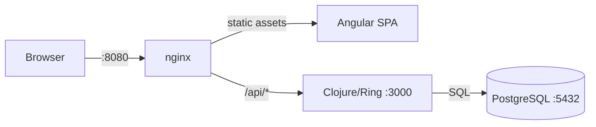
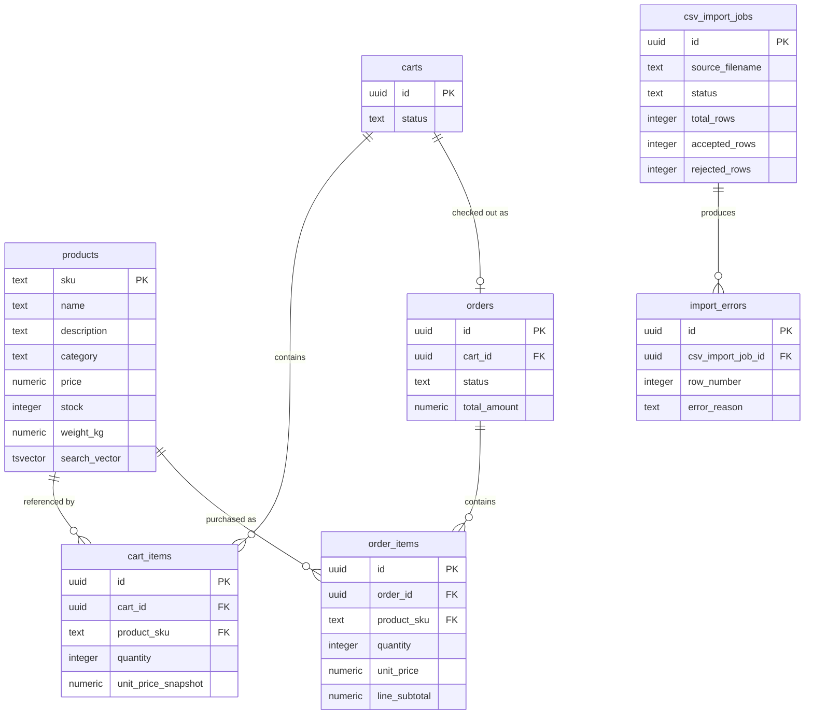
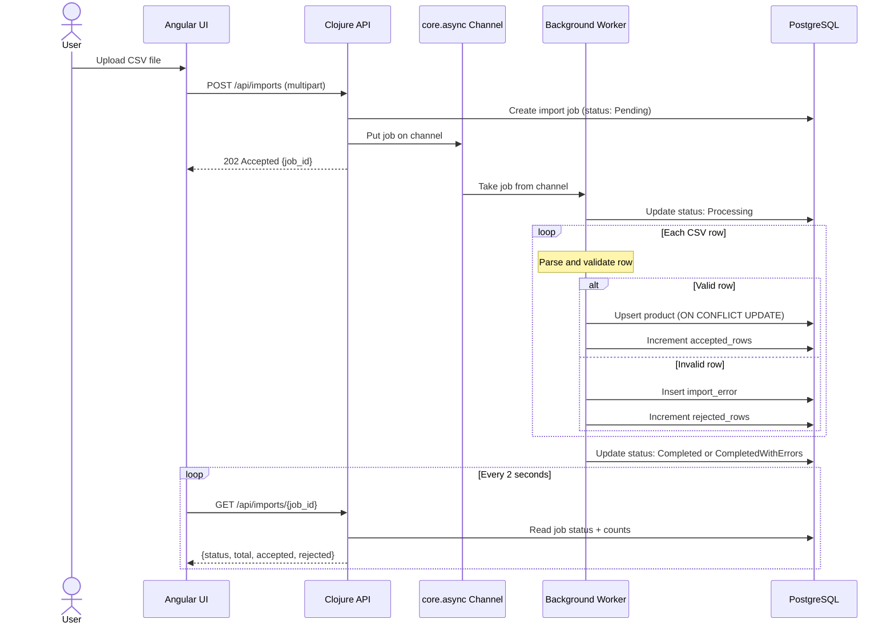

# E-Commerce Application

**Clojure 1.12** | **Angular 22** | **PostgreSQL 17.5** | **Docker Compose**

Full-stack e-commerce application built for the [Gila Software Code Challenge](docs/challenge/Code-Challenge-E-Commerce.pdf). Product catalog with CRUD, CSV bulk import, full-text search, shopping cart, and checkout -- all running in Docker with zero host dependencies.

---

## Table of Contents

- [Quick Start](#quick-start)
- [Architecture](#architecture)
- [Technical Decisions](#technical-decisions)
- [Project Structure](#project-structure)
- [Configuration](#configuration)
- [Testing](#testing)
- [Architecture Documentation](#architecture-documentation)
- [Deliberate Scope Decisions](#deliberate-scope-decisions)

---

## Quick Start

**Prerequisites**: Docker with Compose v2. Nothing else.

```bash
docker compose up --build
```

Open **http://localhost:8080** once all services report healthy. No JDK, Node.js, or PostgreSQL installation needed on the host machine.

| URL | Description |
|-----|-------------|
| `http://localhost:8080` | Angular frontend (Products, Search, Import, Cart, Checkout) |
| `http://localhost:8080/api/health` | Backend health check (200 = healthy, 503 = degraded) |
| `http://localhost:8080/api/products` | Products API (paginated, searchable, filterable) |
| `http://localhost:8080/api/docs` | Swagger UI -- interactive API documentation |

All routes are served through a single nginx entry point. No separately exposed backend or database ports.

To stop and clean up:

```bash
docker compose down -v
```

The product catalog CSV was downloaded on **2026-07-27**.

[Back to top](#table-of-contents)

---

## Architecture

### Request Flow

Every request enters through nginx on port 8080. Static assets are served directly; API requests are reverse-proxied to the Clojure backend.



**Frontend**: Angular 22 with zoneless change detection (signals, no Zone.js). Standalone components only. Container-presentational pattern separates data fetching from display. Lazy-loaded routes per feature. Client-side validation with Zod mirrors backend Malli schemas.

**Backend**: Clojure on JDK 21 with Ring (HTTP) + Reitit (routing) + Malli (validation). SQL-first approach with next.jdbc and HoneySQL -- no ORM. Domain handlers are pure request-to-response functions with the datasource injected. Background CSV processing via core.async channels.

**Database**: PostgreSQL 17.5 with forward-only SQL migrations applied via `docker-entrypoint-initdb.d`. Product SKU is the natural primary key. Full-text search uses `tsvector` with a GIN index maintained by a database trigger.

**Infrastructure**: Multi-stage Docker builds (build tools excluded from production images). nginx serves static files and reverse-proxies `/api/*` to the backend. The backend runs as a non-root user. Services start in dependency order via health checks: db -> backend -> frontend.

### Data Model

Seven tables organized around three aggregates: Catalog (products), Shopping (carts, cart_items), and Orders (orders, order_items), plus an import tracking subsystem (csv_import_jobs, import_errors).



Key design choices:
- `products.sku` is the natural primary key -- no surrogate ID
- `cart_items.unit_price_snapshot` captures price at add-to-cart time, immune to later price changes
- `order_items` are immutable once the order is placed
- `products.price` uses `NUMERIC(10,2)` for exact decimal arithmetic -- never floating point

### CSV Import Pipeline

CSV import runs asynchronously. The upload returns immediately with a job ID; the frontend polls for progress.



[Back to top](#table-of-contents)

---

## Technical Decisions

The challenge asks for decisions, rationale, and alternatives considered. Each decision below includes what was chosen, what was rejected, and why.

<details>
<summary><strong>1. Backend Language: Clojure</strong></summary>

**Chosen**: Clojure 1.12.0 on JVM 21

**Alternatives considered**:
- **Java**: Verbose for a data-transformation-heavy application. Clojure's immutable data structures and sequence abstractions express the domain more concisely.
- **Python**: Weaker concurrency model for background CSV processing. The GIL limits true parallelism.
- **Go**: Less expressive for data pipelines. No equivalent to core.async's channel-based processing without external libraries.
- **PHP**: Requires external queue infrastructure (Redis/RabbitMQ) for background processing that Clojure handles natively with core.async.

**Rationale**: Data-oriented language on a mature JVM ecosystem. The REPL enables rapid iteration. core.async provides in-process concurrent CSV processing without external infrastructure.

</details>

<details>
<summary><strong>2. Frontend Framework: Angular 22</strong></summary>

**Chosen**: Angular 22.0.0 (zoneless, signals, standalone components)

**Alternatives considered**:
- **React 19**: Requires assembling routing, forms, HTTP client, and DI from separate libraries. Angular provides all of these built-in.
- **ClojureScript**: Would introduce a second build pipeline and toolchain, adding complexity without proportional benefit for a standard CRUD UI.
- **Vanilla JS**: Manual DOM manipulation, routing, and state management would slow development and increase bug surface for a multi-view SPA.

**Rationale**: Built-in router, reactive forms, HttpClient, and dependency injection. Angular 22's zoneless mode with signals eliminates Zone.js overhead. Developer expertise with Angular.

</details>

<details>
<summary><strong>3. Database: PostgreSQL</strong></summary>

**Chosen**: PostgreSQL 17.5

**Alternatives considered**:
- **SQLite**: No concurrent write support -- incompatible with background CSV import writing while the API serves reads.
- **MongoDB**: Schemaless storage is a liability for financial data (prices, orders). No ACID transactions for checkout.
- **MySQL**: Weaker full-text search (no `tsvector`), `NUMERIC` precision handling less robust than PostgreSQL's.

**Rationale**: Relational integrity for e-commerce data. `NUMERIC(10,2)` for exact price arithmetic. Native `tsvector` + GIN index for product search without a separate search service. ACID transactions for checkout atomicity.

</details>

<details>
<summary><strong>4. Validation: Malli + Zod (Parallel Schemas)</strong></summary>

**Chosen**: Malli 0.16.4 (backend) + Zod 3.24.4 (frontend)

**Alternatives considered**:
- **Single-layer validation (backend only)**: Delays error feedback until the server round-trip. Poor UX for form validation.
- **Shared schema generation**: Cross-language transpilation (Clojure to TypeScript) is fragile and adds build complexity.

**Rationale**: Both schemas enforce identical rules (field lengths, numeric ranges, required fields) independently. Integration tests verify the contract stays in sync. Frontend gives instant feedback; backend is the authoritative gate.

</details>

<details>
<summary><strong>5. CSV Processing: core.async</strong></summary>

**Chosen**: In-process channel-based processing with core.async 1.7.701

**Alternatives considered**:
- **Distributed step functions (AWS Step Functions, Temporal)**: Infrastructure overkill for processing CSV files in a single-evaluator context.
- **Thread pools (ExecutorService)**: Lower-level than needed. core.async's channel abstraction is more expressive for producer-consumer patterns.

**Rationale**: Zero external dependencies. The upload handler puts a job on a channel; a worker goroutine processes rows asynchronously. The pattern is extractable to a distributed queue if scale demands it later.

</details>

<details>
<summary><strong>6. Product Search: PostgreSQL tsvector</strong></summary>

**Chosen**: Built-in PostgreSQL full-text search with `tsvector` column and GIN index

**Alternatives considered**:
- **Elasticsearch**: A separate search cluster is unjustified at catalog scale (hundreds to low thousands of products).
- **Application-level filtering (ILIKE)**: No ranking, no stemming, no prefix matching. Degrades with catalog growth.

**Rationale**: `tsvector` provides ranked full-text search with stemming and prefix matching at zero operational cost. A database trigger keeps the search vector in sync with product name, description, and category.

</details>

<details>
<summary><strong>7. Duplicate SKU Strategy: Upsert for Catalog, Reject for In-File</strong></summary>

**Chosen**: CSV import upserts (updates existing products by SKU) but rejects duplicate SKUs within the same CSV file

**Alternatives considered**:
- **Reject all duplicates**: Would prevent catalog updates via CSV re-import, forcing manual edits for price/stock changes.
- **Overwrite all**: Last-write-wins within a file is ambiguous -- which row "wins" when the same SKU appears twice with different prices?

**Rationale**: Upsert enables re-importing an updated catalog (common workflow). In-file duplicates are rejected because the intent is ambiguous -- the importer should fix the source data.

</details>

<details>
<summary><strong>8. Delete Behavior: Hard Delete with FK Protection</strong></summary>

**Chosen**: Hard delete with foreign key constraint protection (409 if referenced by orders)

**Alternatives considered**:
- **Soft delete (is_deleted flag)**: Adds query complexity to every product query. Complicates unique constraints. Unnecessary for a catalog without audit requirements.
- **Cascade delete**: Destroying order history when a product is removed violates data integrity for completed transactions.

**Rationale**: Simple and safe. Products referenced by orders cannot be deleted (FK constraint returns 409). Unreferenced products are permanently removed. No ghost data accumulates.

</details>

<details>
<summary><strong>9. Cart Identity: JWT-Signed Cookie</strong></summary>

**Chosen**: JWT-signed cookie via buddy-sign (HMAC-SHA256), HttpOnly, SameSite=Strict, Path=/api

**Alternatives considered**:
- **Database session**: Requires session cleanup and storage management. The cookie approach is stateless on the server side (cart data lives in PostgreSQL, the cookie is just the cart ID).
- **localStorage**: Not sent automatically with API requests. Requires JavaScript to attach to every request. Vulnerable to XSS.

**Rationale**: The browser sends the cookie automatically with every `/api` request. The JWT is signed with HMAC-SHA256, preventing cart ID forgery. No authentication system exists, so the signed cookie is the identity mechanism.

</details>

<details>
<summary><strong>10. Checkout Concurrency: SELECT FOR UPDATE</strong></summary>

**Chosen**: PostgreSQL `SELECT FOR UPDATE` row-level locking within a serializable transaction

**Alternatives considered**:
- **Optimistic locking (version column)**: Requires retry logic in the application. More complex for a multi-item cart where any item might conflict.
- **Queue-based (serialize all checkouts)**: Reduces throughput to one checkout at a time. Unnecessary when row-level locking handles concurrency at the database level.

**Rationale**: `SELECT FOR UPDATE` locks only the specific product rows being purchased, allowing concurrent checkouts for non-overlapping carts. The transaction re-validates stock, decrements atomically, creates the order, and transitions the cart -- all within a single database transaction.

</details>

[Back to top](#table-of-contents)

---

## Project Structure

```
├── src/ecommerce/              # Clojure backend source
│   ├── core.clj                #   Application entry point, server lifecycle
│   ├── config.clj              #   Environment variable loading and validation
│   ├── router.clj              #   Reitit route definitions with Malli coercion
│   ├── middleware.clj           #   Ring middleware pipeline (security, content negotiation, errors)
│   ├── db.clj                  #   HikariCP datasource management
│   ├── product/                #   Product CRUD handlers + repository queries
│   ├── import/                 #   CSV import handlers + core.async worker
│   ├── cart/                   #   Cart handlers + JWT cookie middleware
│   └── checkout/               #   Checkout handler + stock validation + order creation
├── frontend/src/app/           # Angular frontend source
│   ├── products/               #   Product list, detail, and form views
│   ├── search/                 #   Product search with full-text query and filters
│   ├── imports/                #   CSV upload, progress polling, error table
│   ├── cart/                   #   Cart page with quantity adjustment
│   ├── checkout/               #   Checkout flow and order confirmation
│   └── shared/                 #   Zod schemas, HTTP error utilities
├── resources/migrations/       # PostgreSQL forward-only SQL migrations
├── test/                       # Backend tests (clojure.test + Testcontainers) + smoke test
├── Dockerfile.backend          # Multi-stage: Clojure builder -> JRE 21 runtime (non-root)
├── Dockerfile.frontend         # Multi-stage: Node 24 builder -> nginx
├── docker-compose.yml          # 4-service orchestration (db, backend, frontend, playwright)
├── nginx.conf                  # Reverse proxy config + SPA fallback routing
└── docs/                       # Architecture documentation (12 documents)
```

[Back to top](#table-of-contents)

---

## Configuration

All configuration is via environment variables. Docker Compose provides sensible defaults for local development -- no `.env` file is required.

| Variable | Default | Description |
|----------|---------|-------------|
| `DB_USER` | `app` | PostgreSQL username |
| `DB_PASSWORD` | `devpassword` | PostgreSQL password |
| `DB_NAME` | `ecommerce` | PostgreSQL database name |
| `LOG_LEVEL` | `INFO` | Backend log level (DEBUG, INFO, WARN, ERROR) |
| `COOKIE_SECRET` | `dev-secret-...` | Secret for cart JWT signing (min 32 chars) |

The backend validates all environment variables at startup and exits with code 1 if any are missing or invalid.

[Back to top](#table-of-contents)

---

## Testing

**Approach**: Test-Driven Development (Red-Green-Refactor) for all business logic. Tests are written before implementation and map directly to acceptance criteria.

### Test Pyramid

| Layer | Backend | Frontend | Scope |
|-------|---------|----------|-------|
| Unit | clojure.test | Vitest + @analogjs/vitest-angular | Validation rules, pure functions, domain logic |
| Integration | clojure.test + Testcontainers (PostgreSQL 17) | Vitest + MSW | Database queries, API endpoints, CSV pipeline |
| E2E | Playwright 1.62 | Playwright 1.62 | Full user flows through the running application |

**Security testing**: Error responses are verified to never leak stack traces, SQL statements, or file paths. XSS payloads and SQL injection attempts are tested in product creation, CSV import, and search.

**Coverage**: Frontend enforces 80% line coverage thresholds. Backend coverage is tracked via kaocha-cloverage.

### Running Tests

```bash
# Backend tests (requires Docker for Testcontainers)
docker compose run --rm backend clojure -M:test

# Frontend unit + integration tests
cd frontend && CI=true pnpm exec ng test --configuration=ci

# E2E tests (requires all services running)
docker compose up -d
docker compose run --rm playwright
```

### Pre-Commit Hook

The project includes a pre-commit hook that runs build, test, and audit stages inside Docker containers.

```bash
# One-time setup per clone
ln -sf ../../scripts/pre-commit.sh .git/hooks/pre-commit
chmod +x .git/hooks/pre-commit
```

[Back to top](#table-of-contents)

---

## Architecture Documentation

Detailed documentation for each subsystem lives in `docs/architecture/`. Each document is self-contained and cross-referenced.

| Document | Description |
|----------|-------------|
| [Tech Stack](docs/architecture/tech-stack.md) | Technology choices, exact versions, rationale, and alternatives for every layer |
| [API Contract](docs/architecture/api-contract.md) | HTTP API specification: endpoints, request/response shapes, error codes, pagination |
| [API Documentation Strategy](docs/architecture/api-docs-strategy.md) | Swagger/OpenAPI auto-generation from Malli schemas via Reitit |
| [Data Model](docs/architecture/data-model.md) | PostgreSQL schema: tables, columns, constraints, indexes, and foreign keys |
| [Middleware Pipeline](docs/architecture/middleware-pipeline.md) | Ring middleware ordering, request lifecycle, and why the order is load-bearing |
| [Error Handling](docs/architecture/error-handling.md) | How exceptions are translated into the standard error envelope |
| [Health Check Strategy](docs/architecture/health-check-strategy.md) | Zombie service prevention: health probes that verify real database connectivity |
| [Security Guidelines](docs/architecture/security-guidelines.md) | Security model for anonymous cart sessions: what is protected, how, and what is deferred |
| [Testing Strategy](docs/architecture/testing-strategy.md) | TDD workflow, test pyramid enforcement, per-epic test matrix |
| [TDD Workflow](docs/architecture/tdd-workflow.md) | Concrete Red-Green-Refactor steps for Clojure and Angular |
| [Validation & Pruning](docs/architecture/validation-pruning.md) | How Malli and Reitit coercion validate and strip unexpected fields |
| [Package Management](docs/architecture/pnpm-config.md) | pnpm enforcement via Corepack, lockfile integrity, and dependency policy |

[Back to top](#table-of-contents)

---

## Deliberate Scope Decisions

These are intentional boundaries, not gaps. Each represents a tradeoff made for the challenge scope.

| Decision | Rationale | Production Path |
|----------|-----------|-----------------|
| No user authentication | Cart identity via signed cookie provides tamper-evident sessions without an auth system | Add OAuth2/OIDC provider, migrate cart cookies to user-scoped sessions |
| Simulated payment | Checkout always succeeds; `orders` table already has `Failed` and `Fulfilled` statuses reserved | Integrate payment provider, implement the full order state machine |
| No HTTPS/TLS | Localhost-only. TLS termination is an infrastructure concern | Add TLS at the reverse proxy or load balancer layer |
| No rate limiting | Single-evaluator context. Not a risk for the challenge | Add rate limiting at the nginx layer or via Ring middleware |
| Static cookie secret | `COOKIE_SECRET` is fixed for the application lifetime | Implement key rotation with graceful old-cookie invalidation |
| Catalog-scale search only | PostgreSQL `tsvector` handles hundreds to low thousands of products | Add Elasticsearch or Meilisearch for large catalogs with faceted search |

[Back to top](#table-of-contents)
