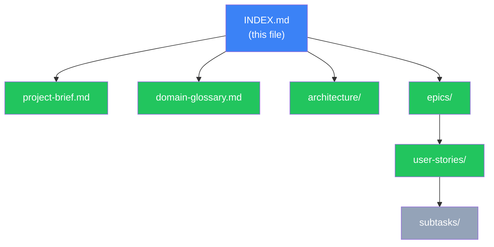

# E-Commerce Application --- Gila Software Challenge

Enterprise-grade e-commerce application demonstrating production-level engineering
judgment through robust product management, resilient data import, and a complete
purchase workflow.

## Document Map

Legend: green = complete, blue = current, gray = pending.

## Project Overview

- [x] [Project Brief](project-brief.md)
- [x] [Domain Glossary](domain-glossary.md)

## Epics

- [ ] **EP01 --- Product Management**: CRUD operations for products ([docs/epics/EP01-product-management.md](epics/EP01-product-management.md))
- [ ] **EP02 --- CSV Import**: Bulk import with validation and sanitization ([docs/epics/EP02-csv-import.md](epics/EP02-csv-import.md))
- [ ] **EP03 --- Product Search**: Search and filtering across catalog ([docs/epics/EP03-product-search.md](epics/EP03-product-search.md))
- [ ] **EP04 --- Purchase Workflow**: Cart and simulated payment ([docs/epics/EP04-purchase-workflow.md](epics/EP04-purchase-workflow.md))
- [ ] **EP05 --- User Interface**: Web UI for all product and purchase flows ([docs/epics/EP05-user-interface.md](epics/EP05-user-interface.md))
- [ ] **EP06 --- Containerization & Documentation**: Docker packaging and README ([docs/epics/EP06-containerization-docs.md](epics/EP06-containerization-docs.md))

## Architecture

- [x] [Tech Stack](architecture/tech-stack.md)
- [x] [Testing Strategy](architecture/testing-strategy.md)
- [x] [API Contract](architecture/api-contract.md)
- [x] [Data Model](architecture/data-model.md)
- [x] [Health Check Strategy](architecture/health-check-strategy.md)
- [x] [Middleware Pipeline](architecture/middleware-pipeline.md)
- [x] [Payload Validation & Pruning](architecture/validation-pruning.md)
- [x] [Error Handling Pipeline](architecture/error-handling.md)
- [x] [Security Guidelines](architecture/security-guidelines.md)
- [x] [TDD Workflow](architecture/tdd-workflow.md)
- [x] [API Documentation Strategy](architecture/api-docs-strategy.md)
- [x] [Frontend Package Management](architecture/pnpm-config.md)

## Refinement

- [x] [MVP Batch 1 --- Refinement Addenda](epics/mvp-batch-1-refinement.md) --- 18 resolved decisions, MVP cut, implementation order

## User Stories --- MVP v1 (16 stories)

### EP06 --- Infrastructure

- [ ] [US-001 --- Project Scaffolding](user-stories/US-001-project-scaffolding.md)

### EP01 --- Product Management (Backend)

- [ ] [US-002 --- Create Product with Validation & Sanitization](user-stories/US-002-create-product.md)
- [ ] [US-003 --- Update Product](user-stories/US-003-update-product.md)
- [ ] [US-004 --- Delete Product](user-stories/US-004-delete-product.md)

### EP02 --- CSV Import (Backend)

- [ ] [US-005 --- CSV Upload & Background Processing Pipeline](user-stories/US-005-csv-upload-processing.md)
- [ ] [US-006 --- CSV Row Validation](user-stories/US-006-csv-row-validation.md)
- [ ] [US-007 --- Import Results & Error Reporting](user-stories/US-007-import-results-reporting.md)

### EP03 --- Product Search (Backend)

- [ ] [US-008 --- Product Search with Filters, Sort & Pagination](user-stories/US-008-product-search.md)

### EP04 --- Purchase Workflow (Backend)

- [ ] [US-009 --- Cart Operations](user-stories/US-009-cart-operations.md)
- [ ] [US-010 --- Checkout & Order Creation](user-stories/US-010-checkout-order.md)

### EP05 --- User Interface (Frontend)

- [ ] [US-011 --- Product Management Views](user-stories/US-011-product-management-views.md)
- [ ] [US-012 --- CSV Import View](user-stories/US-012-csv-import-view.md)
- [ ] [US-013 --- Product Search View](user-stories/US-013-product-search-view.md)
- [ ] [US-014 --- Cart & Checkout Views](user-stories/US-014-cart-checkout-views.md)

### EP06 --- Delivery

- [ ] [US-015 --- Docker Compose Multi-Stage Setup](user-stories/US-015-docker-compose-setup.md)
- [ ] [US-016 --- README & Decision Documentation](user-stories/US-016-readme-documentation.md)

## Deferred --- v2+

| Item | Epic | Reason |
|------|------|--------|
| Duplicate product as template | EP01 | Could Have |
| Warning before delete with purchase history | EP01 | Should Have --- FK already protects |
| Real-time progress via SSE | EP02 | Could Have --- polling suffices |
| Dry-run preview | EP02 | Could Have |
| Export/download skipped rows | EP02 | Should Have --- API errors endpoint covers |
| Search suggestions | EP03 | Could Have |
| Session-remembered filters | EP03 | Could Have |
| Responsive layout | EP05 | Should Have --- Low UX weight |
| Cart Abandoned transition | EP04 | Not required |
| Order Fulfilled transition | EP04 | Not required |

## Sprint Planning

- [x] [Batch 1 --- MVP Implementation Plan](subtasks/batch-1-plan.md) --- 7 execution waves, 16 tasks, dependency graph
- Handoff files: [T-001](subtasks/ep06/T-001-project-scaffolding.md) through [T-016](subtasks/ep06/T-016-readme-documentation.md)

## Navigation Notes

- All documents link back to this INDEX via breadcrumb
- Epics link to their user stories; stories link to their handoff files
- Architecture docs are referenced by stories that touch those systems
