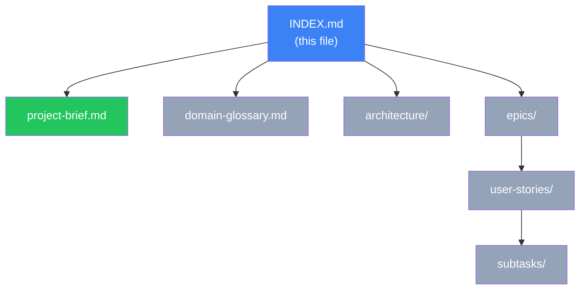

# E-Commerce Application --- Gila Software Challenge

Enterprise-grade e-commerce application demonstrating production-level engineering
judgment through robust product management, resilient data import, and a complete
purchase workflow.

## Document Map

Legend: green = complete, blue = current, gray = pending.

## Project Overview

- [x] [Project Brief](project-brief.md)
- [x] [Domain Glossary](domain-glossary.md)

## Epics

- [ ] **EP01 --- Product Management**: CRUD operations for products ([docs/epics/EP01-product-management.md](epics/EP01-product-management.md))
- [ ] **EP02 --- CSV Import**: Bulk import with validation and sanitization ([docs/epics/EP02-csv-import.md](epics/EP02-csv-import.md))
- [ ] **EP03 --- Product Search**: Search and filtering across catalog ([docs/epics/EP03-product-search.md](epics/EP03-product-search.md))
- [ ] **EP04 --- Purchase Workflow**: Cart and simulated payment ([docs/epics/EP04-purchase-workflow.md](epics/EP04-purchase-workflow.md))
- [ ] **EP05 --- User Interface**: Web UI for all product and purchase flows ([docs/epics/EP05-user-interface.md](epics/EP05-user-interface.md))
- [ ] **EP06 --- Containerization & Documentation**: Docker packaging and README ([docs/epics/EP06-containerization-docs.md](epics/EP06-containerization-docs.md))

## Architecture

- [x] [Tech Stack](architecture/tech-stack.md)
- [x] [Testing Strategy](architecture/testing-strategy.md)
- [x] [API Contract](architecture/api-contract.md)
- [x] [Data Model](architecture/data-model.md)

## Sprint Planning

TBD --- populated during Plan phase.

## Navigation Notes

- All documents link back to this INDEX via breadcrumb
- Epics link to their user stories; stories link to their handoff files
- Architecture docs are referenced by stories that touch those systems
