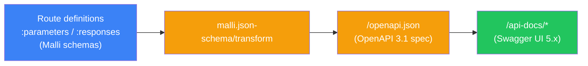

> [INDEX](../INDEX.md) / [Architecture](./) / API Documentation Strategy

# API Documentation Strategy

## 1. Approach

Reitit 0.7.2 (see [Tech Stack — Section 2](tech-stack.md#2-backend)) has built-in OpenAPI 3.1
support. The Malli schemas already used for request/response coercion — the same schemas that
enforce the validation contract described in
[Tech Stack — Section 8](tech-stack.md#8-validation-strategy) — are automatically converted to
JSON Schema via `malli.json-schema/transform`.

This means there is no separate API documentation artifact to hand-maintain. The route
definitions **are** the documentation: a schema change in the coercion config is, by
construction, a documentation change. There is no annotation layer that can drift from the
code it describes, because the annotations and the code are the same data structure.

## 2. How It Works

1. Routes already define `:parameters` and `:responses` with Malli schemas for coercion (see
   [Payload Validation & Pruning](validation-pruning.md)) — this is not additional work done
   for documentation's sake, it is the coercion config Reitit already requires.
2. `reitit.openapi/create-openapi-handler` generates the OpenAPI 3.1 spec at runtime by walking
   the route tree and converting each route's Malli schemas to JSON Schema.
3. `reitit.swagger-ui/create-swagger-ui-handler` serves Swagger UI, which reads the generated
   spec and renders an interactive explorer.
4. `metosin/ring-swagger-ui` (version `5.9.0`, see
   [Tech Stack — Section 2](tech-stack.md#2-backend)) provides the Swagger UI 5.x static assets
   bundled into the backend uberjar — no CDN dependency, no separate frontend build.



## 3. Route Configuration Example

```clojure
["/api/products"
 {:post {:summary    "Create a new product"
         :parameters {:body ProductSchema}
         :responses  {201 {:body ProductSchema}
                      400 {:body ErrorSchema}
                      409 {:body ErrorSchema}}
         :handler    create-product}}]
```

`ProductSchema` and `ErrorSchema` are the same Malli schemas used for request coercion and
error-shape enforcement elsewhere in the backend (see [API Contract](api-contract.md)). Reitit's
OpenAPI handler reads this same route data and emits the corresponding JSON Schema — the
`summary` string becomes the operation's documented summary, the `:parameters`/`:responses` maps
become the request body and response schemas for each status code.

## 4. Setup

```clojure
;; In router.clj
["" {:no-doc true}
 ["/openapi.json" {:get (openapi/create-openapi-handler)}]
 ["/api-docs/*" {:get (swagger-ui/create-swagger-ui-handler
                        {:url "/openapi.json"})}]]
```

The `{:no-doc true}` wrapper excludes the documentation routes themselves from appearing as
documented endpoints in the generated spec — the spec describes the product/import/search/cart
API, not the machinery that serves the spec.

## 5. Dependencies

```clojure
;; Already included in the reitit umbrella dependency (metosin/reitit 0.7.2):
;; reitit.openapi, reitit.swagger-ui namespaces

;; Additional:
metosin/ring-swagger-ui {:mvn/version "5.9.0"}  ;; Swagger UI 5.x static assets
```

No new dependency category is introduced — `reitit.openapi` and `reitit.swagger-ui` ship inside
the same `metosin/reitit` artifact already pinned in [Tech Stack](tech-stack.md#2-backend); only
the static-asset package (`ring-swagger-ui`) is an additional coordinate.

## 6. Benefits for the Challenge

- Evaluators can explore and exercise the API interactively at `/api-docs/` without needing a
  separate Postman collection or hand-written API reference.
- No documentation drift: routes change, coercion schemas change, and the generated spec
  reflects both automatically on the next request — there is no manual sync step to forget.
- Demonstrates the engineering judgment the challenge weights explicitly: choosing a
  zero-maintenance documentation mechanism over a hand-authored one is itself evidence of
  understanding the cost of documentation debt.

## 7. Limitations

- OpenAPI 3 support in Reitit is marked alpha upstream, though functional in the pinned `0.7.2`
  release used here. This is a known, accepted risk for a 3-day challenge timeline rather than a
  production deployment.
- Complex Malli schemas (deeply nested `:multi` schemas, recursive schemas) may not translate
  perfectly to JSON Schema. This project's schemas (see [API Contract](api-contract.md) and
  [Payload Validation & Pruning](validation-pruning.md)) are flat-to-moderately-nested `:map`
  schemas, which are within the well-supported translation path.

## Related Documents

- [Tech Stack](tech-stack.md) — Reitit, Malli, and `ring-swagger-ui` versions and rationale
- [API Contract](api-contract.md) — the request/response shapes rendered by the generated spec
- [Middleware Pipeline](middleware-pipeline.md) — where the OpenAPI and Swagger UI routes sit
  relative to the rest of the middleware chain
