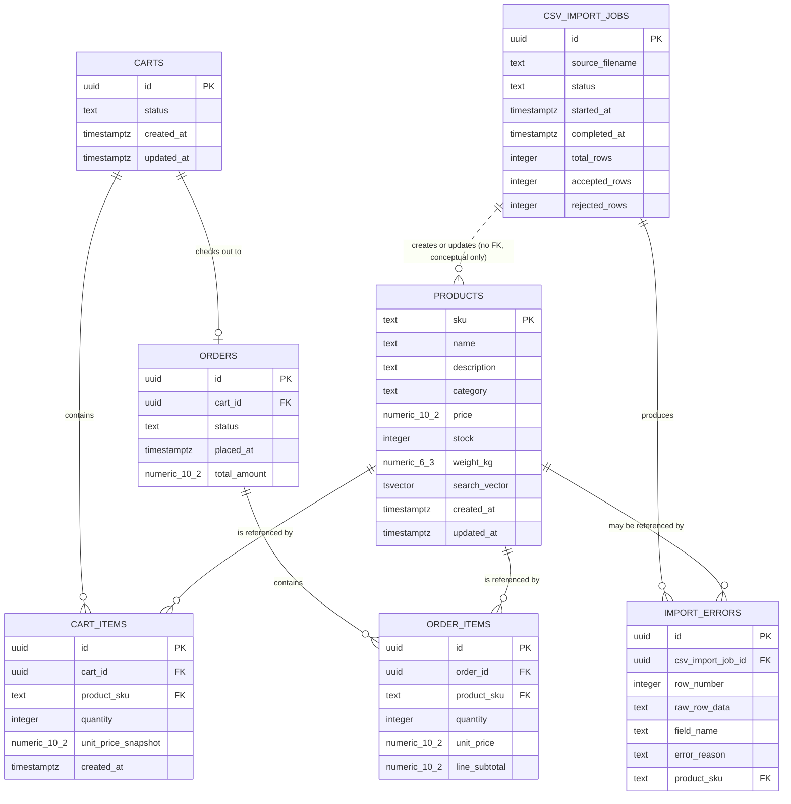

> [INDEX](../INDEX.md) / [Architecture](./) / Data Model

# Data Model

This document translates the [Domain Glossary](../domain-glossary.md) entities into a
concrete PostgreSQL 17.5 schema. Every table, column, constraint, and index below maps
directly to an entity, value object, or state machine defined in the glossary --- no new
domain concepts are introduced here, only their storage representation. SQL is generated
at runtime through HoneySQL (see [Tech Stack](tech-stack.md)); the migrations themselves
are plain, hand-written SQL files, since schema definition is a one-time structural
concern rather than a query built from dynamic Clojure data.

## 1. Schema Overview

| Table | Description |
| ----- | ----------- |
| `products` | The catalog of sellable items; SKU is the natural primary key. |
| `carts` | A customer's in-progress, pre-checkout collection of products. |
| `cart_items` | Line entries within a cart, with a point-in-time price snapshot. |
| `orders` | The immutable record of a completed or attempted purchase. |
| `order_items` | Line entries within an order, immutable once the order is placed. |
| `csv_import_jobs` | A tracked batch operation that ingests and validates a CSV file. |
| `import_errors` | A single rejected CSV row within a `csv_import_jobs` run. |

## 2. Table Definitions

### 2.1 `products`

The central aggregate of the catalog. `sku` is the natural primary key per the domain
glossary's Identifiers convention --- Product has no surrogate `id`.

| Column | Type | Constraints | Notes |
| ------ | ---- | ----------- | ----- |
| `sku` | `TEXT` | `PRIMARY KEY` | Natural key; unique business identifier, immutable once assigned. |
| `name` | `TEXT` | `NOT NULL` | Trimmed, non-empty at the application layer (`ProductName` value object). |
| `description` | `TEXT` | | Optional free text. |
| `category` | `TEXT` | | `CategoryLabel` value object; may be empty (uncategorized). |
| `price` | `NUMERIC(10,2)` | `NOT NULL`, `CHECK (price > 0)` | Exact decimal; never `FLOAT`/`DOUBLE PRECISION`. |
| `stock` | `INTEGER` | `NOT NULL`, `CHECK (stock >= 0)` | Whole units; zero means out of stock. |
| `weight_kg` | `NUMERIC(6,3)` | `CHECK (weight_kg >= 0)` | Optional; nullable for categories with no shipping weight. |
| `search_vector` | `TSVECTOR` | | Generated by trigger; see [Full-Text Search](#4-full-text-search). |
| `created_at` | `TIMESTAMPTZ` | `NOT NULL DEFAULT now()` | UTC, ISO 8601 on the wire. |
| `updated_at` | `TIMESTAMPTZ` | `NOT NULL DEFAULT now()` | Refreshed on every `UPDATE`. |

**Indexes**:

- `products_pkey` --- implicit B-tree on `sku` (primary key).
- `idx_products_search_vector` --- `GIN` on `search_vector`, for full-text search (EP03).
- `idx_products_category` --- B-tree on `category`, for catalog filtering.

**Foreign keys**: none (root aggregate).

### 2.2 `carts`

| Column | Type | Constraints | Notes |
| ------ | ---- | ----------- | ----- |
| `id` | `UUID` | `PRIMARY KEY DEFAULT gen_random_uuid()` | Surrogate identifier per Identifiers convention. |
| `status` | `TEXT` | `NOT NULL DEFAULT 'Active'`, `CHECK (status IN ('Active', 'CheckedOut', 'Abandoned'))` | Mirrors the Cart state machine. |
| `created_at` | `TIMESTAMPTZ` | `NOT NULL DEFAULT now()` | |
| `updated_at` | `TIMESTAMPTZ` | `NOT NULL DEFAULT now()` | Refreshed on every mutation (item added/removed, status change). |

**Indexes**:

- `carts_pkey` --- implicit B-tree on `id`.
- `idx_carts_status` --- B-tree on `status`, to locate `Active` carts eligible for the
  abandonment sweep.

**Foreign keys**: none.

### 2.3 `cart_items`

| Column | Type | Constraints | Notes |
| ------ | ---- | ----------- | ----- |
| `id` | `UUID` | `PRIMARY KEY DEFAULT gen_random_uuid()` | Surrogate identifier. |
| `cart_id` | `UUID` | `NOT NULL REFERENCES carts(id) ON DELETE CASCADE` | Owning cart. |
| `product_sku` | `TEXT` | `NOT NULL REFERENCES products(sku)` | Referenced product; no cascade delete --- a product is never hard-deleted while referenced (see EP01 delete semantics). |
| `quantity` | `INTEGER` | `NOT NULL`, `CHECK (quantity > 0)` | Whole units, always positive. |
| `unit_price_snapshot` | `NUMERIC(10,2)` | `NOT NULL`, `CHECK (unit_price_snapshot > 0)` | Captured at add-to-cart time; immune to later `products.price` changes. |
| `created_at` | `TIMESTAMPTZ` | `NOT NULL DEFAULT now()` | Implementation addition beyond the glossary's key attributes, kept for audit trails. |

**Constraints**: `UNIQUE (cart_id, product_sku)` --- adding an already-present product
increases `quantity` on the existing row instead of inserting a duplicate line.

**Indexes**:

- `cart_items_pkey` --- implicit B-tree on `id`.
- `cart_items_cart_id_product_sku_key` --- implicit unique B-tree on
  `(cart_id, product_sku)`, also serves lookups by `cart_id`.
- `idx_cart_items_product_sku` --- B-tree on `product_sku`, for reverse lookups
  (e.g., "which carts reference this product").

**Foreign keys**: `cart_id` -> `carts(id)`; `product_sku` -> `products(sku)`.

### 2.4 `orders`

| Column | Type | Constraints | Notes |
| ------ | ---- | ----------- | ----- |
| `id` | `UUID` | `PRIMARY KEY DEFAULT gen_random_uuid()` | Surrogate identifier. |
| `cart_id` | `UUID` | `UNIQUE NOT NULL REFERENCES carts(id)` | The cart this order originated from (`Cart \|\|--o\| Order`). NOT NULL --- v1 orders always originate from a cart. |
| `status` | `TEXT` | `NOT NULL DEFAULT 'Pending'`, `CHECK (status IN ('Pending', 'Paid', 'Failed', 'Fulfilled'))` | Mirrors the Order state machine. |
| `placed_at` | `TIMESTAMPTZ` | `NOT NULL DEFAULT now()` | Set when the order is created from a checked-out cart. |
| `total_amount` | `NUMERIC(10,2)` | `NOT NULL`, `CHECK (total_amount >= 0)` | `Money` value object; sum of `order_items.line_subtotal`. |

> **v1 scope note**: v1 uses only `Pending` and `Paid` states. `Failed` and `Fulfilled` are
> reserved for v2 (simulated payment decline and order fulfillment tracking, respectively).
> The CHECK constraint includes all planned states to avoid a schema migration when v2
> features are implemented.

**Indexes**:

- `orders_pkey` --- implicit B-tree on `id`.
- `orders_cart_id_key` --- implicit unique B-tree on `cart_id`.
- `idx_orders_status` --- B-tree on `status`, for fulfillment and reporting queries.

**Foreign keys**: `cart_id` -> `carts(id)`.

### 2.5 `order_items`

Immutable once the parent order is placed --- no domain event updates a row in this
table after insertion.

| Column | Type | Constraints | Notes |
| ------ | ---- | ----------- | ----- |
| `id` | `UUID` | `PRIMARY KEY DEFAULT gen_random_uuid()` | Surrogate identifier. |
| `order_id` | `UUID` | `NOT NULL REFERENCES orders(id) ON DELETE CASCADE` | Owning order. |
| `product_sku` | `TEXT` | `NOT NULL REFERENCES products(sku)` | Referenced product at time of purchase. |
| `quantity` | `INTEGER` | `NOT NULL`, `CHECK (quantity > 0)` | Whole units purchased. |
| `unit_price` | `NUMERIC(10,2)` | `NOT NULL`, `CHECK (unit_price > 0)` | Price at the moment of checkout; permanent record. |
| `line_subtotal` | `NUMERIC(10,2)` | `NOT NULL`, `CHECK (line_subtotal >= 0)` | Equals `quantity * unit_price`, persisted rather than computed on read. |

**Indexes**:

- `order_items_pkey` --- implicit B-tree on `id`.
- `idx_order_items_order_id` --- B-tree on `order_id`, for retrieving an order's line items.
- `idx_order_items_product_sku` --- B-tree on `product_sku`, for sales-history lookups
  per product.

**Foreign keys**: `order_id` -> `orders(id)`; `product_sku` -> `products(sku)`.

### 2.6 `csv_import_jobs`

| Column | Type | Constraints | Notes |
| ------ | ---- | ----------- | ----- |
| `id` | `UUID` | `PRIMARY KEY DEFAULT gen_random_uuid()` | Surrogate identifier. |
| `source_filename` | `TEXT` | `NOT NULL` | Original uploaded filename, for auditability. |
| `status` | `TEXT` | `NOT NULL DEFAULT 'Pending'`, `CHECK (status IN ('Pending', 'Processing', 'Completed', 'CompletedWithErrors', 'Failed'))` | Mirrors the CsvImportJob state machine. |
| `started_at` | `TIMESTAMPTZ` | | Set on transition to `Processing`. |
| `completed_at` | `TIMESTAMPTZ` | | Set on transition to `Completed`, `CompletedWithErrors`, or `Failed`. |
| `total_rows` | `INTEGER` | `NOT NULL DEFAULT 0`, `CHECK (total_rows >= 0)` | Total data rows parsed from the file, excluding the header. |
| `accepted_rows` | `INTEGER` | `NOT NULL DEFAULT 0`, `CHECK (accepted_rows >= 0)` | Rows that produced a `ProductCreated`/`ProductUpdated` event. |
| `rejected_rows` | `INTEGER` | `NOT NULL DEFAULT 0`, `CHECK (rejected_rows >= 0)` | Rows that produced an `import_errors` record. |

> **Skipped rows**: there is no `skipped_rows` column. Rows that are entirely empty are
> excluded from both `accepted_rows` and `rejected_rows` and produce no `import_errors`
> entry, so the skipped count is always derivable as
> `total_rows - accepted_rows - rejected_rows` rather than stored redundantly. See the
> [API Contract](api-contract.md#4-csv-import-api) for the full `skipped` row-status
> semantics on the SSE stream.

**Indexes**:

- `csv_import_jobs_pkey` --- implicit B-tree on `id`.
- `idx_csv_import_jobs_status` --- B-tree on `status`, for polling in-progress jobs.

**Foreign keys**: none.

### 2.7 `import_errors`

| Column | Type | Constraints | Notes |
| ------ | ---- | ----------- | ----- |
| `id` | `UUID` | `PRIMARY KEY DEFAULT gen_random_uuid()` | Surrogate identifier. |
| `csv_import_job_id` | `UUID` | `NOT NULL REFERENCES csv_import_jobs(id) ON DELETE CASCADE` | Owning import job. |
| `row_number` | `INTEGER` | `NOT NULL`, `CHECK (row_number > 0)` | `ImportRowReference` value object; 1-indexed, header row included. |
| `raw_row_data` | `TEXT` | `NOT NULL` | The offending row exactly as read from the CSV, for diagnosis. |
| `field_name` | `TEXT` | | The specific field that failed validation; nullable for row-level failures (e.g., an entirely empty row). |
| `error_reason` | `TEXT` | `NOT NULL` | Human-readable rejection reason (malformed price, duplicate SKU, security payload detected, etc.). |
| `product_sku` | `TEXT` | `REFERENCES products(sku)` | Optional pointer to the product the row would have affected, "when identifiable by SKU" per the glossary. Nullable --- most rejections (e.g., malformed price) never resolve to a known SKU. |

**Indexes**:

- `import_errors_pkey` --- implicit B-tree on `id`.
- `idx_import_errors_job_id` --- B-tree on `csv_import_job_id`, for listing a job's errors.

**Foreign keys**: `csv_import_job_id` -> `csv_import_jobs(id)`; `product_sku` -> `products(sku)`.

## 3. Status Column Summary

Every `CHECK`-constrained status column enumerates exactly the states defined by the
corresponding state machine in the [Domain Glossary](../domain-glossary.md#statusstate-values).
No additional application-level enum exists outside these constraints --- the database is
the single source of truth for which values are legal.

| Table | Column | Allowed Values |
| ----- | ------ | --------------- |
| `carts` | `status` | `Active`, `CheckedOut`, `Abandoned` |
| `orders` | `status` | `Pending`, `Paid`, `Failed`, `Fulfilled` |
| `csv_import_jobs` | `status` | `Pending`, `Processing`, `Completed`, `CompletedWithErrors`, `Failed` |

## 4. Full-Text Search

Product search (EP03) is implemented with PostgreSQL's built-in `tsvector`/`tsquery`
machinery, avoiding a separate search engine at this catalog scale (see
[Tech Stack](tech-stack.md#4-database)).

### 4.1 Column

`products.search_vector` is a `TSVECTOR` column, maintained automatically --- application
code never writes to it directly.

### 4.2 Trigger Function

A trigger function recomputes `search_vector` from `name`, `description`, and `sku` on
every `INSERT` or `UPDATE`:

```sql
CREATE OR REPLACE FUNCTION products_search_vector_update() RETURNS TRIGGER AS $$
BEGIN
  NEW.search_vector :=
    to_tsvector(
      'english',
      coalesce(NEW.name, '') || ' ' ||
      coalesce(NEW.description, '') || ' ' ||
      coalesce(NEW.sku, '')
    );
  RETURN NEW;
END;
$$ LANGUAGE plpgsql;

CREATE TRIGGER products_search_vector_trigger
  BEFORE INSERT OR UPDATE ON products
  FOR EACH ROW
  EXECUTE FUNCTION products_search_vector_update();
```

### 4.3 Index

```sql
CREATE INDEX idx_products_search_vector ON products USING GIN (search_vector);
```

A `GIN` index is chosen over `GIN` alternatives (`GiST`) because `tsvector` columns with
infrequent writes and frequent reads favor `GIN`'s faster lookup at the cost of slightly
slower writes --- an acceptable trade-off for a product catalog.

### 4.4 Query Pattern

HoneySQL builds the query as data; the underlying SQL is:

```sql
SELECT sku, name, description, category, price, stock, weight_kg
FROM products
WHERE search_vector @@ plainto_tsquery('english', ?)
ORDER BY ts_rank(search_vector, plainto_tsquery('english', ?)) DESC;
```

`plainto_tsquery` is used (rather than `to_tsquery`) because it accepts free-form user
input without requiring the caller to construct tsquery operator syntax, which keeps the
search box a plain text field on the frontend.

## 5. Entity Relationship Diagram



## 6. Migration Strategy

Migrations are plain, numbered SQL files applied in order --- no ORM migration tool is
used, consistent with the HoneySQL/`next.jdbc` SQL-first approach (see
[Tech Stack](tech-stack.md#2-libraries)). Each file is idempotent-guarded with
`IF NOT EXISTS` where practical and forward-only; there are no down-migrations in this
challenge's scope.

| # | File | Purpose |
| - | ---- | ------- |
| 1 | `001-create-products.sql` | Create `products` table, `search_vector` column, and `idx_products_category`. |
| 2 | `002-create-products-search-trigger.sql` | Create `products_search_vector_update()` function, its trigger, and `idx_products_search_vector` (GIN). |
| 3 | `003-create-carts.sql` | Create `carts` table and `idx_carts_status`. |
| 4 | `004-create-cart-items.sql` | Create `cart_items` table, its `UNIQUE (cart_id, product_sku)` constraint, and supporting indexes. |
| 5 | `005-create-orders.sql` | Create `orders` table, `UNIQUE (cart_id)`, and `idx_orders_status`. |
| 6 | `006-create-order-items.sql` | Create `order_items` table and supporting indexes. |
| 7 | `007-create-csv-import-jobs.sql` | Create `csv_import_jobs` table and `idx_csv_import_jobs_status`. |
| 8 | `008-create-import-errors.sql` | Create `import_errors` table and `idx_import_errors_job_id`. |

### 6.1 Example: `001-create-products.sql`

```sql
CREATE TABLE IF NOT EXISTS products (
  sku            TEXT PRIMARY KEY,
  name           TEXT NOT NULL,
  description    TEXT,
  category       TEXT,
  price          NUMERIC(10, 2) NOT NULL CHECK (price > 0),
  stock          INTEGER NOT NULL CHECK (stock >= 0),
  weight_kg      NUMERIC(6, 3) CHECK (weight_kg >= 0),
  search_vector  TSVECTOR,
  created_at     TIMESTAMPTZ NOT NULL DEFAULT now(),
  updated_at     TIMESTAMPTZ NOT NULL DEFAULT now()
);

CREATE INDEX IF NOT EXISTS idx_products_category ON products (category);
```

### 6.2 Example: `003-create-carts.sql`

```sql
CREATE TABLE IF NOT EXISTS carts (
  id          UUID PRIMARY KEY DEFAULT gen_random_uuid(),
  status      TEXT NOT NULL DEFAULT 'Active'
                CHECK (status IN ('Active', 'CheckedOut', 'Abandoned')),
  created_at  TIMESTAMPTZ NOT NULL DEFAULT now(),
  updated_at  TIMESTAMPTZ NOT NULL DEFAULT now()
);

CREATE INDEX IF NOT EXISTS idx_carts_status ON carts (status);
```

Applying the full sequence 1 through 8 against a fresh `ecommerce` database produces the
complete schema described in this document.
