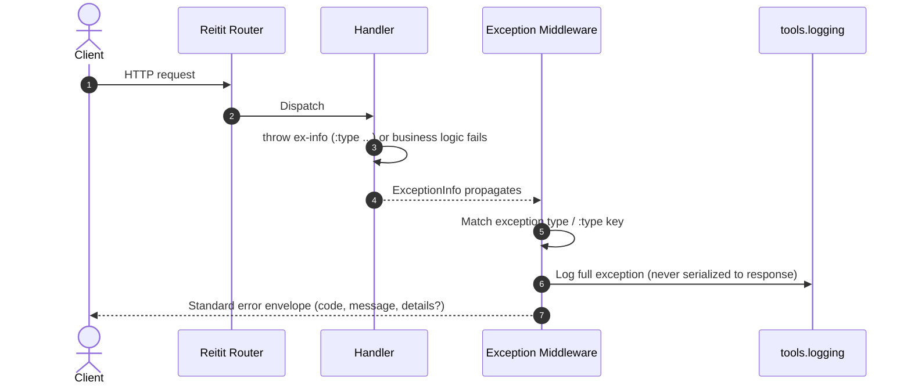
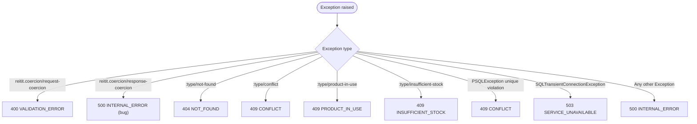

> [INDEX](../INDEX.md) / [Architecture](./) / Error Handling Pipeline

# Error Handling Pipeline

This document defines how exceptions raised anywhere in the backend --- coercion
failures, application-level errors, and unexpected exceptions --- are translated into the
standard error envelope defined in [API Contract](api-contract.md) Section 2.

## 1. Design Principle

Every error that leaves the backend is shaped by a single translation layer. No handler
ever constructs an error response directly --- all errors flow through the exception
middleware, which maps exceptions to the standard error envelope. This guarantees:

- Handlers stay focused on business logic; they raise intent (`:type/not-found`,
  `:type/conflict`, and so on), not HTTP status codes or JSON shapes.
- Exactly one place in the codebase decides what an error response looks like, so the
  envelope shape and the security invariant (Section 5) cannot drift between endpoints.
- Adding a new error case is a one-line addition to the mapping table, not a new
  response-building code path in every handler that might raise it.



## 2. Exception -> Error Code Mapping

| Exception Type | Error Code | HTTP Status | Example |
| -------------- | ---------- | ----------- | ------- |
| `:reitit.coercion/request-coercion` | `VALIDATION_ERROR` | 400 | Invalid field values, unknown fields |
| `:reitit.coercion/response-coercion` | `INTERNAL_ERROR` | 500 | Response doesn't match schema (a bug) |
| Custom `:type/not-found` | `NOT_FOUND` | 404 | Product/order/cart not found |
| Custom `:type/conflict` | `CONFLICT` | 409 | Duplicate SKU |
| Custom `:type/product-in-use` | `PRODUCT_IN_USE` | 409 | Delete product with orders/carts |
| Custom `:type/insufficient-stock` | `INSUFFICIENT_STOCK` | 409 | Checkout with insufficient stock |
| `PSQLException` (unique violation) | `CONFLICT` | 409 | DB-level SKU uniqueness |
| `SQLTransientConnectionException` | `SERVICE_UNAVAILABLE` | 503 | DB unreachable or pool exhausted (HikariCP connection timeout) |
| Any other `Exception` | `INTERNAL_ERROR` | 500 | Unexpected errors |



`PSQLException` is included as a defense-in-depth catch: application code should already
check uniqueness before insert, but a race between the check and the insert can still
raise a DB-level unique violation. Mapping it to `CONFLICT` keeps that race from leaking
as a raw 500 with a SQL exception class name.

## 3. Custom Exception Middleware

The mapping table is implemented with Reitit's `exception/create-exception-middleware`,
which dispatches on exception type and falls back to `::exception/default` for anything
unrecognized:

```clojure
(def exception-middleware
  (exception/create-exception-middleware
    (merge exception/default-handlers
      {::coercion/request-coercion   (coercion-error-handler 400)
       ::coercion/response-coercion  (coercion-error-handler 500)
       :type/not-found               (fn [_ _] {:status 404 :body {:error {:code "NOT_FOUND" ...}}})
       :type/conflict                (fn [_ _] {:status 409 :body {:error {:code "CONFLICT" ...}}})
       :type/product-in-use          (fn [_ _] {:status 409 :body {:error {:code "PRODUCT_IN_USE" ...}}})
       :type/insufficient-stock      (fn [_ _] {:status 409 :body {:error {:code "INSUFFICIENT_STOCK" ...}}})
       org.postgresql.util.PSQLException (psql-exception-handler)
       ::exception/default          (fn [_ _] {:status 500 :body {:error {:code "INTERNAL_ERROR" ...}}})})))
```

Merging over `exception/default-handlers` preserves Reitit's built-in handling for
framework-level exceptions (for example malformed request bodies that fail before
reaching coercion) while overriding the handlers this application cares about.

`psql-exception-handler` inspects `.getSQLState` on the caught `PSQLException`
for `23505` (`unique_violation`) before mapping the response to `CONFLICT`/409.
Any other PSQLException SQLState falls through to the default 500
`INTERNAL_ERROR` handler rather than being blanket-mapped to 409 --- a
`PSQLException` can also signal things like a connection failure or a
constraint violation unrelated to uniqueness, none of which should read back
to the client as a 409 conflict.

## 4. Coercion Error Transformation

Malli's explanation data is not itself the API error shape --- it must be transformed
into the `field`/`reason` pairs documented in [API Contract](api-contract.md) Section 2.

**Verification note (read before relying on the code below):** the exact shape of
`ex-data` for a `:reitit.coercion/request-coercion` exception (specifically, whether
the Malli explanation lives at `:body :explain`, at the top level, or nested
differently) needs REPL verification against Reitit 0.7.2 and Malli 0.16.4 ---
library internals can shift between minor versions. This is tracked as a
verification task for
[T-001 --- Project Scaffolding](../subtasks/ep06/T-001-project-scaffolding.md), where the
coercion middleware is first wired up. The block below is **pseudocode** ---
verify the `ex-data` path against Reitit 0.7.2 at the REPL before treating it as
production-ready:

```clojure
(defn coercion-error-handler [status]
  (fn [exception _request]
    (let [data    (ex-data exception)
          explain (-> data :body :explain)  ;; Malli explanation -- UNVERIFIED path, see note above
          details (when explain
                    (for [[field msgs] (me/humanize explain)]
                      {:field  (name field)
                       :reason (str/join "; " msgs)}))]
      {:status status
       :body   {:error (cond-> {:code    (if (= status 400) "VALIDATION_ERROR" "INTERNAL_ERROR")
                                :message "Validation failed"}
                         details (assoc :details details))}})))
```

## 5. Security Sanitization

The error handler **never** includes any of the following in a response:

- Stack traces or exception class names
- Raw SQL fragments or query plans
- File system paths or internal hostnames
- Raw user input echoed back unsanitized

The `::exception/default` handler catches **all** unexpected exceptions and returns only
`INTERNAL_ERROR` with a generic message. The actual exception --- with full stack trace
and message --- is logged via `tools.logging`, but that detail is never serialized into
the HTTP response. This is the same security invariant documented in
[API Contract](api-contract.md) Section 2: an operator debugging the incident reads the
log; a client (or attacker) receives nothing beyond a generic error code and message.

## 6. Application-Level Error Throwing

Handlers and services never build error responses directly. Instead, they throw
`ex-info` carrying a `:type` key, and the exception middleware (Sections 2-3) does the
translation:

```clojure
(throw (ex-info "Product not found" {:type :type/not-found}))

(throw (ex-info "Duplicate SKU" {:type :type/conflict :sku sku}))

(throw (ex-info "Cannot delete" {:type :type/product-in-use :sku sku :order-count n}))
```

The extra keys in the `ex-info` map (`:sku`, `:order-count`, and so on) are available to
the matching handler for building a human-readable `message`, but they are never
serialized wholesale into the response --- each handler in Section 3 constructs the
response body explicitly, so only the fields the API contract defines are exposed.

## Related Documents

- [API Contract](api-contract.md) --- Section 2 defines the standard error envelope and security invariant
- [Middleware Pipeline](middleware-pipeline.md) --- where exception middleware sits in the Ring/Reitit stack
- [Payload Validation & Pruning](validation-pruning.md) --- how coercion failures are produced upstream
- [Security Guidelines](security-guidelines.md) --- broader security posture beyond error responses
