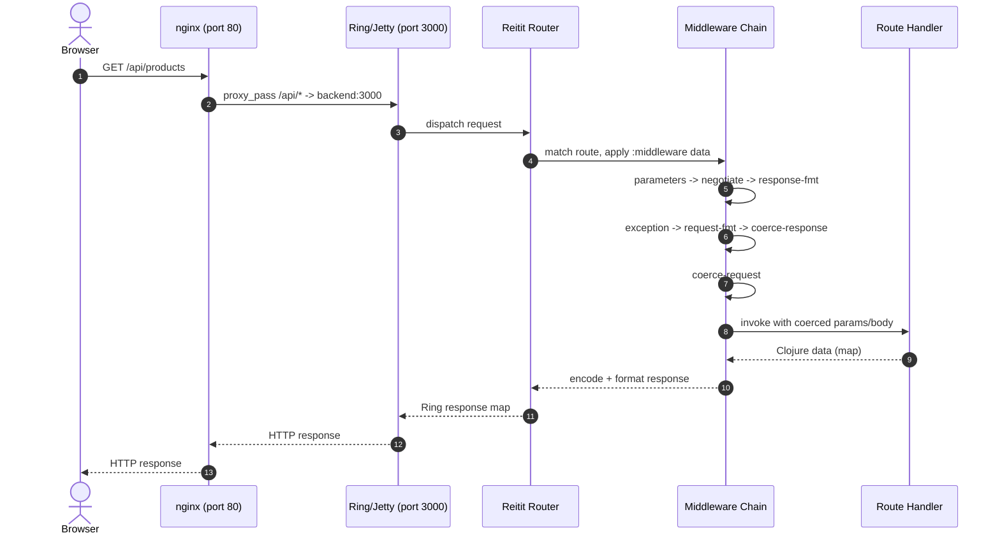
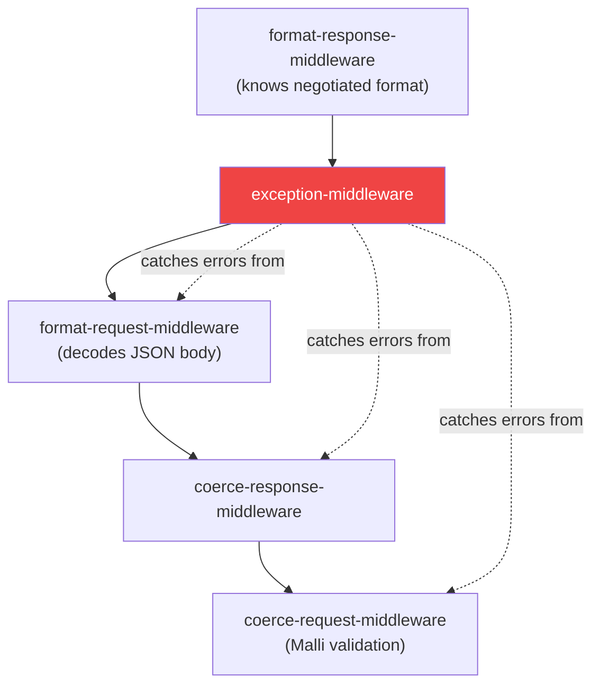
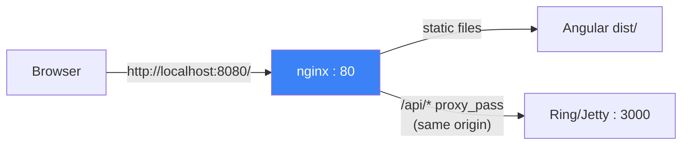

> [INDEX](../INDEX.md) / [Architecture](./) / Middleware Pipeline

# Middleware Pipeline

How an HTTP request travels from the browser to a Reitit handler and back, the exact
Ring middleware ordering the backend enforces, and why that ordering is not
negotiable. This document is the authoritative reference for anyone adding a new
route, a new middleware, or debugging why an error response is not formatted as JSON.

## 1. Request Lifecycle Overview

Every request crosses three boundaries before reaching application code: the nginx
reverse proxy, the embedded Jetty server, and the Reitit middleware chain. The
response retraces the same path in reverse.



**Why nginx sits in front**: nginx serves the compiled Angular static assets at `/`
and proxies everything under `/api/*` to the backend. Both are reachable at the same
origin (`localhost:8080`), which is the foundation of the CORS decision in
Section 4.

## 2. Middleware Stack (Exact Ordering)

Reitit applies middleware in the order they appear in the `:middleware` vector,
wrapping the handler like layers of an onion --- the first entry in the vector is
the outermost layer. Order is not cosmetic: each position depends on state produced
(or not yet destroyed) by its neighbors.

```clojure
[parameters/parameters-middleware      ;; 1. parse query & form params
 muuntaja/format-negotiate-middleware  ;; 2. read Accept / Content-Type headers
 muuntaja/format-response-middleware   ;; 3. encode response body
 exception-middleware                  ;; 4. catch all downstream errors
 muuntaja/format-request-middleware    ;; 5. decode request body
 coercion/coerce-response-middleware   ;; 6. validate response against schema
 coercion/coerce-request-middleware    ;; 7. validate/coerce request (Malli)
 multipart/multipart-middleware]       ;; 8. parse multipart uploads (route-level only)
```

| # | Middleware | Responsibility | Why this position |
| - | ---------- | --------------- | ------------------ |
| 1 | `parameters/parameters-middleware` | Parses query-string and form parameters into `:query-params` / `:form-params`. | Must run before anything reads params. Cheap, has no dependency on format negotiation. |
| 2 | `muuntaja/format-negotiate-middleware` | Reads `Accept` and `Content-Type` headers, decides the response format. | Must run before response encoding and before the exception handler, since both need to know the negotiated format. |
| 3 | `muuntaja/format-response-middleware` | Encodes the handler's Clojure data return value into the negotiated format (JSON). | Must wrap the exception middleware so that error maps thrown downstream are encoded as JSON too, not just successful responses. |
| 4 | `exception-middleware` (custom) | Catches all downstream exceptions: coercion failures, decode failures, application errors. | Sits between response-encoding and request-decoding on purpose --- see explanation below. |
| 5 | `muuntaja/format-request-middleware` | Decodes the request body (JSON text) into a Clojure map under `:body-params`. | Must run after the exception middleware so a malformed JSON body produces a caught, formatted error instead of an unhandled exception. |
| 6 | `coercion/coerce-response-middleware` | Validates the handler's response against the route's Malli response schema. | Runs after decoding so the handler already has clean input; validates what the handler is about to send back. |
| 7 | `coercion/coerce-request-middleware` | Validates and coerces `:body-params` / `:query-params` / `:path-params` against the route's Malli request schema. | Runs last (closest to the handler) so it operates on already-decoded data, and any coercion failure is still caught by the exception middleware above it. |
| 8 | `multipart/multipart-middleware` | Parses `multipart/form-data` bodies (file uploads). | Applied only on routes that accept file uploads (see Section 7), not globally. |

### Why exception-middleware sits between response-encoding and request-decoding

This is the ordering decision most likely to be "fixed" incorrectly by someone
who has not read this document, so it deserves its own explanation.



Two requirements collide at this point in the chain, and only one position
satisfies both:

- **It needs the negotiated format to render errors as JSON.** `exception-middleware`
  must sit *inside* `format-response-middleware` so that when it returns an error
  map (e.g. `{:type :validation-error :errors [...]}`), that map still passes
  through the response encoder and reaches the client as `application/json`,
  not as an unencoded Clojure data structure or a raw stack trace.
- **It needs to catch both decode failures and coercion errors.** Malformed JSON
  bodies fail inside `format-request-middleware`; invalid field values fail inside
  `coerce-request-middleware`. Both of those middlewares sit *below*
  `exception-middleware` in the chain, so any exception they throw propagates
  upward and is caught here.

If `exception-middleware` were moved outside `format-response-middleware`, error
bodies would bypass the Muuntaja encoder and the client could receive an
unformatted response for the same error path that returns formatted JSON on
success --- an inconsistency that breaks the API contract documented in
[API Contract](api-contract.md). If it were moved below
`format-request-middleware`, a malformed JSON body would throw before the
exception handler ever sees it.

## 3. Muuntaja Configuration

This is a JSON-only API. The Muuntaja instance is restricted to a single format
so no other content negotiation branch exists to reason about:

```clojure
(def json-only-muuntaja
  (m/create
    (m/select-formats m/default-options ["application/json"])))
```

`json-only-muuntaja` is passed as `:muuntaja` in the router's `:data` map (see
Section 6). Any client sending `Accept: application/edn` or
`Accept: application/transit+json` receives **406 Not Acceptable**. This is
intentional: the API contract commits to JSON exclusively, and restricting the
format set at the Muuntaja level enforces that contract structurally rather than
by convention. There is no code path that could accidentally serve EDN.
(This 406 behavior depends on Muuntaja's `:default-format` configuration ---
verify at REPL.)

## 4. CORS Decision

**This project does not use CORS middleware.** The same-origin architecture via
the nginx proxy eliminates the need.

nginx serves the compiled Angular frontend at `/` and proxies `/api/*` to the
Ring/Jetty backend, both under the single origin `http://localhost:8080`. The
browser never issues a cross-origin request, so no preflight `OPTIONS` request is
ever generated and no `Access-Control-*` response header is ever required.



### If CORS were needed

For reference, should a future deployment split the frontend and backend across
different origins, `ring-cors/wrap-cors` would need to wrap the **entire**
`ring-handler`, outside the Reitit router:

```clojure
(-> (ring/ring-handler (ring/router routes {...}))
    (wrap-cors :access-control-allow-origin [#"https://example\.com"]
               :access-control-allow-methods [:get :post :put :delete]))
```

This placement matters for the same reason security headers wrap the whole
handler (Section 5): an `OPTIONS` preflight request does not match any declared
route in Reitit, so route-level or router-level middleware never runs for it. Only
middleware wrapping the outermost `ring-handler` sees every request regardless of
whether it matches a route.

## 5. Security Headers Middleware

A minimal, custom middleware adds three security headers to every response:

```clojure
(defn wrap-security-headers [handler]
  (fn [request]
    (-> (handler request)
        (assoc-in [:headers "X-Content-Type-Options"] "nosniff")
        (assoc-in [:headers "X-Frame-Options"] "DENY")
        (assoc-in [:headers "Referrer-Policy"] "no-referrer"))))
```

| Header | Value | Purpose |
| ------ | ----- | ------- |
| `X-Content-Type-Options` | `nosniff` | Prevents the browser from MIME-sniffing a response away from the declared `Content-Type`. |
| `X-Frame-Options` | `DENY` | Blocks the API from being embedded in an `<iframe>`, mitigating clickjacking. |
| `Referrer-Policy` | `no-referrer` | Prevents the `Referer` header from leaking API paths to third parties on outbound navigation. |

Like `wrap-cors` in Section 4, `wrap-security-headers` wraps the entire
`ring-handler`, outside the router, so it applies uniformly --- including to the
default 404 handler and to responses for paths that never matched a route.

**Why not `ring-defaults`**: `ring.middleware.defaults` bundles a wider set of
headers and behaviors, but the current release pins `ring-core` 1.15.5+, which
would drift the project away from the pinned `ring-core` 1.12.2 documented in
[Tech Stack](tech-stack.md). Three explicit lines of code cost less than an
indirect version bump across the whole Ring dependency tree.

## 6. Putting It All Together

The complete assembly, from the innermost router configuration outward to the
process-wide wrappers:

```clojure
(def app
  (-> (ring/ring-handler
        (ring/router
          routes
          {:data {:coercion  malli-coercion
                  :muuntaja  json-only-muuntaja
                  :middleware [parameters/parameters-middleware
                               muuntaja/format-negotiate-middleware
                               muuntaja/format-response-middleware
                               exception-middleware  ;; custom, see error-handling.md
                               muuntaja/format-request-middleware
                               coercion/coerce-response-middleware
                               coercion/coerce-request-middleware]}})
        (ring/create-default-handler))
      (wrap-security-headers)
      (wrap-request-logging)))
```

| Layer | Scope | Contains |
| ----- | ----- | -------- |
| `ring/router` `:data :middleware` | Every declared route | The eight-step chain from Section 2 (minus multipart, which is route-scoped) |
| `ring/create-default-handler` | Unmatched paths | Reitit's default 404 / 405 / 406 responses |
| `wrap-security-headers` | Every response, matched or not | Section 5 headers |
| `wrap-request-logging` | Every request and response, OUTERMOST layer | Request/response logging, see below |

### Request Logging Middleware (`wrap-request-logging`)

`wrap-request-logging` is the OUTERMOST middleware entry --- it wraps everything
else in the pipeline, including `wrap-security-headers`. Logs method, path,
status, duration-ms at INFO level. Exclusions: NEVER logs Cookie/Set-Cookie
headers, request bodies, or response bodies. This is the only place where
request metadata is logged.

> **Note**: the logging middleware is deliberately outermost so it captures the
> final status code (including error middleware transformations) and total
> duration.

There is no global cart-cookie middleware. Cart identity (`wrap-cart-cookie`,
via `buddy-sign`) is applied at the **route level only** --- to `/api/cart/*`
and `/api/checkout` --- as detailed in Section 7 below. It does not run for
the default 404 handler or for any path that does not match one of those
routes, since those requests have no notion of cart state to begin with. Full
detail on the signing scheme lives in [Security Guidelines](security-guidelines.md).

## 7. Route-Level Middleware

Not every middleware applies globally. Reitit supports attaching middleware to a
specific route (or a subtree of routes) through the same `:middleware` key in
that route's data map, which composes with --- and runs inside --- the
router-level middleware from Section 2.

```clojure
["/api"
 ["/imports"
  {:post {:middleware [multipart/multipart-middleware]
          :handler    handle-csv-import}}]

 ["/cart" {:middleware [wrap-cart-cookie]}
  ["/items" {:get  {:handler handle-list-cart-items}
             :post {:handler handle-add-cart-item}}]]

 ["/checkout"
  {:middleware [wrap-cart-cookie]
   :post       {:handler handle-checkout}}]]
```

| Middleware | Scope | Reason it is not global |
| ---------- | ----- | ------------------------ |
| `multipart/multipart-middleware` | `POST /api/imports` only | Only the CSV upload endpoint receives `multipart/form-data`. Applying it globally would add parsing overhead to every JSON request for no benefit. |
| Cart cookie middleware | `/api/cart/*` and `/api/checkout` | Only these routes read or issue the signed cart-identity cookie. Product and search endpoints have no notion of cart state. |

This mirrors the global assembly: middleware is added at the narrowest scope that
still satisfies its purpose, keeping the request path for unrelated routes free
of work they do not need.

## Related Documents

- [Tech Stack](tech-stack.md) --- exact Ring, Reitit, Malli, and Muuntaja versions
- [API Contract](api-contract.md) --- endpoint definitions and response shapes
- [Health Check Strategy](health-check-strategy.md) --- `/api/health` is a
  standard Reitit route and goes through the full middleware chain described
  above like any other route; it needs no bypass, since `wrap-cart-cookie`
  (Section 7) is never applied to it in the first place
- [Validation Pruning](validation-pruning.md) --- Malli schema pruning rules applied during coercion
- [Error Handling](error-handling.md) --- the exception-middleware error taxonomy and response shapes
- [Security Guidelines](security-guidelines.md) --- signed cart cookies and the buddy-sign scheme
