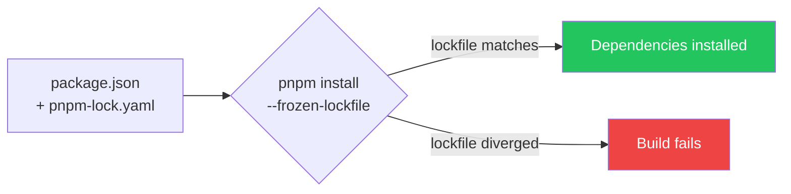

> [INDEX](../INDEX.md) / [Architecture](./) / Frontend Package Management

# Frontend Package Management

## 1. Package Manager

pnpm is the only package manager for the frontend. npm and yarn are explicitly prohibited. The
`packageManager` field in `package.json` enforces this via Corepack — Node.js's built-in tool
manager refuses to run a different package manager than the one declared there, so "someone ran
`npm install` by habit" becomes a hard failure instead of a silent lockfile mismatch.

## 2. package.json Configuration

```json
{
  "packageManager": "pnpm@10.11.0",
  "engines": {
    "node": ">=22.0.0 <23",
    "pnpm": ">=10.0.0 <11"
  }
}
```

The exact pnpm version and its `sha512` integrity hash are set during
[US-001 Project Scaffolding](../user-stories/US-001-project-scaffolding.md) based on the latest
stable pnpm 10.x release available at build time. As with every other dependency in this project
(see [Tech Stack](tech-stack.md)), the version is exact — no floating ranges (`^`, `~`, `*`).

## 3. .npmrc Configuration

```ini
save-exact=true
engine-strict=true
strict-peer-dependencies=true
auto-install-peers=true
resolution-mode=highest
```

| Setting | Purpose |
| ------- | ------- |
| `save-exact=true` | All installed versions are pinned exactly (no `^`, no `~`) |
| `engine-strict=true` | Fail if the Node.js or pnpm version doesn't match `engines` |
| `strict-peer-dependencies=true` | Fail on unresolved peer dependencies instead of warning |
| `auto-install-peers=true` | Auto-install peer dependencies so `strict-peer-dependencies` has something to satisfy |
| `resolution-mode=highest` | Use the highest compatible version when multiple ranges are satisfiable |

## 4. Security Audit

```bash
docker compose run --rm frontend pnpm audit --audit-level high
```

Run as part of the build pipeline (see
[Tech Stack — Section 5](tech-stack.md#5-build-pipeline--quality-gates)). Fails the pipeline on
any `HIGH` or `CRITICAL` severity vulnerability — the same "gate, not aspiration" standard
applied to lint, format, and tests elsewhere in the pipeline.

## 5. Docker Integration

The frontend Dockerfile uses pnpm through Corepack, matching the build-stage description in
[Tech Stack — Section 6](tech-stack.md#6-docker-architecture):

```dockerfile
FROM node:22-alpine AS build
RUN corepack enable && corepack prepare pnpm@10.11.0 --activate
COPY package.json pnpm-lock.yaml .npmrc ./
RUN pnpm install --frozen-lockfile
```

Key: `--frozen-lockfile` makes `pnpm-lock.yaml` authoritative. If `package.json` and
`pnpm-lock.yaml` have diverged — a dependency was added to one but the lockfile was never
regenerated — the install fails loudly at build time instead of silently resolving a different
dependency tree than what was tested.



## 6. Commands (Docker)

All commands run inside the frontend container — no local Node.js or pnpm install, consistent
with the zero-local-install guarantee in
[Tech Stack — Section 6](tech-stack.md#6-docker-architecture):

```bash
docker compose run --rm frontend pnpm install                    # install deps
docker compose run --rm frontend pnpm audit --audit-level high   # security audit
docker compose run --rm frontend pnpm exec ng build              # Angular build
docker compose run --rm frontend pnpm exec ng lint                # lint
docker compose run --rm frontend pnpm exec vitest run              # tests
```

`pnpm exec` replaces `npx` — consistent with pnpm as the sole package manager. These are the
same commands already wired into the build pipeline's Command Reference (see
[Tech Stack — Section 9](tech-stack.md#9-key-commands--quality-gate-echoes)).

## 7. Why pnpm Over npm/yarn

- **Strict dependency resolution** prevents phantom dependencies — code cannot silently import
  a package that is only a transitive dependency of something else, because pnpm's
  content-addressable `node_modules` layout does not hoist everything into a flat, accessible
  root the way npm/yarn classic do.
- **Content-addressable storage** reduces disk usage: identical package versions are stored once
  on disk and hard-linked into every project that needs them, rather than duplicated per
  project.
- **`engine-strict` prevents "works on my machine" issues** by failing fast when the Node.js or
  pnpm version does not match what the project declares, rather than allowing a mismatched
  toolchain to produce a build that differs from CI.
- **Audit integration** (`pnpm audit`) catches known vulnerabilities as a pipeline gate, the same
  category of automated, deterministic check the rest of the build pipeline relies on (see
  [Tech Stack — Section 5](tech-stack.md#5-build-pipeline--quality-gates)).

## Related Documents

- [Tech Stack](tech-stack.md) — Node.js version, Angular version, Docker build stages
- [Testing Strategy](testing-strategy.md) — how `pnpm exec vitest run` fits into the unit and
  integration test commands
