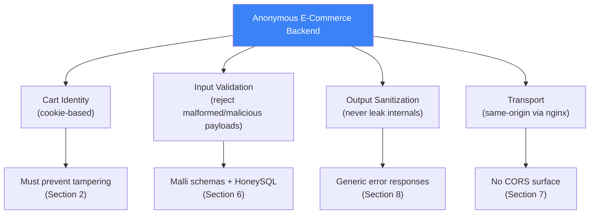
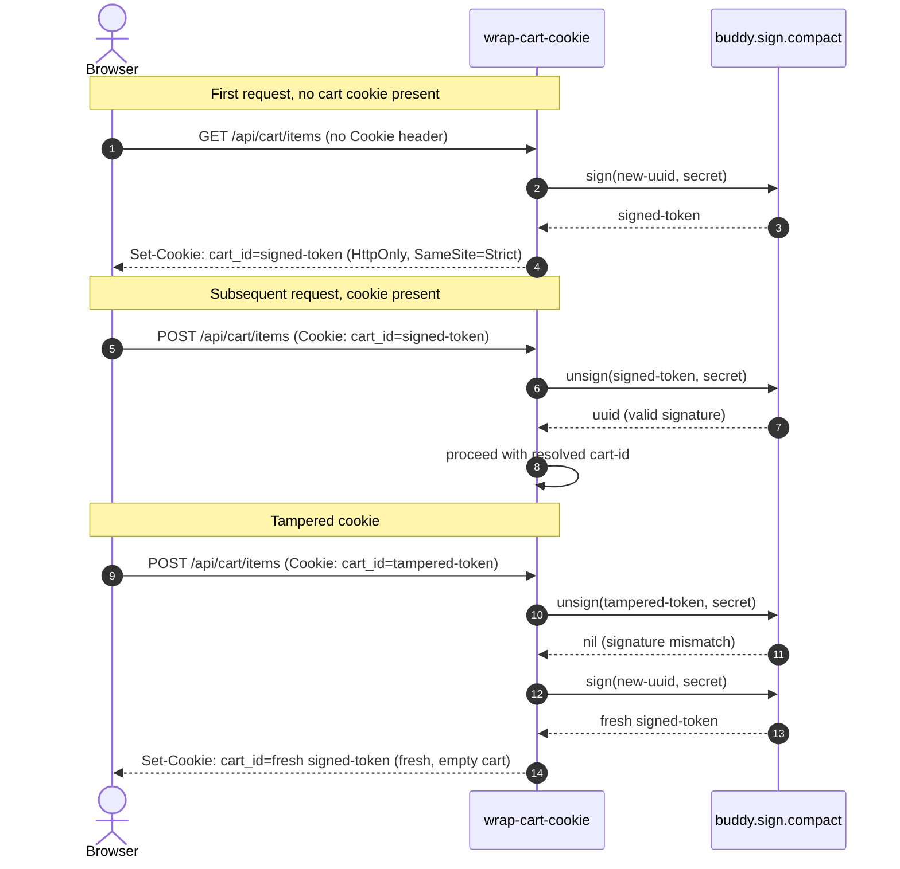
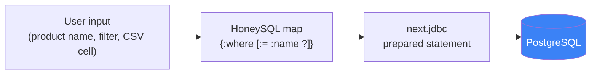
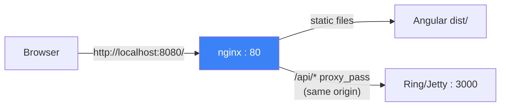

> [INDEX](../INDEX.md) / [Architecture](./) / Security Guidelines

# Security Guidelines

This document defines the security model for an anonymous e-commerce cart backend
built on Ring 1.12.2, Reitit 0.7.2, and buddy-sign 3.4.0. It explains what is
protected, how, and --- just as importantly --- what is deliberately deferred and
why. Anyone adding an endpoint, a cookie, or a new dependency should read this
first to understand which decisions are load-bearing and which are scope cuts.

## 1. Security Model Overview

There is no user authentication in this application. The cart is anonymous ---
identified only by a signed cookie, not by a logged-in principal. That single fact
shapes the entire threat model: there is no session to hijack, no account to take
over, no privilege boundary to escalate across. The security surface reduces to
four concerns.



Each of these four boxes maps directly to a section below. Nothing in this document
addresses authentication, authorization, or rate limiting --- see Section 11 for
why those are out of scope for this challenge.

## 2. Cart Cookie --- Signed Identity

The cart is identified by a UUID (`cart_id`) carried in a cookie. Because the
cookie is the only thing standing between "this is my cart" and "this is anyone's
cart," it must be tamper-evident: a client must not be able to forge or guess
another cart's identifier by editing the cookie value.

This is solved with HMAC-SHA256 signing via `buddy-sign`, not by making the UUID
itself unguessable. The cookie does not need to be secret --- a UUID is already
high-entropy --- it needs to be **unforgeable**, so the server can trust that any
`cart_id` it receives back is one it issued.



### Implementation

```clojure
(ns ecommerce.cart.cookie
  (:require [buddy.sign.compact :as compact]))

(def ^:private secret
  (or (System/getenv "CART_COOKIE_SECRET")
      (throw (ex-info "CART_COOKIE_SECRET required" {}))))

(defn sign-cart-id [cart-id]
  (compact/sign (str cart-id) secret))

(defn unsign-cart-id [token]
  (try
    (java.util.UUID/fromString (compact/unsign token secret))
    (catch Exception _ nil)))
```

- `compact/sign` produces a base64 URL-safe token: payload + HMAC-SHA256 signature,
  concatenated compactly (no JSON envelope, unlike `buddy.sign.jwt`).
- `compact/unsign` verifies the signature using constant-time comparison and
  returns the original payload string, or throws if the signature does not match.
- `unsign-cart-id` wraps that in a `try/catch` and normalizes both signature
  failures and malformed UUID strings to `nil` --- the caller only ever has to
  handle "valid UUID" or "nothing," never a raised exception.

### Secret loading --- fail fast, not fail silent

The secret is read once, at namespace load time, directly from
`CART_COOKIE_SECRET`. If the environment variable is unset, the `ex-info` throws
during application startup, before Jetty binds to a port. This is deliberate: a
missing secret must be a boot-time failure, not a runtime `NullPointerException`
buried inside the first request that tries to sign a cookie. Fail fast at the
boundary where the mistake was made (deployment configuration), not deep inside
request-handling code.

Key generation and injection:

```bash
openssl rand -base64 32
```

The generated value is injected via Docker Compose, never committed to the
repository:

```yaml
services:
  backend:
    environment:
      CART_COOKIE_SECRET: ${CART_COOKIE_SECRET}
```

### Behavior on a tampered cookie

`unsign-cart-id` returns `nil` for any cookie whose signature does not verify ---
whether that is because a client edited the UUID, truncated the token, or the
token was generated with a different secret entirely. When that happens, the
server does not attempt to repair or interpret the cookie: it treats the request
as if no cookie were present and issues a fresh cart.

This is the intentional, safe default. Two outcomes are possible for a tampered
cookie:

1. It is an attack attempt (a client trying to guess or forge another cart's
   identity) --- the correct response is to refuse it, not to reward it with
   access to anything.
2. It is accidental corruption (a browser extension mangling cookies, a proxy
   truncating headers) --- the user loses their in-progress cart, which is an
   acceptable degradation for a cart that has no persistent account tying it to
   the user across devices anyway.

Both cases resolve to the same code path: discard, reissue, move on. There is no
silent "best effort" recovery that would blur the line between a legitimate and a
forged identifier.

## 3. Cookie Attributes --- Defense in Depth

Each attribute on the `cart_id` cookie closes a specific attack surface. None of
them alone is sufficient; together they form layered defense.

| Attribute | Value | Purpose |
| --------- | ----- | ------- |
| `HttpOnly` | `true` | JS cannot read the cookie value (mitigates XSS cookie theft) |
| `SameSite` | `Strict` | Browser never sends the cookie on cross-site requests (mitigates CSRF) |
| `Path` | `/api/cart` | Cookie only sent to cart-related endpoints |
| `Max-Age` | `2592000` (30 days) | Cart persists for 30 days |
| `Secure` | `false` (dev) | Challenge runs on HTTP localhost; would be `true` in production |

`Secure: false` is a deliberate, environment-scoped exception, not a general
recommendation. Section 11 documents TLS as an explicitly deferred concern for the
same reason: this evaluation runs over plain HTTP on `localhost`. A production
deployment behind TLS must flip this to `true` --- otherwise the `HttpOnly` and
`SameSite` protections above would still work, but the cookie itself would
traverse the network in plaintext.

## 4. CSRF Protection

**`SameSite=Strict` is the complete CSRF mitigation for this application.** No
anti-forgery token is used, and none is needed.

### Why it is sufficient

- With `SameSite=Strict`, the browser omits the `cart_id` cookie on *any*
  cross-site request --- including top-level navigations arriving from an
  external link. A malicious page hosted anywhere else cannot cause the browser
  to attach the victim's cart cookie to a request against this API.
- There is no user authentication, so there is no authenticated session to
  hijack via CSRF in the traditional sense (no "transfer funds" or "change
  password" action tied to a logged-in identity).
- The only cookie-authenticated actions are cart operations: add item, remove
  item, checkout. None of these are destructive in the way an admin action or an
  account-level mutation would be --- worst case, an attacker who somehow forced
  a request would only be able to manipulate the victim's own anonymous cart
  contents, not read or modify data belonging to anyone else.

### Why no anti-forgery token

- `ring-anti-forgery` is designed for server-rendered HTML forms backed by
  cookie sessions, where a hidden form field carries a token back to the server.
  Neither server-rendered forms nor server-side sessions exist here --- the
  frontend is an Angular single-page application talking JSON over `fetch`.
- Layering a CSRF token on top of a JSON API that already has
  `SameSite=Strict` protection is redundant complexity: it would require issuing,
  storing, and validating a second token whose only job duplicates what the
  cookie attribute already guarantees at the browser level.

### What `SameSite=Strict` does NOT protect against

`SameSite=Strict` stops the cookie from being **sent** on cross-site requests. It
does nothing about a request that is same-origin to begin with. If the frontend
itself were compromised by XSS, a malicious script running on
`localhost:8080` could issue same-origin `fetch` calls that legitimately carry the
cart cookie --- `SameSite` would not stop that, because from the browser's
perspective it is not a cross-site request at all. That failure mode is an XSS
problem, not a CSRF problem, and is mitigated separately by input validation and
Angular's automatic template escaping (Section 6).

## 5. Security Headers

A minimal, custom middleware --- not `ring-defaults` --- adds three headers to
every response:

```clojure
(defn wrap-security-headers [handler]
  (fn [request]
    (-> (handler request)
        (assoc-in [:headers "X-Content-Type-Options"] "nosniff")
        (assoc-in [:headers "X-Frame-Options"] "DENY")
        (assoc-in [:headers "Referrer-Policy"] "no-referrer"))))
```

| Header | Value | Purpose |
| ------ | ----- | ------- |
| `X-Content-Type-Options` | `nosniff` | Prevents the browser from MIME-sniffing a response away from the declared `Content-Type` |
| `X-Frame-Options` | `DENY` | Blocks the API from being embedded in an `<iframe>`, mitigating clickjacking |
| `Referrer-Policy` | `no-referrer` | Prevents the `Referer` header from leaking API paths to third parties on outbound navigation |

### Why NOT ring-defaults

- `ring-defaults` 0.7.1 pins `ring-core` at 1.13.0+. This project pins
  `ring-core` 1.12.2 (see [Tech Stack](tech-stack.md)). Adding `ring-defaults`
  would silently bump `ring-core` transitively, violating the version-pinning
  policy for no functional gain.
- `ring-defaults` is designed for full websites: cookie sessions, CSRF-protected
  HTML forms, static file serving. This is a pure JSON API with none of those
  concerns.
- The three headers above are the complete set relevant to a JSON API:
  - HSTS is skipped because the challenge runs over HTTP on `localhost` --- an
    `HSTS` header on a non-HTTPS origin is meaningless and can even be
    counter-productive during local evaluation.
  - Content-Security-Policy belongs on the nginx/Angular layer, which serves
    HTML and controls script sources, not on a backend that only ever emits
    `application/json`.

## 6. Input Security

### SQL Injection

All SQL is generated via HoneySQL (parameterized by construction) and executed
through `next.jdbc` prepared statements. There is no string concatenation of user
input into a query, anywhere in the codebase. Parameters are always bound values,
never interpolated text.



The CSV import test suite confirms this behavior directly: a row containing
`'; DROP TABLE products; --` in a text field is stored as an inert string value,
not interpreted as SQL. There is no code path where that would be possible, since
the value never leaves the parameter-binding boundary of the prepared statement.

### XSS

Strategy: **store raw, encode on output** (see
[Validation Pruning](validation-pruning.md) for the full pruning and sanitization
rules).

- Angular auto-escapes template bindings (`{{ }}`), so any string value rendered
  in the UI --- including one containing `<script>` --- is displayed as literal
  text, never executed as markup.
- The backend serves JSON only. There is no server-side HTML templating anywhere
  in the request path, so there is no server-side injection point for markup to
  execute.
- CSV import explicitly **rejects** rows containing `<script>` tags as a
  security test requirement --- this is a defense-in-depth rejection at the
  input boundary, in addition to (not instead of) Angular's output escaping.
- Error responses never echo raw user input back into a message body (Section
  8), closing the reflected-XSS-via-error-message path some APIs leave open.

### Payload Pruning

Malli schemas declared with `:closed true` reject any request body containing an
unknown field, responding with `400` before the field ever reaches a handler. No
unrecognized key --- extra, misspelled, or maliciously injected --- is silently
dropped or silently accepted; it is rejected at the coercion boundary. Full
schema-level detail lives in [Validation Pruning](validation-pruning.md).

## 7. Transport Security

The same-origin architecture eliminates CORS as a concern entirely, rather than
configuring it permissively or restrictively.



- nginx serves the compiled Angular frontend at `/` (port 80).
- nginx proxies `/api/*` to the backend (port 3000).
- The browser only ever observes a single origin, `localhost:8080`. No
  cross-origin request is ever issued, so no preflight `OPTIONS` request is
  generated and no `Access-Control-*` response header is ever required. Full
  reasoning for this decision is in
  [Middleware Pipeline, Section 4](middleware-pipeline.md).

## 8. Error Response Sanitization

The error-handling pipeline (full taxonomy in
[Error Handling](error-handling.md)) guarantees that no response body, under any
failure mode, contains:

- Stack traces or exception class names
- Raw SQL fragments or query plans
- File system paths or internal hostnames
- Database connection strings or credentials

Every unexpected exception is mapped to a generic `INTERNAL_ERROR` response with a
fixed, non-descriptive message. The full exception --- stack trace included --- is
logged server-side only, where an operator can retrieve it, but it never crosses
the process boundary into an HTTP response. This is the same principle as
Section 2's "fail fast, don't leak": errors are informative to the people
operating the system and opaque to the client making the request.

## 9. Dependency --- buddy-sign

The only new security dependency introduced for this feature:

```clojure
;; deps.edn
buddy/buddy-sign {:mvn/version "3.4.0"}
```

`buddy-sign` provides HMAC-SHA256 signing with constant-time signature
comparison, base64 URL-safe encoding, and algorithm negotiation, all implemented
and audited by a third-party cryptography library. No cryptographic primitive is
hand-rolled anywhere in this codebase --- signing, comparison, and encoding are
delegated entirely to `buddy-sign`.

## 10. Key Management

For the scope of this challenge:

- A single secret, `CART_COOKIE_SECRET`, lives in the Docker Compose
  `environment:` block.
- It is generated once, via `openssl rand -base64 32`, before the containers are
  brought up.
- There is no key rotation. This is deferred deliberately (see Section 11), not
  an oversight.

### What production key rotation would require

Rotating `CART_COOKIE_SECRET` in a running production system is not a drop-in
replacement of one environment variable for another, because carts signed with
the old secret are still in circulation (up to the 30-day `Max-Age` from Section
3). A zero-downtime rotation would need:

1. The verification path to accept signatures produced by **either** the old or
   the new secret during a transition window --- typically by trying the new key
   first and falling back to the old key on failure.
2. The signing path to switch to the new secret immediately, so newly issued
   cookies are signed with it going forward.
3. A transition window at least as long as the cookie's `Max-Age`, after which
   the old secret can be safely discarded, since every cookie signed with it will
   have expired.

None of this is implemented here --- it is documented so that whoever moves this
system toward production understands the shape of the work, rather than
discovering it the hard way during an incident.

## 11. Deferred Security Concerns

The following are explicitly out of scope for this challenge. Each is deferred
because the challenge's scope --- an anonymous cart, a single evaluator, a local
Docker Compose environment --- does not require it, not because it is unimportant
in a production context.

| Concern | Why it is deferred here |
| ------- | ------------------------ |
| User authentication and authorization | There are no user accounts; the entire application is intentionally anonymous |
| Rate limiting | Single local evaluator, not a multi-tenant public deployment |
| Key rotation | 3-day challenge scope; see Section 10 for what it would require |
| HTTPS/TLS | Evaluator runs locally over HTTP; `Secure` cookie flag documented as a production follow-up (Section 3) |
| Content Security Policy | Belongs on the nginx/static-asset layer serving HTML, not on a JSON-only API |
| Audit logging | No authenticated identity to attribute actions to; error logging (Section 8) covers operational diagnosis |

## Related Documents

- [API Contract](api-contract.md) --- endpoint definitions and response shapes
- [Middleware Pipeline](middleware-pipeline.md) --- where `wrap-cart-cookie` and
  `wrap-security-headers` sit in the request chain
- [Validation Pruning](validation-pruning.md) --- Malli `:closed` schemas and
  payload pruning rules
- [Error Handling](error-handling.md) --- the exception-middleware error
  taxonomy and sanitized response shapes
- [Testing Strategy](testing-strategy.md) --- security test cases (SQL
  injection, `<script>` rejection, cookie tampering)
- [Health Check Strategy](health-check-strategy.md) --- why `/api/health` bypasses cart-cookie middleware
