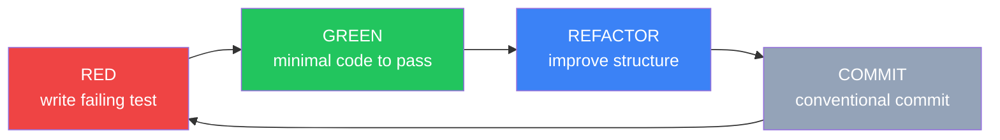

> [INDEX](../INDEX.md) / [Architecture](./) / TDD Workflow

# TDD Workflow

[Testing Strategy — Section 7](testing-strategy.md#7-tdd-workflow) states the Red-Green-Refactor
contract in brief: every unit of business logic is test-driven, in that order, with a commit at
the end of the cycle. This document is the expanded, project-specific version of that contract —
it exists so that "write a failing test first" has a concrete, repeatable shape for both the
Clojure backend and the Angular frontend, instead of remaining a one-paragraph policy statement.

Treat [Testing Strategy](testing-strategy.md) as the parent document: it defines *what* must be
tested (the pyramid, the per-epic test matrix, the security test cases). This document defines
*how* the test-first cycle is executed, step by step, with real code from this project's stack.

## 1. The Red-Green-Refactor Cycle



Each step is scoped narrowly, on purpose. A step that tries to do more than its name implies
(e.g., "green" that also refactors, or "refactor" that also adds a feature) breaks the cycle's
core guarantee: that at every commit boundary, the suite is green and the diff is explainable
as exactly one of "added a test," "made it pass," or "improved structure without changing
behavior."

### RED

Write a test that exercises **one** acceptance criterion from the user story — not the whole
story, one bullet of it. Run the suite:

```bash
docker compose run --rm backend clojure -M:test
```

Confirm the test **fails for the expected reason**. "Fails" is not enough on its own — a test
that fails because of a typo in the namespace require, a missing function that should exist
already, or a malformed fixture is not a valid Red. The failure message must point at the
missing behavior (e.g., `Unable to resolve symbol: validate-product`, or an assertion mismatch
on the expected value), not at an unrelated error. If the failure reason is ambiguous, fix the
test setup before treating the step as complete.

### GREEN

Write the **minimum** code required to make the failing test pass. No premature abstractions,
no interfaces for a second implementation that does not exist yet, no "while I'm here" cleanup
of adjacent code. The implementation is allowed to be inelegant — a hardcoded value, a single
`if` instead of a general rule — because the Refactor step exists precisely to fix that once the
suite proves the behavior is correct.

### REFACTOR

With **all** tests green (not just the one just added — the full suite), improve the
implementation's structure: extract duplication, apply SOLID, DRY, KISS, and the project's
Clean/Hexagonal Architecture boundaries (see [Tech Stack](tech-stack.md)). Re-run the full test
suite after **every** individual refactor step, not just once at the end — a refactor is a
sequence of small, independently-verified transformations, not one large rewrite validated in
one pass.

### COMMIT

Commit the Red-Green-Refactor unit as one coherent change, in [conventional commits
format](https://www.conventionalcommits.org/):

```bash
git commit -m "feat(product): add price validation"
```

The commit contains both the test and the implementation that makes it pass. See
[Section 6](#6-commit-discipline) for the full discipline this implies.

## 2. What Gets Test-Driven vs What Doesn't

| Category | Test-driven? | Example |
| -------- | ------------- | ------- |
| Validation rules | Yes | Price > 0, SKU non-empty, stock >= 0 |
| Repository functions | Yes (integration) | Product CRUD against Testcontainers PostgreSQL |
| API handlers | Yes (integration) | `POST /api/products` returns 201 with a valid body |
| CSV row parsing | Yes | Each of the trap types in [Testing Strategy — Section 4](testing-strategy.md#4-test-data-strategy) gets its own test |
| Cart operations | Yes | Add item, update quantity, stock check |
| Checkout atomicity | Yes (integration) | Concurrent checkout race test |
| Docker config | No | Scaffolding, no business logic |
| nginx config | No | Infrastructure, tested via E2E |
| Migration files | No | DDL, verified indirectly by integration tests |

The dividing line is the same one [Testing Strategy — Section 1](testing-strategy.md#1-testing-philosophy)
draws: if a rule can be stated as "given this input, the system must produce that output or
reject it with this reason," it is business logic and it is test-driven. If a file only wires
tools together (a `Dockerfile`, an `nginx.conf`, a schema migration), there is no rule to encode
in a test, and the R-G-R cycle does not apply — see [Section 7](#7-when-tdd-doesnt-apply).

## 3. Concrete Example: Product Price Validation

### RED

```clojure
(deftest price-must-be-positive
  (is (= {:price ["must be greater than 0"]}
         (validate-product {:name "Widget" :sku "W-001" :price -5 :stock 10}))))
```

Run the suite. It fails with `Unable to resolve symbol: validate-product` — `validate-product`
does not exist yet. That is the expected failure reason: the test names the function under test
before the function exists.

### GREEN

```clojure
(defn validate-product [data]
  (when-let [explanation (m/explain ProductSchema data)]
    (me/humanize explanation)))
```

Run the suite again. It passes: `m/explain` returns an explanation for the negative price,
`me/humanize` turns it into the field-keyed message map the test asserts on.

### REFACTOR

With the suite green, apply a structural improvement that does not change behavior — for
example, extracting `ProductSchema` into a shared `product.schema` namespace so both the
handler and the CSV import pipeline reference the same definition, or adding a docstring to
`validate-product` documenting that it returns `nil` on a valid payload. Re-run the suite after
the extraction to confirm nothing broke.

## 4. Integration Test Cycle

Integration tests follow the identical three-step cycle; the only difference is that Green
touches more layers (handler, service, repository) because the test asserts on the full request
path rather than a pure function.

### RED

```clojure
(deftest ^:integration create-product-persists
  (let [response (app (mock/request :post "/api/products"
                        (json/write-str {:name "Widget" :sku "W-001" :price 9.99 :stock 10})))]
    (is (= 201 (:status response)))
    (is (= "W-001" (-> response :body :sku)))))
```

The `^:integration` namespace metadata is what Kaocha's `--focus-meta`/`--skip-meta` filters on
(see [Testing Strategy — Section 6](testing-strategy.md#6-test-commands)), so this test runs
against a real Testcontainers-managed PostgreSQL instance rather than an in-memory stub. Run it
and confirm it fails because the `/api/products` route does not exist yet (a 404, or a route
resolution error) — not because of a Testcontainers startup failure, which would be an
infrastructure problem to fix first, not a valid Red.

### GREEN

Implement the handler, the service function it delegates to, and the repository function that
performs the `INSERT`, plus the route registration that wires them together. Nothing beyond
what the test requires — no update or delete handling yet if this test only covers create.

### REFACTOR

Extract common test helpers (e.g., a `post-json` request-building helper used across every
handler integration test) and confirm the handler delegates to the service layer rather than
embedding persistence logic directly — the same Hexagonal boundary documented in
[Tech Stack](tech-stack.md) applies to test-driven code, not just to the final shape of the
codebase.

## 5. Frontend TDD (Angular + Vitest)

The same Red-Green-Refactor cycle applies to the Angular frontend, run through:

```bash
docker compose run --rm frontend pnpm exec vitest run
```

- **Component and service tests** are test-driven the same way Clojure functions are: a failing
  Vitest spec is written first, against one behavior, then the minimal component/service code
  is added to satisfy it.
- **Zod schema validation tests mirror the Malli rules** documented in
  [Tech Stack — Section 8](tech-stack.md#8-validation-strategy). A Zod schema test and its Malli
  counterpart assert the same accept/reject decision for the same input, keeping the parallel
  validation contract honest.
- **Container components** (which inject services and hold state) get integration-style tests
  that exercise the component against a mocked HTTP layer (MSW), per
  [Testing Strategy — Section 2](testing-strategy.md#2-test-pyramid).
- **Presentational components** (which only receive `input()` and emit `output()`) get
  rendering tests: given these inputs, the template renders this DOM — no service mocking
  required, because there are no services to mock.

## 6. Commit Discipline

Each Red-Green-Refactor cycle produces exactly **one** commit:

- The commit includes both the test and the implementation that makes it pass — never split
  across two commits.
- Conventional commits format: `feat(product): add price validation`,
  `fix(cart): reject quantity exceeding stock`, `test(csv): cover duplicate SKU trap`.
- **Never commit a failing test.** The Green step must be complete before the commit exists —
  a red test in version control history means the cycle was interrupted, not completed.
- **Never commit implementation without its test.** A diff that introduces new logic with no
  accompanying test is not acceptable under this workflow, per
  [Testing Strategy — Section 1](testing-strategy.md#1-testing-philosophy)'s "no implementation
  without a preceding failing test" commitment.

## 7. When TDD Doesn't Apply

Pure scaffolding tasks — [US-001 Project Scaffolding](../user-stories/US-001-project-scaffolding.md)
is the canonical example — have no business logic to test-drive. There is no rule of the form
"given X, reject with reason Y" in a `Dockerfile`, a `docker-compose.yml`, or a dependency
manifest; there is only "does it build, does it start, does it respond."

These tasks are verified through quality gates instead of R-G-R cycles:

- Docker images build successfully (Stage 1 of the [Build Pipeline](tech-stack.md#5-build-pipeline--quality-gates)).
- The health endpoint responds once dependencies are ready (see
  [Health Check Strategy](health-check-strategy.md)).
- Database tables exist after migrations run.

This is not an exemption from rigor — it is the same "required, gated, reviewable" standard
[Testing Strategy — Section 8](testing-strategy.md#8-coverage-policy) applies everywhere else,
just expressed as infrastructure checks rather than unit assertions, because there is no domain
rule for a unit assertion to encode.

## Related Documents

- [Testing Strategy](testing-strategy.md) — parent document; test pyramid, per-epic test matrix,
  test data strategy, security test cases, coverage policy
- [Middleware Pipeline](middleware-pipeline.md) — request/response middleware exercised by
  integration tests
- [API Contract](api-contract.md) — request/response shapes asserted in handler integration tests
