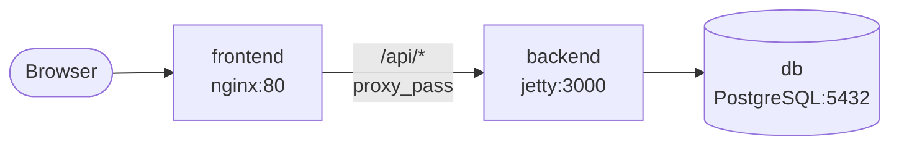
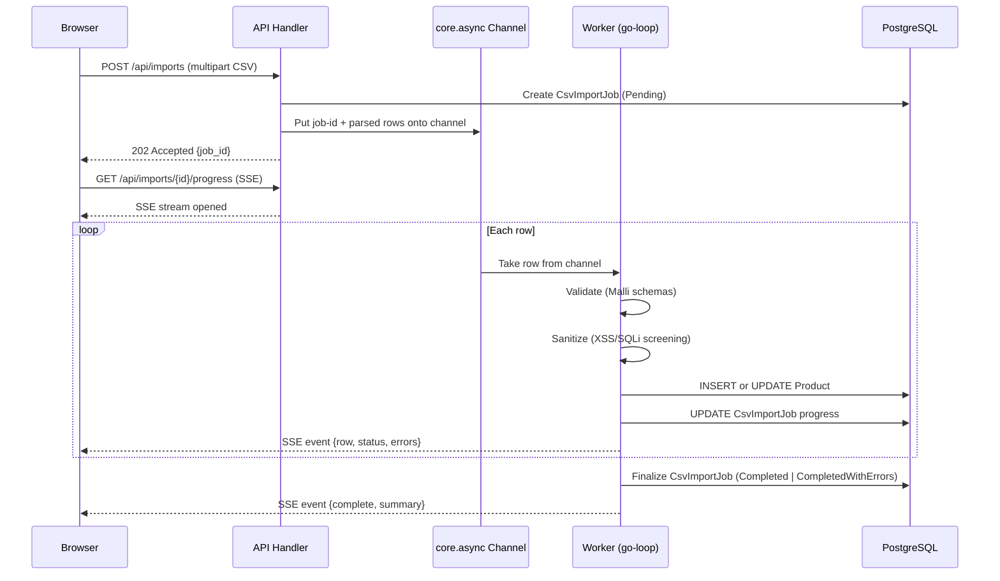
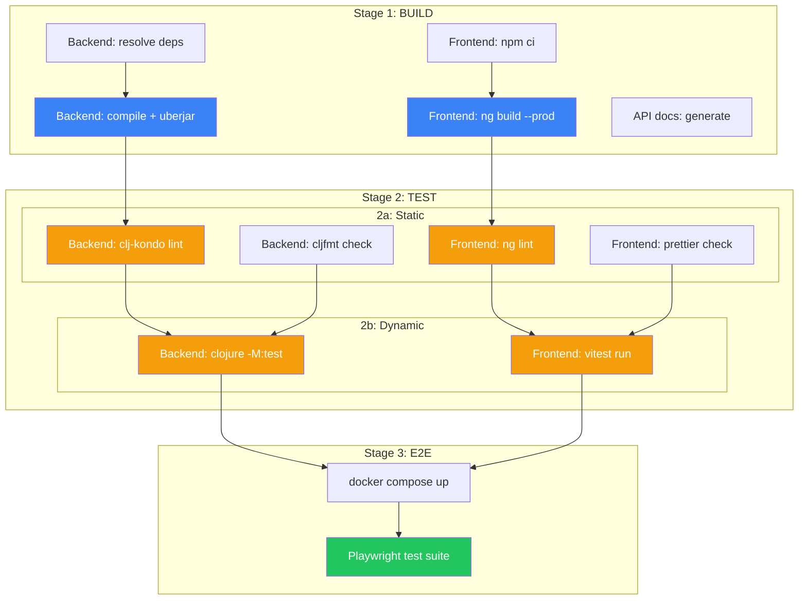

> [INDEX](../INDEX.md) / [Architecture](./) / Tech Stack

# Tech Stack

Technology choices, exact versions, rationale, and alternatives considered for the
Gila Software e-commerce challenge. Every runtime and build tool lives exclusively
inside Docker containers --- nothing is installed on the developer's host machine.

## 1. Stack Overview

| Layer | Technology | Version | Purpose |
| ----- | ---------- | ------- | ------- |
| Backend language | Clojure | 1.12.0 | Business logic, API, CSV pipeline |
| Backend runtime | JDK (Eclipse Temurin) | 21 LTS | JVM runtime for Clojure |
| Web server | Ring + Reitit | Ring 1.12.2, Reitit 0.7.2 | HTTP handling, data-driven routing |
| Validation (BE) | Malli | 0.16.4 | Data-driven schema validation |
| Database access | next.jdbc + HoneySQL | next.jdbc 1.3.955, HoneySQL 2.6.1235 | SQL-first data access, no ORM |
| Async processing | core.async | 1.7.790 | Background job queue for CSV import |
| Build tool | tools.build | 0.10.7 | Clojure compilation, uberjar packaging |
| Frontend framework | Angular | 22.0.0 | User interface (zoneless, strict, signals) |
| Frontend runtime | Node.js | 22 LTS | Build tooling (in container only) |
| Bundler | Angular CLI (esbuild) | 22.0.0 | Frontend build and dev server |
| Validation (FE) | Zod | 3.24.4 | Client-side schema validation |
| Database | PostgreSQL | 17.5 | Relational data store |
| Reverse proxy | nginx | 1.27-alpine | Serve frontend static assets |
| Containerization | Docker + Compose | Compose v2 | Orchestration, zero-local-install |

## 2. Backend

### Language and Runtime

**Clojure 1.12.0** on **JDK 21 LTS** (Eclipse Temurin distribution).

Clojure is chosen from the allowed set (Java, Clojure, Python, PHP, Go) because:

- **Data-oriented**: Clojure's immutable data structures and sequence abstractions are a
  natural fit for a CSV import pipeline that transforms rows through validation stages.
- **JVM ecosystem**: access to mature JDBC drivers, connection pooling (HikariCP), and
  production-grade HTTP servers (Jetty) without reinventing infrastructure.
- **REPL-driven development**: fast feedback loops offset the tight 3-day deadline.
- **Concurrency primitives**: `core.async` channels provide structured background
  processing without external job queue dependencies.

The JDK is installed only inside the Docker build container. The developer's host machine
has no JVM, no Clojure CLI, no Leiningen.

### Libraries

| Library | Version | Purpose |
| ------- | ------- | ------- |
| `org.clojure/clojure` | 1.12.0 | Language runtime |
| `ring/ring-core` | 1.12.2 | HTTP request/response abstraction |
| `ring/ring-jetty-adapter` | 1.12.2 | Embedded Jetty HTTP server |
| `metosin/reitit` | 0.7.2 | Data-driven routing, middleware, coercion |
| `metosin/malli` | 0.16.4 | Data-driven schemas, validation, transformation |
| `com.github.seancorfield/next.jdbc` | 1.3.955 | JDBC wrapper, connection pooling |
| `com.github.seancorfield/honeysql` | 2.6.1235 | SQL generation from Clojure data structures |
| `org.postgresql/postgresql` | 42.7.5 | PostgreSQL JDBC driver |
| `com.zaxxer/HikariCP` | 6.2.1 | Connection pool |
| `org.clojure/core.async` | 1.7.790 | Async channels for background processing |
| `org.clojure/data.csv` | 1.1.0 | CSV parsing |
| `org.clojure/data.json` | 2.5.1 | JSON serialization |
| `org.clojure/tools.logging` | 1.3.0 | Logging facade |
| `ch.qos.logback/logback-classic` | 1.5.16 | Logging implementation |

All versions are pinned exactly in `deps.edn` --- no floating ranges, no `RELEASE` or
`LATEST` markers.

### Alternatives Considered

| Alternative | Why Not |
| ----------- | ------- |
| **Java (Spring Boot)** | Viable but verbose for a 3-day prototype. Spring's annotation-heavy model increases boilerplate without proportional benefit at this scale. |
| **Python (FastAPI)** | Strong for rapid prototyping, but weaker concurrency model for background CSV processing. No JVM ecosystem access. |
| **Go (Gin/Echo)** | Excellent for concurrent services, but less expressive for data transformation pipelines. No REPL-driven development. |
| **PHP (Laravel)** | Mature CRUD framework, but async background processing requires external queue (Redis/RabbitMQ), adding infrastructure complexity. |

## 3. Frontend

### Framework and Runtime

**Angular 22.0.0** (zoneless, strict mode, signals, resources) on **Node.js 22 LTS**.

Angular is chosen over ClojureScript and other JavaScript frameworks because:

- **Zoneless + Signals**: Angular 22 with `provideZonelessChangeDetection()` eliminates
  Zone.js entirely. Signals provide fine-grained reactivity without manual subscription
  management. `resource()` encapsulates async loading/error/value states for API calls.
- **Strict mode**: `strictTemplates`, `strictInjectionParameters`, and
  `strictPropertyInitialization` catch errors at compile time, reducing runtime surprises.
- **Zod integration**: Zod schemas plug directly into Angular reactive forms for
  client-side validation that mirrors the backend's Malli schemas. No wrapper library
  needed --- Zod's `.parse()` and `.safeParse()` work naturally with Angular's form
  control validators.
- **Built-in routing, forms, HTTP**: Angular's standard library covers routing,
  reactive forms, and HTTP client out of the box --- no separate libraries to evaluate,
  version-pin, and maintain.
- **Developer expertise**: the candidate has deep Angular experience, which under a
  3-day deadline is the strongest argument for any framework choice.

Node.js is installed only inside the Docker build container. The developer's host machine
has no Node.js, no npm.

### Libraries

| Library | Version | Purpose |
| ------- | ------- | ------- |
| `@angular/core` | 22.0.0 | Framework core (signals, resource, DI) |
| `@angular/router` | 22.0.0 | Client-side routing |
| `@angular/forms` | 22.0.0 | Reactive forms with validation |
| `@angular/common` | 22.0.0 | Common directives, pipes, HTTP client |
| `@angular/platform-browser` | 22.0.0 | Browser platform bootstrap |
| `zod` | 3.24.4 | Schema validation (shared contract with backend) |

Dev dependencies:

| Library | Version | Purpose |
| ------- | ------- | ------- |
| `@angular/cli` | 22.0.0 | Build tool, dev server, scaffolding |
| `@angular/build` | 22.0.0 | esbuild-based build system |
| `vitest` | 3.2.1 | Unit and component testing |
| `@analogjs/vitest-angular` | 1.18.0 | Angular + Vitest integration |
| `eslint` | 9.27.0 | Linting |
| `angular-eslint` | 19.6.0 | Angular-specific lint rules |

All versions are pinned exactly in `package.json` --- no `^`, no `~`, no `*`.

### Angular Architecture Conventions

- **Zoneless**: `provideZonelessChangeDetection()` in app config. No Zone.js import.
- **Signals everywhere**: component state uses `signal()`, computed state uses
  `computed()`, async data uses `resource()`. No `subscribe()` calls in components.
- **Standalone components**: all components are standalone (no NgModules).
- **External templates**: always `templateUrl`, never inline `template`.
- **External styles**: always `styleUrls`, never inline `styles`.
- **Container-Presentational pattern**: smart containers inject services and hold state;
  presentational components receive data via `input()` and emit via `output()`.

### Alternatives Considered

| Alternative | Why Not |
| ----------- | ------- |
| **React 19 + Vite** | Viable, but requires assembling routing, state management, and form handling from separate libraries. Angular provides these built-in, reducing evaluation and wiring time under a 3-day deadline. |
| **ClojureScript (Reagent/Re-frame)** | Valid per constraints, but adds a second Clojure build pipeline and limits access to the broader JavaScript ecosystem. |
| **Vanilla JavaScript** | No framework overhead, but manual DOM management and state handling would slow UI development for the required CRUD + search + cart + import workflows. |

## 4. Database

### Engine and Version

**PostgreSQL 17.5**, running as a Docker container alongside the application.

### Rationale

- **Structured domain model**: Products, Orders, Carts, and ImportErrors have well-defined
  fields and relationships (see [Domain Glossary](../domain-glossary.md)). A relational
  database with foreign keys enforces these relationships at the storage layer.
- **Decimal precision**: PostgreSQL's `NUMERIC` type handles monetary values without
  floating-point drift, satisfying the domain constraint that prices are exact decimals
  with two fractional digits.
- **Full-text search**: PostgreSQL's built-in `tsvector`/`tsquery` provides product search
  (EP03) without introducing a separate search engine. At the expected catalog size
  (hundreds to low thousands of products) this is more than sufficient.
- **Parameterized queries**: HoneySQL generates parameterized SQL structurally, preventing
  SQL injection at the query-construction level rather than relying on manual escaping.
- **ACID transactions**: row-level import atomicity (each CSV row is fully persisted or not
  at all) and stock decrement during checkout both require transactional guarantees.

### Alternatives Considered

| Alternative | Why Not |
| ----------- | ------- |
| **SQLite** | Simpler deployment (single file), but no concurrent write support limits background CSV import while the API serves requests. |
| **MongoDB** | Flexible schema, but the domain model is well-defined and relational. Schemaless storage trades away structural guarantees that are central to the challenge's evaluation criteria. |
| **MySQL/MariaDB** | Functionally equivalent for this use case, but PostgreSQL's `tsvector` full-text search is more capable, and its `NUMERIC` handling is more precise by default. |

## 5. Build Pipeline & Quality Gates

Three sequential stages. Each stage is a gate --- a failure at any point aborts the
pipeline. All stages run inside Docker containers.


### Stage 1: BUILD (artifacts)

Compile and produce all deliverable artifacts. Nothing runs, nothing is tested --- just
build. If it does not compile, everything stops here.

| Artifact | Backend Command | Frontend Command |
| -------- | --------------- | ---------------- |
| Application | `clojure -T:build uber` | `npx ng build --configuration=production` |
| API docs | (generated from API contract at build time) | --- |
| Dependencies | `clojure -P` (resolve + cache) | `npm ci` (exact lockfile) |

**Gate**: all artifacts produced without errors. The backend uberjar exists, the frontend
`dist/` directory contains the compiled application, dependencies resolved cleanly.

### Stage 2: TEST (static + dynamic)

Two sub-stages, executed in order. Static analysis runs first (cheapest, fastest
feedback). Dynamic tests run second.

#### 2a. Static Analysis

| Check | Backend Command | Frontend Command |
| ----- | --------------- | ---------------- |
| Lint | `clojure -M:lint` (clj-kondo) | `npx ng lint` (eslint + angular-eslint) |
| Format | `clojure -M:fmt --check` (cljfmt) | `npx prettier --check .` |

**Gate**: zero lint errors, zero format violations. Warnings are allowed but tracked.

#### 2b. Dynamic Tests (unit + integration)

All tests live in a single suite and are distinguished by **naming convention**, not by
separate suite configurations. This enables flexible filtering:

| Convention | Backend (Clojure) | Frontend (Angular/Vitest) |
| ---------- | ----------------- | ------------------------- |
| Unit test | Namespace suffix: `*-test` (e.g., `product.validation-test`) | File suffix: `*.spec.ts` (e.g., `product-form.spec.ts`) |
| Integration test | Namespace suffix: `*-integration-test` (e.g., `product.repository-integration-test`) | File suffix: `*.integration.spec.ts` (e.g., `product-api.integration.spec.ts`) |

**Commands**:

```bash
# Run ALL tests (unit + integration)
clojure -M:test                          # backend
npx vitest run                           # frontend

# Filter by name pattern
clojure -M:test --focus :unit            # backend: unit only (Kaocha metadata filter)
npx vitest run --testPathPattern='\.spec\.ts$' --testPathIgnorePatterns='integration'  # frontend: unit only

clojure -M:test --focus :integration     # backend: integration only
npx vitest run --testPathPattern='integration\.spec\.ts$'  # frontend: integration only
```

**Gate**: all tests pass. Zero failures, zero skipped (skipped tests are treated as
incomplete work, not as acceptable state).

### Stage 3: E2E (Playwright)

A single Playwright suite exercises the full application stack end-to-end. This stage
requires the complete Docker Compose environment running (backend + frontend + database).

```bash
npx playwright test
```

**Gate**: all E2E tests pass against the fully composed application.

### Pipeline Summary

| Stage | What | Gate Condition | Type |
| ----- | ---- | -------------- | ---- |
| 1. BUILD | Compile app, API docs, artifacts | All artifacts produced | EXE |
| 2a. TEST static | Lint + format | Zero errors | EXE |
| 2b. TEST dynamic | Unit + integration (by name) | All pass, zero skipped | EXE |
| 3. E2E | Playwright full-stack | All pass | EXE |

Every gate is `EXE` (deterministic, automatable, copy-pasteable shell command). No
subjective `MAN` gates exist in the build pipeline.

## 6. Docker Architecture

### Zero-Local-Install Guarantee

The developer's host machine requires only Docker and Docker Compose. No JDK, no
Clojure CLI, no Node.js, no npm, no PostgreSQL client. Every tool runs inside a
container.

### Multi-Stage Dockerfiles

#### Backend (`Dockerfile.backend`)

```dockerfile
# Stage 1: Build
FROM eclipse-temurin:21-jdk-jammy AS build
# Install Clojure CLI, resolve deps, compile, run tests, build uberjar

# Stage 2: Test
FROM build AS test
# Run lint + unit tests + integration tests
# If any test fails, the build stops here

# Stage 3: Production
FROM eclipse-temurin:21-jre-jammy AS production
# Copy only the uberjar from build stage
# Minimal JRE image, no build tools, no source code
EXPOSE 3000
ENTRYPOINT ["java", "-jar", "app.jar"]
```

Key design decisions:
- **JDK in build, JRE in production**: the production image contains no compiler, no
  Clojure CLI, no source code --- only the uberjar and the minimal JRE.
- **Test stage as gate**: tests run inside the Docker build. A failing test prevents the
  production image from being created.
- **Layer caching**: `deps.edn` is copied and resolved before source code, so dependency
  resolution is cached across builds when only source changes.

#### Frontend (`Dockerfile.frontend`)

```dockerfile
# Stage 1: Build
FROM node:22-alpine AS build
# npm ci (exact versions), ng lint, vitest, ng build --configuration=production

# Stage 2: Test
FROM build AS test
# Run lint + unit tests
# If any test fails, the build stops here

# Stage 3: Production
FROM nginx:1.27-alpine AS production
# Copy only dist/frontend/browser/ from build stage
# No Node.js, no npm, no source code in production
EXPOSE 80
```

Key design decisions:
- **nginx serves static assets**: the production frontend image is a pure static file
  server. Angular compiles to static HTML/JS/CSS --- no Node.js runtime in production.
- **Alpine base**: minimal image size for both build and production stages.
- **esbuild**: Angular 22 uses esbuild by default, producing optimized bundles with
  tree-shaking and dead code elimination.

### Docker Compose Topology

```yaml
services:
  db:        # PostgreSQL 17.5
  backend:   # Clojure uberjar on JRE 21
  frontend:  # nginx serving static Angular build
```



- **Single command**: `docker compose up --build` starts all three services.
- **Health checks**: each service declares a health check so Compose can enforce startup
  order (`backend` waits for `db` healthy; `frontend` waits for `backend` healthy).
- **Networking**: all services share a Docker bridge network. The frontend's nginx proxies
  `/api/*` requests to the backend, avoiding CORS configuration.
- **Database volume**: optional named volume for PostgreSQL data persistence. Omitted by
  default for a clean evaluation experience (each `docker compose up` starts fresh).

## 7. CSV Import Pipeline

### Design: Background Job Queue within the Same Service

The CSV import runs as a background job inside the Clojure backend process, using
`core.async` channels to decouple the HTTP request from row-by-row processing.



**Flow**:

1. The client uploads the CSV via `POST /api/imports`. The API handler parses the file,
   creates a `CsvImportJob` record in `Pending` state, and puts the parsed rows onto a
   `core.async` channel. It returns `202 Accepted` with the job ID immediately.
2. The client opens an SSE connection to `GET /api/imports/{id}/progress`.
3. A `go-loop` worker takes rows from the channel one at a time, validates each row
   against Malli schemas, screens for security payloads, and either persists the product
   or records an `ImportError`. After each row, progress is pushed to the SSE stream.
4. When all rows are processed, the job transitions to `Completed` or
   `CompletedWithErrors` and the SSE stream sends a final summary event.

**Why this design**:

- **No external dependencies**: no Redis, no RabbitMQ, no separate worker process. The
  entire pipeline runs inside the same JVM process using Clojure's built-in concurrency.
- **Responsive UI**: SSE delivers real-time progress without polling. The browser knows
  exactly which row is being processed and can display errors as they occur.
- **Adequate for scale**: the sample CSV has approximately 100 rows. Even a file with
  10,000 rows would process in seconds on a single `go-loop`. The overhead of distributed
  infrastructure is not justified at this volume.

### Alternative Considered: Distributed Step Functions

A distributed pipeline (e.g., AWS Step Functions + Lambda, or a separate worker service
with a message queue) was explicitly considered and deferred.

| Aspect | Current Design | Distributed Alternative |
| ------ | -------------- | ---------------------- |
| Infrastructure | Zero additional services | Message queue + worker + orchestrator |
| Latency | Sub-second per row | Network hop per step |
| Failure isolation | Per-row within same process | Per-step across services |
| Observability | SSE + job record | Distributed tracing required |
| Scale ceiling | ~10K rows/minute (single JVM) | Horizontally scalable |
| Operational cost | Zero (included in backend) | Queue hosting + worker instances |

**Rationale for deferral**: current volume (~100 rows) does not justify the infrastructure
cost. The design supports extraction to independent workers if scale demands it --- the
`core.async` channel is an internal interface that can be replaced with a message queue
consumer without changing the validation or persistence logic.

## 8. Validation Strategy

### The Problem

The user wanted Zod validation on both frontend and backend to ensure consistent rules.
The natural approach would be a shared validation layer (e.g., NestJS as an API gateway
running Zod on the server side). However, Node.js is not in the allowed backend language
list (Java, Clojure, Python, PHP, Go), so a NestJS gateway is not viable.

### The Solution: Parallel Schema Validation

Malli (Clojure, backend) and Zod (JavaScript, frontend) both follow the same philosophy:
**data-driven, composable schemas defined as plain data structures**. They do not share
code, but they enforce the same validation contract.

```
                     Validation Contract
                    (documented in API spec)
                   ┌───────────────────────┐
                   │  name: non-empty       │
                   │  sku: non-empty, unique │
                   │  price: > 0, decimal    │
                   │  stock: >= 0, integer   │
                   │  category: non-empty    │
                   │  weight_kg: >= 0, dec.  │
                   └────────┬───────────────┘
                            │
              ┌─────────────┼─────────────┐
              │                           │
        ┌─────▼─────┐             ┌───────▼───────┐
        │  Zod (FE)  │             │  Malli (BE)   │
        │  JS schema │             │  CLJ schema   │
        │  fast UX   │             │  authoritative│
        └────────────┘             └───────────────┘
```

**How it works**:

1. The **validation contract** is documented in the API specification with exact rules for
   each field (see [Validation Rules](validation-rules.md)).
2. The **frontend** implements these rules as Zod schemas integrated with Angular reactive
   forms. Zod's `.safeParse()` drives custom validators on form controls, providing
   immediate field-level feedback. Forms disable submit until the schema passes.
3. The **backend** implements the same rules as Malli schemas. The backend is
   **authoritative** --- it rejects any request that fails validation regardless of what
   the frontend accepted. This is the security boundary.
4. A **contract test** verifies that a canonical set of valid and invalid inputs produces
   the same accept/reject decision from both Zod and Malli schemas, catching drift.

**Why not share code**:

- Clojure and JavaScript cannot share runtime validation code without a transpilation
  layer (e.g., compiling Malli to JSON Schema, then generating Zod from JSON Schema).
  This adds build complexity and a fragile code generation step.
- Documenting the contract and testing both sides against it is simpler, more transparent,
  and produces an artifact (the contract document) that the challenge evaluators can read.

### Alternative Considered: NestJS API Gateway

| Aspect | Chosen (Malli + Zod) | NestJS Gateway |
| ------ | -------------------- | -------------- |
| Constraint compliance | Clojure backend (allowed) | Node.js backend (not allowed) |
| Validation consistency | Contract-tested parallel schemas | Single Zod schema on both sides |
| Architecture complexity | One backend service | Two backend services (gateway + Clojure) |
| Latency | Direct API call | Extra network hop through gateway |

**Verdict**: NestJS is blocked by the language constraint. Even if it were allowed, adding
a gateway service for validation alone introduces architectural complexity (two services,
inter-service communication, two Dockerfiles, two health checks) that is not justified
when contract-tested parallel schemas achieve the same validation guarantee.

## 9. Key Commands & Quality Gate Echoes

All commands run inside Docker containers. The pipeline echoes gate results at each
stage boundary so failures are immediately visible.

### Docker Build Pipeline (full run)



### Gate Echo Protocol

After each stage completes, the pipeline prints a gate echo summarizing the result.
This mirrors the AGENTS.md PDC (Post-Delegation Checkpoint) pattern applied to CI.

```text
═══════════════════════════════════════════════════
GATE: Stage 1 — BUILD
───────────────────────────────────────────────────
  [PASS] Backend uberjar:      target/app.jar (12.3 MB)
  [PASS] Frontend dist:        dist/frontend/browser/ (1.8 MB)
  [PASS] API docs:             docs/api/ generated
───────────────────────────────────────────────────
VERDICT: STAGE 1 CLEAR — proceeding to TEST
═══════════════════════════════════════════════════

═══════════════════════════════════════════════════
GATE: Stage 2a — STATIC ANALYSIS
───────────────────────────────────────────────────
  [PASS] clj-kondo:            0 errors, 0 warnings
  [PASS] cljfmt:               0 format violations
  [PASS] ng lint (eslint):     0 errors, 0 warnings
  [PASS] prettier:             0 format violations
───────────────────────────────────────────────────
VERDICT: STAGE 2a CLEAR — proceeding to dynamic tests
═══════════════════════════════════════════════════

═══════════════════════════════════════════════════
GATE: Stage 2b — DYNAMIC TESTS
───────────────────────────────────────────────────
  [PASS] Backend tests:        42 passed, 0 failed, 0 skipped
  [PASS] Frontend tests:       28 passed, 0 failed, 0 skipped
───────────────────────────────────────────────────
VERDICT: STAGE 2 CLEAR — proceeding to E2E
═══════════════════════════════════════════════════

═══════════════════════════════════════════════════
GATE: Stage 3 — E2E
───────────────────────────────────────────────────
  [PASS] Playwright:           8 passed, 0 failed
───────────────────────────────────────────────────
VERDICT: ALL GATES CLEAR — pipeline complete
═══════════════════════════════════════════════════
```

Any `[FAIL]` in a gate echo stops the pipeline immediately. The echo format is machine
parseable (prefix `[PASS]` or `[FAIL]`) for CI integration.

### Run the Application

```bash
docker compose up --build
```

The application is available at `http://localhost:8080` after all health checks pass.

### Stage 1: Build Commands

```bash
# Backend: resolve deps + build uberjar
docker compose run --rm backend clojure -P
docker compose run --rm backend clojure -T:build uber

# Frontend: install + build
docker compose run --rm frontend npm ci
docker compose run --rm frontend npx ng build --configuration=production
```

### Stage 2a: Static Analysis Commands

```bash
# Backend
docker compose run --rm backend clojure -M:lint
docker compose run --rm backend clojure -M:fmt --check

# Frontend
docker compose run --rm frontend npx ng lint
docker compose run --rm frontend npx prettier --check .
```

### Stage 2b: Dynamic Test Commands

```bash
# All tests (unit + integration)
docker compose run --rm backend clojure -M:test
docker compose run --rm frontend npx vitest run

# Filter by name pattern — backend (Kaocha metadata)
docker compose run --rm backend clojure -M:test --focus :unit
docker compose run --rm backend clojure -M:test --focus :integration

# Filter by name pattern — frontend (Vitest path pattern)
docker compose run --rm frontend npx vitest run --testPathPattern='\.spec\.ts$' --testPathIgnorePatterns='integration'
docker compose run --rm frontend npx vitest run --testPathPattern='integration\.spec\.ts$'
```

### Stage 3: E2E Commands

```bash
# Requires full stack running (docker compose up)
docker compose run --rm playwright npx playwright test
```

### Database Commands

```bash
docker compose exec db psql -U app -d ecommerce
docker compose down -v && docker compose up --build
```

### Command Reference (for handoff substitution)

| Variable | Command |
| -------- | ------- |
| `{build_command}` | `docker compose up --build` |
| `{build_command_be}` | `docker compose run --rm backend clojure -T:build uber` |
| `{build_command_fe}` | `docker compose run --rm frontend npx ng build --configuration=production` |
| `{lint_command}` | `docker compose run --rm backend clojure -M:lint` |
| `{lint_command_fe}` | `docker compose run --rm frontend npx ng lint` |
| `{fmt_command}` | `docker compose run --rm backend clojure -M:fmt --check` |
| `{fmt_command_fe}` | `docker compose run --rm frontend npx prettier --check .` |
| `{test_command}` | `docker compose run --rm backend clojure -M:test` |
| `{test_command_fe}` | `docker compose run --rm frontend npx vitest run` |
| `{e2e_command}` | `docker compose run --rm playwright npx playwright test` |

## 10. Alternatives Considered

Consolidated decision table covering all major architectural choices.

| Decision | Chosen | Alternative | Why Not |
| -------- | ------ | ----------- | ------- |
| Backend language | Clojure | Java (Spring Boot) | More verbose, slower iteration for 3-day deadline |
| Backend language | Clojure | Python (FastAPI) | Weaker concurrency model for background CSV processing |
| Backend language | Clojure | Go (Gin/Echo) | Less expressive for data transformation pipelines |
| Backend language | Clojure | PHP (Laravel) | Requires external queue for async processing |
| Frontend framework | Angular 22 (zoneless, signals) | React 19 + Vite | Angular provides routing, forms, HTTP built-in; candidate has deep expertise; fewer deps to manage |
| Frontend framework | Angular 22 | ClojureScript (Reagent) | Second build pipeline, limited ecosystem access under deadline |
| Frontend framework | Angular 22 | Vanilla JS | Manual DOM management slows UI development |
| Database | PostgreSQL | SQLite | No concurrent write support for background import |
| Database | PostgreSQL | MongoDB | Schemaless storage trades structural guarantees |
| Database | PostgreSQL | MySQL | PostgreSQL has better full-text search and NUMERIC handling |
| Validation (BE) | Malli | clojure.spec | Malli has better error messages, transformation, and JSON Schema interop |
| Validation (FE) | Zod | Yup | Zod has better TypeScript inference and stricter parsing |
| Validation gateway | Parallel schemas | NestJS API gateway | Node.js not in allowed backend languages; extra service complexity |
| CSV processing | core.async (in-process) | Distributed step functions | ~100 rows does not justify infrastructure cost; extractable later |
| CSV progress | SSE | WebSockets | SSE is simpler for server-to-client unidirectional updates |
| CSV progress | SSE | Polling | SSE provides real-time updates without repeated requests |
| SQL generation | HoneySQL | Raw SQL strings | HoneySQL prevents injection structurally and composes queries as data |
| SQL generation | HoneySQL | ORM (e.g., Korma) | SQL-first approach gives full control; ORM abstractions leak at edges |
| Build tool | tools.build | Leiningen | tools.build is the official Clojure build tool; deps.edn is simpler than project.clj |
| Product search | PostgreSQL tsvector | Elasticsearch | Separate service not justified at catalog scale; PostgreSQL built-in is sufficient |
| Logging | Logback | log4j2 | Logback is the SLF4J reference implementation; simpler configuration |
| Connection pool | HikariCP | c3p0 | HikariCP is faster, more reliable, and the de facto standard |
