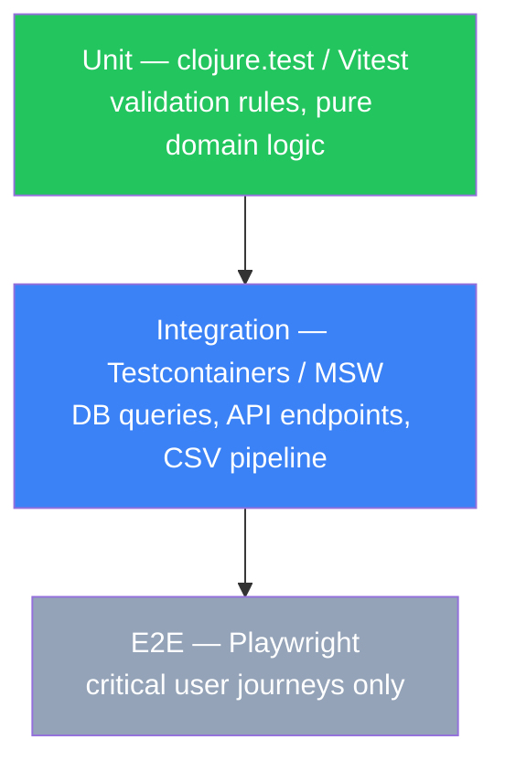

> [INDEX](../INDEX.md) / [Architecture](./) / Testing Strategy

# Testing Strategy

## 1. Testing Philosophy

Test-Driven Development (Red/Green/Refactor) is the mandatory workflow for every piece of
business logic in this project, not an optional discipline layered on afterward. The challenge's
own evaluation criteria weight data integrity, security posture, and engineering judgment as
"High" — these are exactly the properties that only a test-first discipline reliably surfaces,
because writing the test forces the author to state the rule ("a malformed price is rejected
with reason X") before writing the code that satisfies it.

Core commitments:

- **Tests are written before implementation** for every acceptance criterion in EP01-EP06.
  A story is not "started" until its first failing test exists.
- **Tests map directly to acceptance criteria.** Every bullet in an epic's "Acceptance
  Boundaries" section and every user story's stated behavior has a traceable test. If a rule
  exists in `docs/epics/` but has no corresponding test, the rule is considered unimplemented,
  regardless of what the code appears to do.
- **Test evidence is part of Definition of Done.** A task is not complete without: the failing
  test (Red) existing in version control history, the passing test (Green), and the test
  suite passing in CI/Docker before merge. Screenshots or manual verification alone do not
  satisfy DOD for any rule covered by this document.
- **No implementation without a preceding failing test**, except for pure scaffolding
  (project structure, Docker configuration, dependency wiring) that has no business logic to
  assert against.

The Red/Green/Refactor cycle is detailed in [Section 7](#7-tdd-workflow) and applies uniformly
to both the Clojure backend and the Angular frontend.

## 2. Test Pyramid

| Layer | Backend Tool | Frontend Tool | Scope | Volume |
| ----- | ------------ | -------------- | ----- | ------ |
| Unit | `clojure.test` | Vitest + @analogjs/vitest-angular | Domain logic, validation rules, pure functions, value object constraints (Price, Stock, SKU, ProductName) | Many — the majority of the suite |
| Integration | `clojure.test` + Testcontainers (PostgreSQL 17) | Vitest + MSW | Database queries, repository behavior, HTTP API endpoints, the full CSV parsing/validation pipeline | Fewer — one per persistence-touching behavior |
| E2E | Playwright | Playwright | Full user flows through the running Angular UI: product CRUD, CSV upload, search, purchase | Minimal — one per critical user journey |

The pyramid shape is deliberate and enforced, not aspirational. Enforcement is structural: code
review verifies that validation logic is tested at the unit layer first, and integration tests
are reserved for persistence-touching behavior. A PR introducing a new integration test for logic
that could be tested as a unit test is rejected at review.



Rationale: the domain rules that carry the highest evaluation weight (data integrity, security)
are pure validation logic — a malformed price, a negative stock value, an XSS payload — and are
cheapest and fastest to verify at the unit layer, in isolation from a database or a browser.
Integration tests confirm those same rules survive contact with PostgreSQL and the HTTP boundary.
E2E tests exist only to prove a human can actually complete each required workflow end to end;
they are not where edge-case validation logic is re-verified.

## 3. What to Test per Epic

| Epic | Unit Tests | Integration Tests | E2E Tests |
| ---- | ---------- | ------------------ | --------- |
| EP01 — Product Management | Price, Stock, SKU, ProductName, CategoryLabel, WeightKg validation rules; sanitization of free-text fields; pagination boundary logic | CRUD operations against a real PostgreSQL 17 instance (Testcontainers); SKU uniqueness constraint at the DB layer; API endpoint contract tests (request/response shapes, error codes) | Product create/edit form flow: submit valid data, submit invalid data and see field-level errors, delete with confirmation |
| EP02 — CSV Import | CSV row parser (one test per trap type — see [Section 4](#4-test-data-strategy)); row validation reuse of EP01 rules; duplicate SKU strategy logic | Full import pipeline against a seeded PostgreSQL instance: file parsed, valid rows persisted, invalid rows rejected with reasons, summary counts reconcile with total rows | CSV upload UI flow: upload the sample file, observe progress, view the results/errors summary distinguishing imported vs. rejected rows |
| EP03 — Product Search | Search query builder (keyword, category, price-range, sort composition); malformed price-range bound rejection | Search executed against a PostgreSQL instance seeded with known fixture products; pagination and combined filter+sort behavior verified against real data | Search-and-filter UI flow: keyword search, apply category and price filters together, sort results, empty-catalog "no results" state |
| EP04 — Purchase Workflow | Cart operations (add, update quantity, remove); subtotal/total computation; stock-decrement logic; quantity-exceeds-stock rejection/capping logic | Checkout against a seeded PostgreSQL instance: stock re-validation at checkout time, atomic stock decrement, order creation, concurrent-checkout race handled correctly | Full purchase flow: browse to product, add to cart, adjust quantity, checkout, view order confirmation |
| EP05 — User Interface | Angular component rendering tests (product form, cart line item, import results table) in isolation with mocked inputs via `input()` signals | Form validation feedback (Zod + reactive forms) and CSV results rendering, covered via the epic-specific E2E flows above rather than duplicated separately | Covered by EP01-EP04 E2E flows; EP05 does not introduce a separate E2E suite |
| EP06 — Containerization & Docs | N/A (no business logic) | Container health-check endpoint responds correctly once dependencies (DB) are ready | Smoke test: `docker compose up`, then a single request confirms the application is reachable and serving |

## 4. Test Data Strategy

The provided sample CSV (downloaded 2026-07-27, per the project brief's fixed-fact constraint)
is deliberately seeded with edge cases and is the primary source of test fixtures for EP02.
Treating it as documentation-by-example — rather than inventing synthetic equivalents — keeps
tests aligned with the exact traps the challenge is graded against.

- **Use the actual sample CSV, and row-level extracts of it, as fixtures.** The full file
  drives the integration-level "import pipeline" test; individual rows are extracted into
  minimal single-row or few-row CSV fixtures for fast, isolated unit tests of the parser and
  validator.
- **Each trap type gets its own dedicated test case with an explicit assertion**, not a single
  combined "dirty data" test. Minimum required cases, one per row-level trap named in EP02:
  - Malformed price (non-numeric, currency-prefixed, or textual placeholder such as `"free"`)
    → row rejected with reason identifying the price field.
  - Negative stock → row rejected with reason identifying the stock field.
  - Empty or whitespace-only name → row rejected, treated as empty per the `ProductName`
    value object contract, not silently trimmed and accepted.
  - Missing category → per the `CategoryLabel` value object, an empty category is valid and
    must not be rejected; a test asserts this is accepted, not skipped.
  - Missing weight → per the `WeightKg` value object, a missing weight is valid and must not
    invalidate the row; a test asserts this is accepted.
  - Completely empty row → skipped silently, with no `ImportError` noise recorded.
  - Duplicate SKU within the same file → the defined duplicate-SKU strategy is applied
    consistently (test asserts the documented outcome: update, skip, or flag — never a
    silent overwrite).
  - Duplicate SKU against an already-persisted product → identical strategy and outcome as
    the in-file case, asserted as a separate test to prove behavioral consistency.
  - XSS payload in the name field (e.g., `<script>alert(1)</script>`) → row rejected or the
    payload is stripped/escaped before persistence; assertion confirms no raw markup is
    ever stored.
  - SQL injection payload in the name field (e.g., `'; DROP TABLE products; --`) → row is
    either rejected or the value is persisted as an inert string via a parameterized query;
    assertion confirms the payload never alters query structure or executes.
- **Test data seeding for integration tests** uses a dedicated fixture-loading step (SQL seed
  script or a repository-layer seed function) executed against a Testcontainers-managed
  PostgreSQL 17 instance before each integration test run, and torn down after — no shared
  mutable state leaks between test cases.
- **Database isolation per test** uses transaction-per-test rollback: each integration test runs
  inside a transaction opened with `next.jdbc`'s `:rollback-only true` option. The transaction is
  automatically rolled back after the test completes, guaranteeing zero state leakage between
  tests regardless of test outcome (including crashes). The Testcontainers-managed PostgreSQL
  instance provides the container-level isolation; transaction rollback provides the test-level
  isolation within it.
- Fixture files live alongside their test suites (e.g., `test/fixtures/csv/`) so each trap
  case's fixture is discoverable next to the test that exercises it.

## 5. Security Test Cases

Security posture is a "High" weighted evaluation criterion; the following test cases are
mandatory and must exist as explicit, named tests — not incidentally covered by a broader test.

| Attack vector | Entry points | Required assertion |
| ------------- | ------------ | ------------------- |
| XSS payload in product name | Manual product create/edit form (EP01); CSV import row (EP02) | The payload (e.g., `<script>alert(document.cookie)</script>`, ``) is never rendered as executable HTML/DOM in any UI view (product list, product detail, search results, CSV import results). It is either rejected at validation or safely encoded on output (Angular's built-in template sanitization and DomSanitizer, verified with a rendering test asserting the raw tag is not present in the rendered DOM as a live element). |
| SQL injection in product name | Manual product create/edit form (EP01); CSV import row (EP02); search query (EP03) | The payload (e.g., `Robert'); DROP TABLE products;--`, `' OR '1'='1`) is never concatenated into a query string. All persistence and search queries use parameterized statements exclusively (JDBC prepared statements via `next.jdbc` or the chosen Clojure DB library). A test asserts the payload is stored/searched as an inert literal value and that the products table is intact and unaffected after the operation. |
| Script content in search queries | Search input (EP03) | A search term containing script or markup content (e.g., `<script>`, `%27 OR 1=1`) is escaped/parameterized before reaching the database and, if echoed back in the UI (e.g., "no results for ..."), is safely encoded rather than rendered as markup. A test asserts both the query executes safely and any UI echo of the term is inert. |

Additional security-adjacent tests treated as part of this section:

- Error responses from any failed validation (product create, CSV import, search) never leak
  stack traces, raw SQL fragments, or file system paths, per EP02's acceptance boundary —
  verified with a test asserting the error payload shape contains only a safe, user-facing
  message.
- The same sanitization/validation contract is exercised identically across all three entry
  points (form, CSV, search) to prove EP01's shared contract is not weakened or bypassed for
  bulk import or read paths, per EP02 and EP03's acceptance boundaries.

## 6. Test Commands

All commands run inside Docker containers. No local JDK or Node.js required. Commands
align with the 3-stage pipeline defined in
[Tech Stack — Build Pipeline](tech-stack.md#5-build-pipeline--quality-gates).

### Stage 2a: Static Analysis

```bash
docker compose run --rm backend clojure -M:lint        # clj-kondo
docker compose run --rm backend clojure -M:fmt --check  # cljfmt
docker compose run --rm frontend pnpm exec ng lint            # eslint + angular-eslint
docker compose run --rm frontend pnpm exec prettier --check . # prettier
```

### Stage 2b: Dynamic Tests (unit + integration by name)

Tests are distinguished by **naming convention**, not separate suite configs:

- Backend: `*-test` (unit), `*-integration-test` (integration)
- Frontend: `*.spec.ts` (unit), `*.integration.spec.ts` (integration)

```bash
# All dynamic tests (unit + integration)
docker compose run --rm backend clojure -M:test
docker compose run --rm frontend pnpm exec vitest run

# Filter: unit only (skip namespaces tagged ^:integration)
docker compose run --rm backend clojure -M:test --skip-meta :integration
docker compose run --rm frontend pnpm exec vitest run --exclude '**/*.integration.spec.ts'

# Filter: integration only (focus on namespaces tagged ^:integration)
docker compose run --rm backend clojure -M:test --focus-meta :integration
docker compose run --rm frontend pnpm exec vitest run '**/*.integration.spec.ts'
```

> **Implementation note**: backend filtering requires `^:integration` metadata on integration
> test namespace forms (e.g., `(ns ^:integration myapp.product.repository-integration-test ...)`).
> Kaocha's `--focus-meta` / `--skip-meta` operate on namespace metadata, not on namespace name
> suffixes. The naming convention (`*-integration-test`) remains for human readability; the
> metadata tag is what the tooling filters on.

### Stage 3: E2E (Playwright)

```bash
# Requires full stack running (docker compose up)
docker compose run --rm playwright pnpm exec playwright test
```

### Handoff Quality Gate Variables

See [Tech Stack — Command Reference](tech-stack.md#command-reference-for-handoff-substitution)
for the full `{variable}` → command mapping used in handoff files.

## 7. TDD Workflow

Every unit of business logic — a validation rule, a query builder, a cart operation, a stock
decrement — follows this cycle without exception:

1. **Red** — Write a failing test that encodes one specific acceptance criterion (e.g., "a
   price of `-5` is rejected with reason `invalid_price`"). Run the test suite and confirm it
   fails for the expected reason, not for an unrelated error (typo, missing dependency).
2. **Green** — Write the minimal implementation code required to make the failing test pass.
   Resist adding behavior the current test does not require; additional behavior gets its own
   Red step first.
3. **Refactor** — With the test suite green, improve the implementation applying
   **SOLID**, **DRY**, **KISS**, **Clean Architecture**, **Hexagonal Architecture**, **OWASP**,
   and **design patterns** principles without changing observable behavior. This is where
   structure emerges: extract ports and adapters, eliminate duplication, name things precisely,
   ensure single responsibility, close known vulnerability classes, and apply the design pattern
   that fits the emerging shape. Re-run the full suite after every refactor step to confirm it
   remains green. The Refactor step is not optional cleanup — it is where engineering quality is
   built into the codebase.
4. **Commit** — Commit the Red→Green→Refactor unit as a coherent change once the suite is
   green. A commit that introduces new logic without an accompanying test is not acceptable
   under this workflow.

This cycle applies identically to Clojure domain/service code and to Angular components
and services --- a component's Zod-driven form validation behavior is test-driven the same
way a Clojure validation function is.

## 8. Coverage Policy

| Requirement | Status | Detail |
| ----------- | ------ | ------ |
| Every acceptance criterion has a corresponding test | Required, gated | Traced against each epic's user stories and "Acceptance Boundaries" section; a merged change missing a test for a stated criterion fails review. |
| Every CSV trap type has a dedicated test case | Required, gated | The ten trap types enumerated in [Section 4](#4-test-data-strategy) must each have an identifiable, individually named test — combining multiple traps into one assertion does not satisfy this requirement. |
| Security test cases (XSS, SQL injection, script-in-search) | Required, gated | The three vectors in [Section 5](#5-security-test-cases) must exist as explicit tests before the corresponding epic (EP01, EP02, EP03) is considered done. |
| Line/statement coverage percentage | Aspirational, tracked | Reported by the CI test run (Cloverage for Clojure, Vitest's `--coverage` for the frontend) and visible in test output, but not a merge gate on its own — a high percentage number does not substitute for the explicit, required test cases above. A conspicuous coverage gap in a security- or integrity-critical namespace is treated as a signal to review, not an automatic failure. |

The distinction is deliberate: required items are rule-based and reviewable ("does this
specific trap have a test — yes or no"), which is a more reliable proxy for engineering
judgment than an aggregate percentage that can be satisfied by testing trivial code paths
while skipping the traps the challenge is actually designed to surface.
