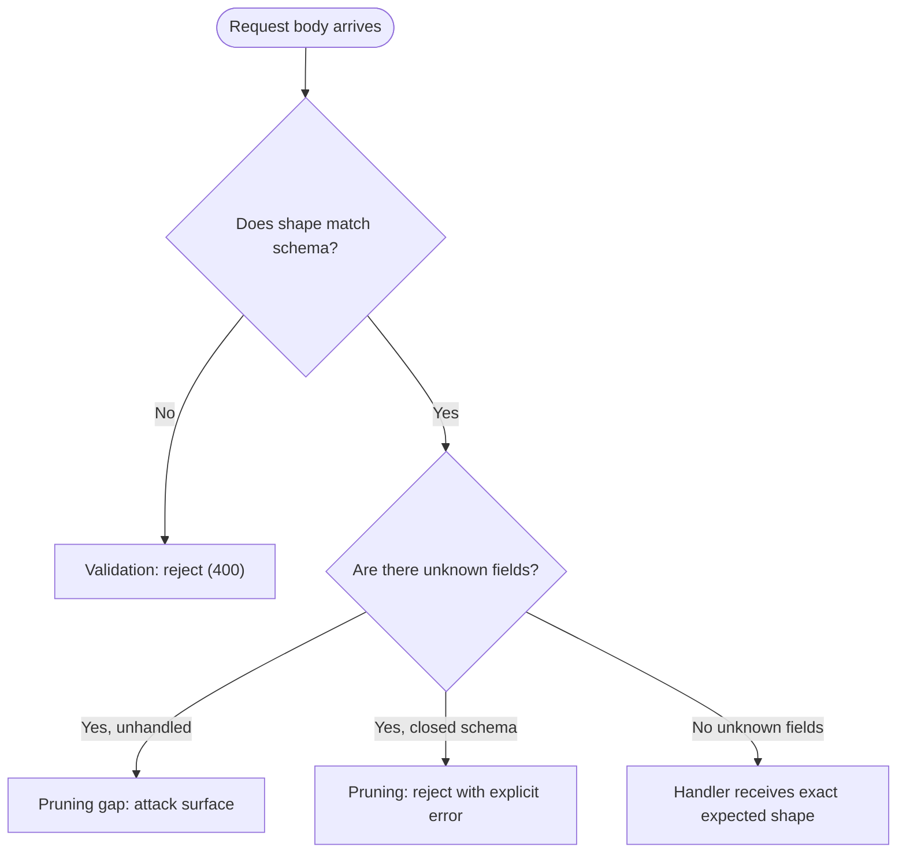
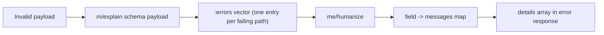
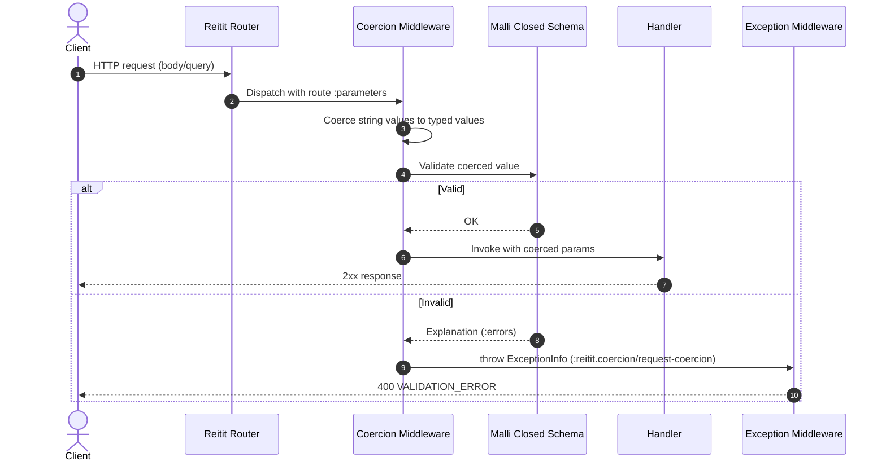
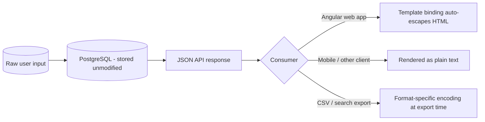

> [INDEX](../INDEX.md) / [Architecture](./) / Payload Validation & Pruning

# Payload Validation & Pruning

This document defines how the backend validates request payloads and how it disposes of
fields the API does not expect. It complements [API Contract](api-contract.md) Section 7,
which is the single source of truth for field-level rules; this document covers the
mechanism (Malli, Reitit coercion) rather than the rules themselves.

## 1. Problem Statement

A JSON API that accepts request bodies must answer two separate questions:

1. **Does the payload conform to the expected shape?** --- this is validation.
2. **What happens to fields the API does not expect?** --- this is pruning.

These are often conflated, but they require independent decisions. A schema can validate
correctly while still allowing unexpected fields to pass through untouched. Without
explicit pruning, unknown fields flow through to handlers and potentially to the database,
creating an attack surface: mass-assignment vulnerabilities, hidden field injection, and
silent schema drift between what the API documents and what it actually accepts.



## 2. Malli Schema Design --- Closed Maps

Malli maps are **open by default**. Given the schema:

```clojure
[:map
 [:name string?]
 [:sku string?]]
```

The payload `{:name "foo", :sku "bar", :evil_field "inject"}` validates successfully, and
`:evil_field` is not stripped --- it passes through to any code that destructures or
persists the map wholesale.

### Decision: `:closed true` on every request-body schema

Two options were evaluated for what happens to unknown keys:

| Option | Behavior | Verdict |
| ------ | -------- | ------- |
| **A --- `:closed true`** | Validation **rejects** unknown keys with a 400 error. The attacker (or misbehaving client) receives explicit feedback that a field was rejected. | **Chosen** |
| **B --- `:strip-extra-keys true`** | Unknown keys are **silently removed**; the request still succeeds. | Rejected for request bodies |

Option A is chosen for request bodies because:

- **Explicit feedback beats silent tolerance.** A client sending an unexpected field
  (whether by bug or by attack) needs to know its input was rejected, not have it
  quietly disappear.
- **Security auditing visibility.** A rejected request produces a 400 response and a
  validation error entry that can be logged and inspected. A silently stripped field
  produces a 200/201 response indistinguishable from a well-formed request --- the
  injection attempt leaves no trace.
- **Contract enforcement.** `:closed true` makes the schema the literal, enforced
  definition of the payload shape. Any drift between documentation and implementation
  surfaces immediately as a test failure, not as a runtime surprise.

Option B remains appropriate in contexts where lenient parsing of externally-produced
data is desirable (for example, tolerating extra columns in a best-effort import), but it
is explicitly rejected here for request bodies, which are the security boundary.

### Coercion configuration

Rather than annotating every schema individually with `{:closed true}`, the coercion
configuration closes every `:map` schema globally:

```clojure
(def malli-coercion
  (rcm/create
    {:compile mu/closed-schema
     :default-values true}))
```

`mu/closed-schema` (from `malli.util`) is applied as a `:compile` step, which closes
**every** `:map` schema encountered during route compilation --- there is no need to add
`{:closed true}` to each schema by hand, and no schema can accidentally be left open by
omission.

## 3. Multi-Error Collection

Malli's `m/explain` collects **all** failing fields in a single pass. It is not
first-error-wins: a payload with three invalid fields produces three error entries, not
one.



Given the payload `{:name 123, :price -5}` against the Product schema, `m/explain`
produces an `:errors` vector covering both failing fields. Passing that explanation
through `me/humanize` yields:

```clojure
{:name ["should be a string"]
 :price ["should be greater than 0"]}
```

All errors are collected and returned together in a single 400 response, matching the
`details` array shape defined in [API Contract](api-contract.md) Section 2:

```json
{
  "error": {
    "code": "VALIDATION_ERROR",
    "message": "Product validation failed",
    "details": [
      { "field": "name", "reason": "should be a string" },
      { "field": "price", "reason": "should be greater than 0" }
    ]
  }
}
```

A client fixing only the first reported field and resubmitting will see the remaining
failures on the next attempt --- but the multi-error response means it does not have to
guess or resubmit repeatedly to discover every problem.

## 4. Coercion Behavior

Reitit's coercion middleware performs the following automatically, with no manual
validation code in handlers:

1. Reads the Malli schema from route data (`:parameters {:body Schema}`).
2. Coerces string values --- for example query parameters such as `"20"` are coerced to
   the integer `20` for fields typed as `int?`.
3. Validates the coerced value against the closed schema (Section 2).
4. On failure, throws an `ExceptionInfo` with type `:reitit.coercion/request-coercion`.
5. The exception middleware (see [Error Handling Pipeline](error-handling.md)) catches
   this exception type and transforms it into the standard API error format.



Because coercion and validation happen in middleware before the handler is ever invoked,
handlers can assume the shape and types of `:parameters` are exactly what the schema
declares --- there is no defensive re-validation inside business logic.

## 5. XSS Strategy

### Decision: store raw data, encode on output

The backend stores request data **as-is**, without HTML-encoding on write. Encoding
happens, if at all, at the point where the data is rendered into a specific output
format --- not before persistence.

Rationale:

- **Encoding on write is lossy and format-specific.** HTML entity encoding is meaningless
  (and actively wrong) for a mobile client rendering plain text, a CSV export, or a
  search index. Baking one output format's escaping rules into the stored value corrupts
  every other consumer.
- **This is a JSON API, not an HTML-rendering server.** The backend's job ends at
  serializing valid JSON. Angular's template binding (`{{ }}` interpolation) auto-escapes
  HTML by default on the client, which is where HTML rendering actually happens.
- **Separation of concerns.** The backend is not responsible for HTML encoding; it is
  responsible for correct, unmodified data. The client is responsible for safely
  rendering that data in whatever format it displays.



### Exception: CSV import XSS trap rejection

CSV import is the one path where this policy tightens: rows containing `<script>` tags
(the XSS trap row type defined in the CSV import stories) are **rejected outright**, not
sanitized. This is a rejection, not a sanitization step --- the raw offending data is
never written to the database at all. Store-raw-encode-on-output only applies to data
that is accepted; data identified as an injection payload during CSV validation never
reaches storage.

Scope note: this check is a literal `<script>` substring match against the known
XSS-trap test fixture, not comprehensive XSS screening --- it does not detect
event-handler attributes (`onerror=`), `javascript:` URIs, or obfuscated/encoded
markup. It is a defense-in-depth rejection at one specific input boundary, not the
application's XSS defense. The broader XSS defense is Angular's built-in template
sanitization on the frontend (Section 5 above).

## 6. Validation Contract

[API Contract](api-contract.md) Section 7 (Validation Contract) is the single source of
truth for field-level rules --- required/optional, types, min/max constraints, and
reject/accept examples for every Product field. Malli schemas implement these rules
exactly; Zod schemas on the frontend mirror them for immediate user feedback. Neither
Malli nor Zod invents its own rules: both derive from the documented contract, and a
contract test verifies the two produce identical accept/reject decisions for the same
canonical inputs.

## Related Documents

- [API Contract](api-contract.md) --- Section 7 Validation Contract is the source of truth for field rules
- [Middleware Pipeline](middleware-pipeline.md) --- full Reitit middleware stack, coercion registration order
- [Error Handling Pipeline](error-handling.md) --- how coercion failures become HTTP error responses
- [Testing Strategy](testing-strategy.md) --- contract tests verifying Malli/Zod parity
