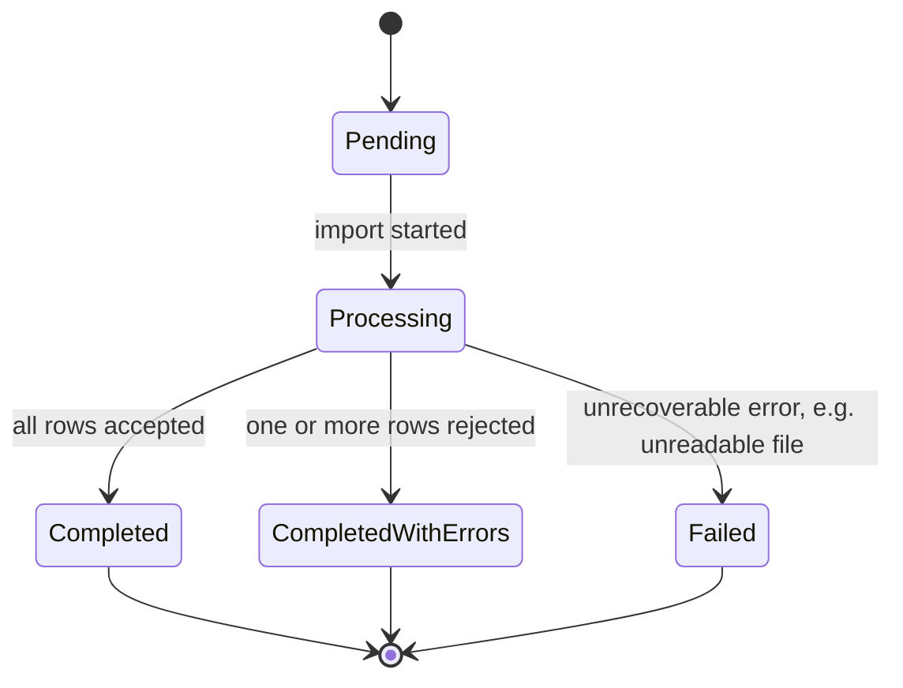
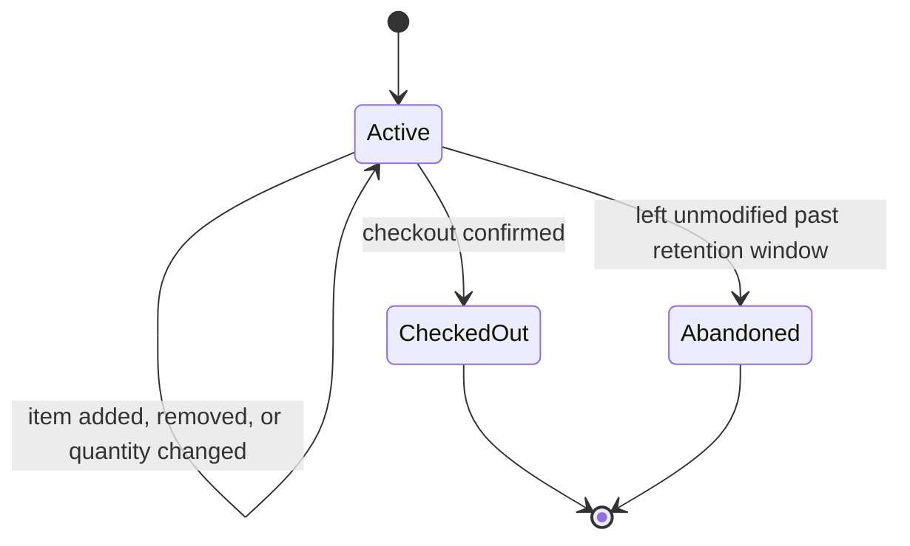
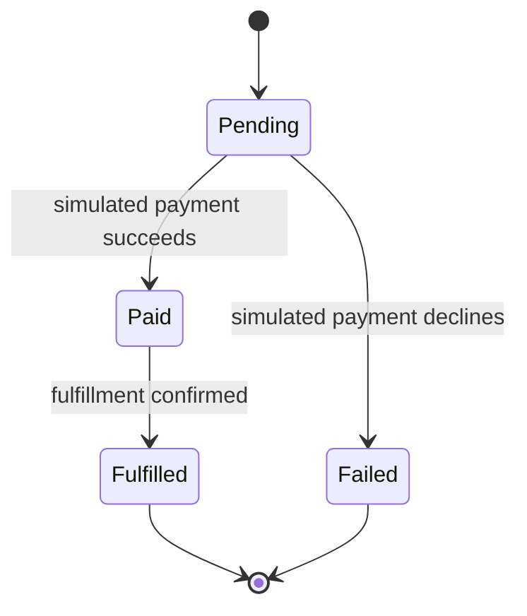
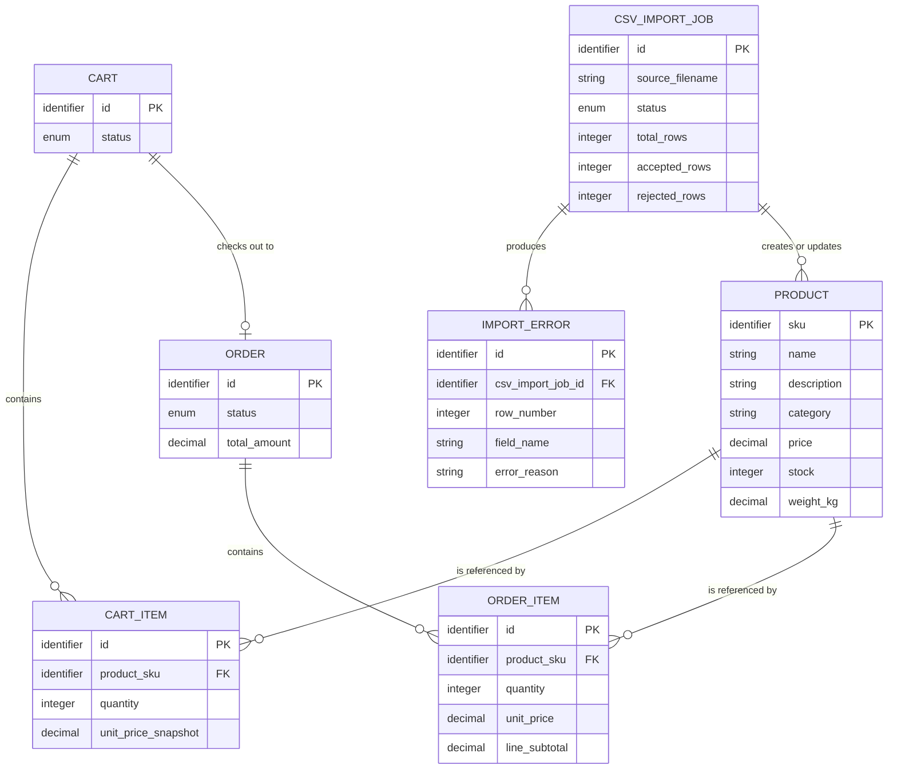

> [INDEX](INDEX.md) / Domain Glossary

# Domain Glossary

This glossary defines the ubiquitous language for the e-commerce domain: the entities,
value objects, events, and lifecycle states that Product Management, CSV Import, Product
Search, and Purchase Workflow all speak in common. It is technology-agnostic by design —
no database schema, no framework types — so it stays valid regardless of which stack the
Architect phase selects. Validation rules for specific fields (e.g., exact rejection
criteria for a malformed price) belong to the corresponding user stories; this document
only defines what the concepts are and what shape they take.

## Entities

| Entity | Description | Key Attributes | Relationships | Rationale |
| ------ | ------------ | --------------- | -------------- | --------- |
| Product | The core sellable item in the catalog; the unit of inventory, pricing, and search. | name, sku (unique), description, category, price, stock, weight_kg | Classified by one Category (value object, not a separate entity); referenced by zero or more CartItem and OrderItem; may be created or updated by a CsvImportJob | Central aggregate of Product Management (EP01) and the shared subject of CSV Import (EP02), Search (EP03), and Purchase (EP04). Category is modeled as a Value Object rather than an Entity because it has no independent identity or lifecycle in the source data — it is a classification label only, and can be empty (see Value Objects). |
| Cart | A customer's in-progress collection of products intended for purchase, before checkout. | id, status (lifecycle), created_at, updated_at | Contains zero or more CartItem; checks out into zero or one Order | Represents the working set of the Purchase Workflow (EP04) prior to commitment, kept separate from Order so abandoned or incomplete purchases never pollute order history. |
| CartItem | A line entry in a Cart referencing a specific Product and the quantity intended for purchase. | product_sku (reference), quantity, unit_price_snapshot | Belongs to one Cart; references one Product | Captures a point-in-time price snapshot so that later price changes on Product do not retroactively alter what the customer already sees in their cart. |
| Order | The record of a completed or attempted purchase, produced when a Cart is checked out. | id, status (lifecycle), placed_at, total_amount | Originates from one Cart; contains one or more OrderItem | Represents the outcome of the Purchase Workflow (EP04). Kept immutable after placement to preserve an accurate financial and fulfillment history, in contrast to the mutable Cart. |
| OrderItem | A line entry in an Order capturing what was actually purchased, at what price and quantity. | product_sku (reference), quantity, unit_price, line_subtotal | Belongs to one Order; references one Product | Mirrors CartItem's line-item shape but is immutable once the Order is placed, forming the permanent record of the transaction. |
| CsvImportJob | A tracked batch operation that ingests a CSV file, validates each row, and creates or updates Product records. | id, source_filename, status (lifecycle), started_at, completed_at, total_rows, accepted_rows, rejected_rows | Produces zero or more Product (created or updated); produces zero or more ImportError | Central to CSV Import (EP02); gives an auditable unit of "what happened" for a given file, including partial success — the sample CSV is deliberately seeded to exercise this. |
| ImportError | A record of a single CSV row that failed validation during a CsvImportJob, with enough detail to diagnose and correct it. | row_number, raw_row_data, field_name, error_reason | Belongs to one CsvImportJob; may reference the Product it would have affected, when identifiable by SKU | Separates "why did this row fail" from the job summary, enabling row-level reporting. Directly answers the CSV's known traps: XSS and SQL-injection payloads in names, malformed prices, negative or empty stock, duplicate SKUs, empty or whitespace-only names, and empty rows. |

## Value Objects

| Name | Description | Constraints |
| ---- | ------------ | ----------- |
| SKU | Unique business identifier for a Product, independent of any surrogate ID. | Non-empty string; unique across all Product records; immutable once assigned. A duplicate SKU encountered during import is a validation concern (reject or explicitly update), never a silent overwrite. |
| Price | The monetary amount a Product is sold for. | Decimal, strictly greater than 0; a single implied currency; never negative. Inputs such as a `$` prefix, the word "free", or `0.00` do not satisfy this constraint and must be normalized or rejected before entering the domain. |
| Stock | The quantity of a Product currently available for purchase. | Non-negative integer; zero is a valid value meaning out of stock. Negative values are invalid. An absent value is invalid and must not be silently defaulted to zero. |
| WeightKg | The physical shipping weight of a single unit of a Product, in kilograms. | Non-negative decimal; optional — a missing weight does not by itself invalidate a Product, since not every category (e.g., digital gift cards) has a meaningful shipping weight. |
| ProductName | The customer-facing display name of a Product. | Non-empty after trimming; whitespace-only input is treated as empty and is invalid. Must be safely encoded before rendering and never interpolated directly into a query, since names are an untrusted input channel. |
| CategoryLabel | A free-text classification label attached to a Product. | May be empty (uncategorized); no fixed enumeration in v1; not unique on its own — many Products share a label; comparison is case-sensitive unless a story states otherwise. |
| Money | An aggregated monetary amount computed from one or more line items (Cart or Order totals). | Decimal, non-negative; equals the sum of (unit price × quantity) across the relevant items at the time of computation. |
| ImportRowReference | A pointer back to a row's position in the original CSV file. | Positive integer matching the 1-indexed line number in the source file, including the header row in the count, so an error message matches what a human sees when opening the file. |

## Domain Events

| Event | Trigger | Outcome |
| ----- | ------- | ------- |
| ProductCreated | A new SKU is successfully validated and added to the catalog, via manual CRUD or CSV Import. | Product becomes searchable and purchasable; stock and price are set to their validated initial values. |
| ProductUpdated | An existing Product's attributes change, via manual CRUD or a later CSV row for the same SKU. | Product reflects the new values; price snapshots already captured on existing CartItems are unaffected. |
| ProductDeleted | A Product is removed from the catalog via a manual CRUD action. | Product no longer appears in search or catalog views; existing OrderItems retain their historical snapshot and are unaffected. |
| CsvImportJobStarted | A CSV file is submitted for import. | A CsvImportJob is created in a Pending or Processing state; row-by-row validation begins. |
| CsvImportRowRejected | A single CSV row fails validation — malformed price, negative or empty stock, empty or whitespace-only name, a duplicate SKU already seen earlier in the same file, a detected security payload, or an empty row. | An ImportError is recorded referencing the row number and reason; the row is not persisted as a Product; the job continues to the next row. |
| CsvImportRowAccepted | A single CSV row passes all validation rules. | The corresponding Product is created (new SKU) or updated (existing SKU); ProductCreated or ProductUpdated fires. |
| CsvImportJobCompleted | All rows in the file have been processed. | CsvImportJob status becomes Completed or CompletedWithErrors; final accepted/rejected counts are recorded for reporting. |
| ItemAddedToCart | A customer adds a Product and quantity to their Cart. | A CartItem is created, or an existing one's quantity is increased; a price snapshot is taken from the Product's current price. |
| CartCheckedOut | A customer confirms their Cart for purchase. | Stock availability is re-validated for every CartItem; on success, an Order and its OrderItems are created from the Cart's contents, and Stock is decremented per Product. |
| OrderPaymentSimulated | The checkout process reaches the (simulated) payment step. | Order status transitions to Paid on simulated success, or Failed on simulated decline; no real payment provider is contacted. |

## Status/State Values

The following entities have a lifecycle; all other entities (Product, CartItem, OrderItem,
ImportError) are either always-active records or immutable once written, and therefore have
no state machine of their own.

### CsvImportJob

| State | Meaning |
| ----- | ------- |
| Pending | The job has been created but row processing has not yet started. |
| Processing | Rows are being validated and applied one at a time. |
| Completed | Every row in the file was accepted; no ImportError records exist for this job. |
| CompletedWithErrors | Processing finished, but one or more rows were rejected and recorded as ImportError. |
| Failed | Processing could not finish at all — for example, the file itself was unreadable. |

### Cart

| State | Meaning |
| ----- | ------- |
| Active | The cart can still be modified — items added, removed, or quantities changed. |
| CheckedOut | The customer confirmed the cart; it produced an Order and can no longer be modified. |
| Abandoned | The cart was left unmodified past its retention window and is no longer eligible for checkout. |

### Order

| State | Meaning |
| ----- | ------- |
| Pending | The order has been created from a checked-out Cart and awaits the simulated payment outcome. |
| Paid | The simulated payment succeeded; stock has been decremented for every OrderItem. |
| Failed | The simulated payment declined; no stock was decremented. |
| Fulfilled | The order has been confirmed as complete from a fulfillment standpoint. |

## Entity Relationships

## Conventions

### Naming & Terminology

- Use "Cart" (never "basket") and "Order" (never "purchase" as a noun) consistently across
  documents and code.
- Use "CsvImportJob" (never "upload" or "batch") to refer to a single import run, and
  "ImportError" (never "validation error" alone) for a single rejected row within that run.
- "SKU" is always written as an uppercase acronym, never expanded or lowercased.

### Casing

- Entity names are documented in PascalCase, singular (`Product`, `CartItem`,
  `CsvImportJob`).
- Attribute names are documented in snake_case, matching the source CSV header names where
  they overlap (`sku`, `weight_kg`). Implementation code may adapt casing to the target
  language's own convention (e.g., camelCase), as long as the underlying concept and
  constraint are preserved.
- Lifecycle state values are documented in PascalCase (`Pending`, `CompletedWithErrors`).

### Identifiers

- Every entity other than Product has a system-generated surrogate identifier (`id`); the
  concrete identifier scheme (UUID, sequence, etc.) is an Architect-phase decision, not a
  domain concern.
- Product's business identifier is its `sku` — a human-meaningful, unique value supplied
  by the data source, not a system-generated surrogate.

### Monetary & Numeric Values

- Monetary amounts (`price`, `unit_price`, `total_amount`) are represented as an exact
  decimal with two fractional digits and are never represented as a binary floating-point
  type in the domain model.
- A single implied currency is assumed for the scope of this challenge; no multi-currency
  conversion is part of the domain.
- `stock` is always a whole number; fractional stock has no domain meaning.
- `weight_kg` uses kilograms as the sole canonical unit; no other unit of mass appears in
  the domain.

### Date & Time

- All timestamps (`created_at`, `started_at`, `completed_at`, `placed_at`, `updated_at`)
  are expressed in ISO 8601, UTC (e.g., `2026-07-27T14:30:00Z`).
- Durations and retention windows (e.g., when a Cart becomes Abandoned) are expressed in
  whole units of time (minutes, hours, or days) rather than mixed or fractional units.
