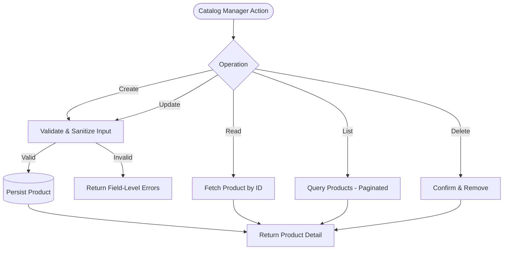

> [INDEX](../INDEX.md) / [Epics](./) / EP01 --- Product Management

# EP01 --- Product Management

## Summary

This epic covers the full lifecycle of a product record: creation, retrieval, update, deletion,
and listing. It establishes the validation and sanitization contract that every other epic
(CSV Import, Search) depends on, since all product data --- whether entered by hand or imported
in bulk --- must satisfy the same integrity and security rules.

## Business Value

Product Management is the foundation of the catalog. Without reliable CRUD operations, no other
capability (search, purchase, import) has trustworthy data to operate on. This epic also carries
the highest-weighted evaluation criteria of the challenge: data integrity and security posture
are proven here first, then reused everywhere else. A catalog that silently accepts malformed
prices, negative stock, or unescaped script content is a liability, not a feature.

## Domain Flow

## User Stories

- [ ] **Must Have** --- As a Catalog Manager, I want to create a new product through a form,
  so that I can add items to the catalog without touching the database directly.
- [ ] **Must Have** --- As a Catalog Manager, I want every product field validated and sanitized
  on submission, so that malformed, malicious, or incomplete data never reaches the catalog.
- [ ] **Must Have** --- As a Catalog Manager, I want to view the full detail of a single product,
  so that I can verify its data before making decisions about it.
- [ ] **Must Have** --- As a Catalog Manager, I want to update an existing product's fields,
  so that I can correct mistakes or reflect changes in price, stock, or description.
- [ ] **Must Have** --- As a Catalog Manager, I want to delete a product, so that discontinued
  or erroneously created items no longer appear in the catalog.
- [ ] **Must Have** --- As a Catalog Manager, I want to list all products in a paginated view,
  so that I can browse the catalog without loading the entire dataset at once.
- [ ] **Should Have** --- As a Catalog Manager, I want to be warned before deleting a product
  that has outstanding purchase history, so that I do not accidentally destroy order-relevant data.
- [ ] **Should Have** --- As a Catalog Manager, I want clear, field-specific error messages when
  validation fails, so that I know exactly what to correct instead of guessing.
- [ ] **Could Have** --- As a Catalog Manager, I want to duplicate an existing product as a
  starting point for a new one, so that I can create similar products faster.

## Acceptance Boundaries

The following constraints apply to every story in this epic:

- All free-text input (name, description, category) is sanitized before storage and before
  render; no user-supplied content is ever interpreted as executable script or markup.
- All input reaching a persistence layer is treated as untrusted data, never as executable
  query logic; injection attempts must be neutralized rather than merely rejected on the surface.
- Price must be a positive numeric value with a defined precision; non-numeric, negative, or
  zero values are rejected with an explicit reason.
- Stock quantity must be a non-negative integer; negative values are rejected.
- SKU is unique across the catalog; a create or update that would violate uniqueness is
  rejected with a clear conflict error, not a silent overwrite.
- Whitespace-only values in required text fields (name, category) are treated as empty and
  rejected, not trimmed-and-accepted.
- Every mutating operation (create, update, delete) returns an outcome that unambiguously
  distinguishes success, validation failure, and conflict.
- Listing operations default to a bounded page size; no operation returns an unbounded result
  set.
- Deletion is explicit and requires confirmation; there is no accidental bulk delete path in
  this epic.

## Related Architecture

- [Tech Stack](../architecture/tech-stack.md) --- technology choices and rationale (placeholder,
  populated during Architect phase)
- [API Contract](../architecture/api-contract.md) --- request/response shapes for product
  operations (placeholder, populated during Architect phase)
- [Data Model](../architecture/data-model.md) --- product entity schema and constraints
  (placeholder, populated during Architect phase)

## Related Documents

- [Project Brief](../project-brief.md)
- [Domain Glossary](../domain-glossary.md) --- TBD, populated during Discover
- [EP02 --- CSV Import](EP02-csv-import.md) --- reuses this epic's validation and sanitization
  contract for bulk-loaded rows
- [EP03 --- Product Search](EP03-product-search.md) --- reads the catalog this epic maintains
- [INDEX](../INDEX.md)
