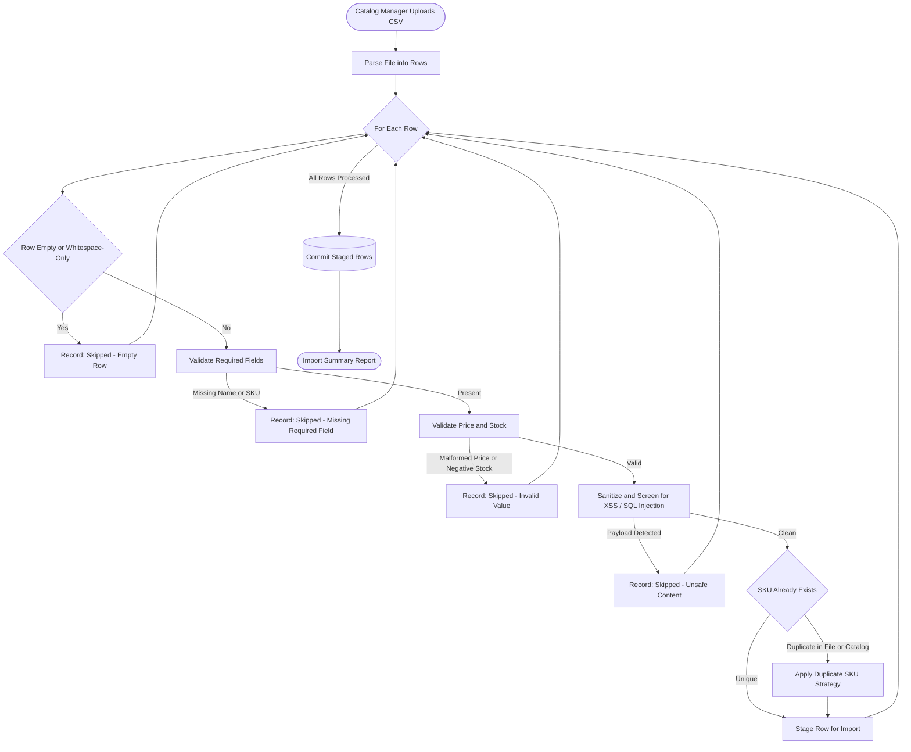

> [INDEX](../INDEX.md) / [Epics](./) / EP02 --- CSV Import

# EP02 --- CSV Import

## Summary

This epic covers bulk product import from an uploaded CSV file: parsing, row-level validation,
sanitization, duplicate handling, and result reporting. The provided sample CSV is deliberately
seeded with malformed prices, negative stock, empty rows, whitespace-only names, missing
categories and weights, duplicate SKUs, and XSS/SQL-injection payloads --- this epic exists to
prove the system survives that data intact rather than merely completing the happy path.

## Business Value

Bulk import is how a real catalog gets populated at scale --- suppliers and internal teams do
not create products one at a time through a form. This is also the single most evaluated
capability in the challenge: it directly exercises data integrity and security posture, the
two highest-weighted criteria. An import pipeline that silently accepts a negative-stock row,
executes an embedded SQL fragment, or stores an unescaped script tag fails the challenge's core
intent regardless of how polished the rest of the application is.

## Domain Flow

## User Stories

- [ ] **Must Have** --- As a Catalog Manager, I want to upload a CSV file, so that I can bring
  an entire supplier catalog into the system in one action instead of entering rows by hand.
- [ ] **Must Have** --- As a Catalog Manager, I want the system to parse the file into individual
  rows before any data is persisted, so that a malformed file structure fails fast and clearly.
- [ ] **Must Have** --- As a Catalog Manager, I want each row validated against the same rules
  that apply to manually created products, so that bulk-imported data is never held to a lower
  standard than hand-entered data.
- [ ] **Must Have** --- As a Catalog Manager, I want rows with malformed prices (non-numeric
  values, currency symbols, or textual placeholders) rejected with a specific reason, so that
  garbage pricing never enters the catalog.
- [ ] **Must Have** --- As a Catalog Manager, I want rows with negative stock quantities rejected,
  so that inventory counts never go negative from an import.
- [ ] **Must Have** --- As a Catalog Manager, I want rows with empty or whitespace-only names
  rejected, so that products without an identifiable name never enter the catalog. Missing
  category and missing weight are valid per the domain model (category may be empty, weight
  is optional) and must not cause rejection.
- [ ] **Must Have** --- As a Catalog Manager, I want completely empty rows skipped without error
  noise, so that blank lines in the source file do not pollute the results.
- [ ] **Must Have** --- As a Catalog Manager, I want any row containing script content or
  injection-style payloads neutralized or rejected, so that a malicious CSV cannot compromise
  the catalog or any system reading its data.
- [ ] **Must Have** --- As a Catalog Manager, I want a defined and visible strategy for rows
  whose SKU duplicates another row in the same file or an existing catalog product, so that I
  know whether the import updates, skips, or flags the conflict rather than silently overwriting
  or duplicating data.
- [ ] **Must Have** --- As a Catalog Manager, I want a summary report after import listing how
  many rows were imported, how many were skipped, and the specific reason for each skipped row,
  so that I can act on the rejected data instead of wondering what happened to it.
- [ ] **Should Have** --- As a Catalog Manager, I want to download or export the list of skipped
  rows with their reasons, so that I can correct the source file and re-import only the failures.
- [ ] **Should Have** --- As a Catalog Manager, I want valid rows imported even when other rows
  in the same file fail validation, so that one bad row does not block the entire batch.
- [ ] **Could Have** --- As a Catalog Manager, I want to see import progress while a large file
  is processing, so that I know the system is working rather than stalled.
- [ ] **Could Have** --- As a Catalog Manager, I want a dry-run preview of what an import would
  do before committing it, so that I can validate the outcome without risking the live catalog.

## Acceptance Boundaries

The following constraints apply to every story in this epic:

- Row-level validation reuses the exact same rules defined in EP01 (price, stock, SKU
  uniqueness, required fields, whitespace handling) --- this epic does not define a parallel or
  looser rule set.
- Every rejected row carries a specific, actionable reason; a generic "invalid row" message is
  insufficient.
- A single malformed, malicious, or duplicate row never aborts the entire import; failures are
  isolated per row unless the file itself cannot be parsed.
- No content from the CSV --- including any embedded script or query fragment --- is ever
  executed, rendered as markup, or interpreted as executable logic at any stage of the pipeline.
- The duplicate SKU strategy is explicit and consistent: the same rule applies whether the
  duplicate exists within the file or against an already-persisted product; behavior is never
  ambiguous or silently inconsistent between the two cases.
- The import is atomic per row: a row is either fully persisted with all its valid fields, or
  not persisted at all; there is no partially-written row.
- The import summary accounts for every row in the source file --- imported, skipped, or
  reported as a conflict --- with no row silently disappearing from the count.
- Error messages returned to the user never leak internal implementation details (stack traces,
  raw query fragments, file paths).

## Related Architecture

- [Tech Stack](../architecture/tech-stack.md) --- technology choices and rationale
- [CSV Import Pipeline](../architecture/tech-stack.md#7-csv-import-pipeline) --- parsing and
  staging design
- [Validation Contract](../architecture/api-contract.md#7-validation-contract) --- canonical
  field-level validation contract shared with EP01

## Related Documents

- [Project Brief](../project-brief.md)
- [Domain Glossary](../domain-glossary.md) --- TBD, populated during Discover
- [EP01 --- Product Management](EP01-product-management.md) --- source of the shared validation
  and sanitization contract
- [EP03 --- Product Search](EP03-product-search.md) --- surfaces the products this epic imports
- [INDEX](../INDEX.md)
