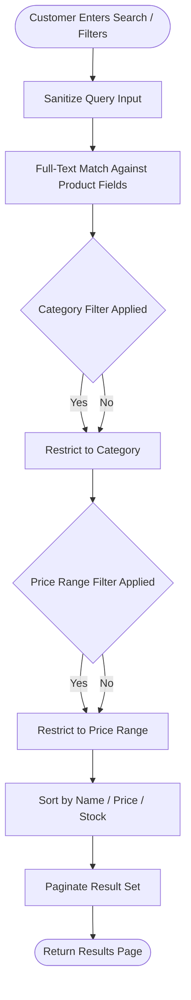

> [INDEX](../INDEX.md) / [Epics](./) / EP03 --- Product Search

# EP03 --- Product Search

## Summary

This epic covers discovery of products already in the catalog: full-text search, category and
price-range filtering, sorting, and pagination of results. It depends on EP01 for the underlying
catalog data and on EP02 for bulk-loaded records, and it must treat search input with the same
security discipline applied to every other entry point in the system.

## Business Value

Search is how a customer converts intent into a purchase; a catalog nobody can find is a catalog
nobody buys from. This epic also demonstrates that the defensive posture established for product
creation and import extends to the read path: a search query is user input too, and must not
become a vector for injection or an oracle for probing the catalog's internal structure.

## Domain Flow

## User Stories

- [ ] **Must Have** --- As a Customer, I want to search products by keyword across name,
  description, and SKU, so that I can find items without knowing the exact product title.
- [ ] **Must Have** --- As a Customer, I want to filter search results by category, so that I can
  narrow my browsing to the type of product I am interested in.
- [ ] **Must Have** --- As a Customer, I want to filter results by a minimum and maximum price,
  so that I only see products within my budget.
- [ ] **Must Have** --- As a Customer, I want to sort results by name, price, or stock
  availability, so that I can organize the list in the way most useful to my decision.
- [ ] **Must Have** --- As a Customer, I want search results returned in paginated pages, so that
  I can browse large result sets without an overwhelming single page.
- [ ] **Should Have** --- As a Customer, I want to combine keyword search, category, and price
  filters in a single query, so that I can narrow results precisely instead of filtering in
  separate steps.
- [ ] **Should Have** --- As a Customer, I want a clear "no results" state when my search or
  filters match nothing, so that I understand the catalog was searched, not broken.
- [ ] **Could Have** --- As a Customer, I want search suggestions as I type, so that I can find
  products faster without typing a full query.
- [ ] **Could Have** --- As a Customer, I want my last-used filters remembered within a session,
  so that I do not have to reapply them after navigating away and back.

## Acceptance Boundaries

The following constraints apply to every story in this epic:

- Search and filter input is treated as untrusted data; it is sanitized and never interpreted
  as executable query logic, regardless of what characters or fragments it contains.
- Search only ever operates over data that has already passed the validation and sanitization
  contract defined in EP01 and EP02; this epic does not re-expose raw or unsanitized fields.
- Price range filters only accept well-formed numeric bounds; a malformed bound is rejected with
  a clear message rather than silently ignored or coerced to zero.
- Every search request is paginated by default; there is no code path that returns the entire
  catalog in a single unbounded response.
- Sorting and filtering behave consistently together: applying a sort never bypasses an active
  filter, and applying a filter never resets an active sort.
- An empty or product-less catalog returns a well-formed empty result, never an error.
- Search results never render any field's content as executable markup or script, consistent
  with the sanitization boundary established in EP01.

## Related Architecture

- [Tech Stack](../architecture/tech-stack.md) --- technology choices and rationale (placeholder,
  populated during Architect phase)
- [API Contract](../architecture/api-contract.md) --- search and filter request/response shapes
  (placeholder, populated during Architect phase)
- [Data Model](../architecture/data-model.md) --- indexed and searchable product fields
  (placeholder, populated during Architect phase)

## Related Documents

- [Project Brief](../project-brief.md)
- [Domain Glossary](../domain-glossary.md) --- TBD, populated during Discover
- [EP01 --- Product Management](EP01-product-management.md) --- source of the catalog data
  this epic searches
- [EP02 --- CSV Import](EP02-csv-import.md) --- bulk-loaded products also become searchable
  through this epic
- [INDEX](../INDEX.md)
