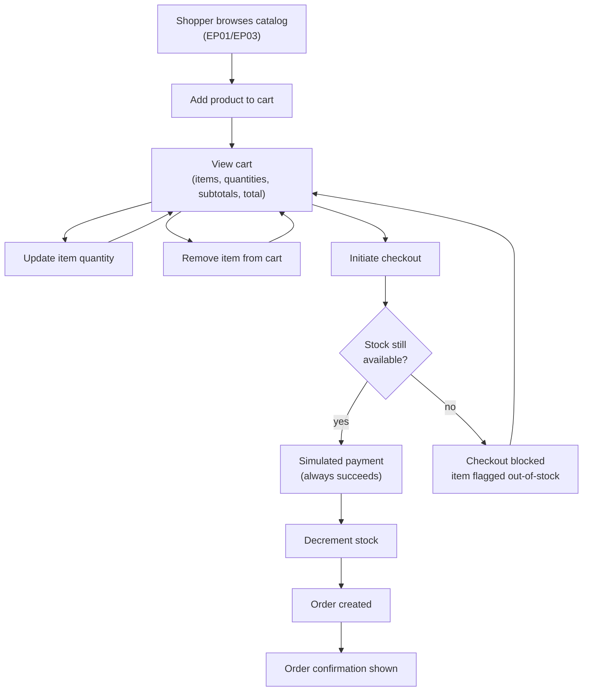

> [INDEX](../INDEX.md) / [Epics](./) / EP04 --- Purchase Workflow

# EP04 --- Purchase Workflow

## Summary

This epic covers the end-to-end purchase journey: building a cart from the product catalog,
reviewing and adjusting its contents, and completing a simulated checkout that produces a
confirmed order. It also covers the data-integrity guarantees that must hold when stock is
consumed, including the case where availability changes between cart assembly and checkout.

## Business Value

The purchase workflow is the ultimate proof that the catalog is usable, not just viewable.
A shopper who can find a product but cannot reliably buy it experiences the application as
broken, regardless of how well search or CRUD behaves. Correct stock accounting protects
the business from overselling and from silently losing inventory count, which is the single
most damaging failure mode of a commerce system. A trustworthy checkout --- even with a
simulated payment --- demonstrates that the candidate treats money-adjacent flows with the
rigor they deserve in a production system.

## Domain Flow

## User Stories

- [ ] **Must Have** --- As a shopper, I want to add a product to my cart with a chosen
  quantity, so that I can collect items I intend to purchase.
  - Adding a quantity greater than available stock must be rejected or capped, with the
    shopper informed of the actual limit.
- [ ] **Must Have** --- As a shopper, I want to view my cart with each item's quantity, unit
  price, and subtotal, plus a grand total, so that I understand exactly what I am about to
  pay before committing.
- [ ] **Must Have** --- As a shopper, I want to change the quantity of an item already in my
  cart, so that I can adjust my order without removing and re-adding it.
  - Increasing quantity beyond available stock must be rejected or capped, with feedback.
- [ ] **Must Have** --- As a shopper, I want to remove an item from my cart, so that I can
  exclude products I no longer want to buy.
- [ ] **Must Have** --- As a shopper, I want to place an order through a simulated checkout,
  so that I can complete a purchase without needing a real payment method.
  - The simulated payment always succeeds; no external payment provider is involved.
- [ ] **Must Have** --- As a shopper, I want to see an order confirmation with the purchased
  items, quantities, prices, total, and an order identifier, so that I have a record of what
  I bought.
- [ ] **Must Have** --- As the business, I want product stock to decrease by the purchased
  quantity when an order succeeds, so that the catalog reflects true remaining availability.
- [ ] **Must Have** --- As the business, I want checkout to detect and reject items whose
  stock became insufficient between being added to the cart and checkout time, so that the
  system never oversells a product.
  - The shopper is informed which item(s) caused the rejection and the order is not created
    for the affected line until the cart is corrected.

## Acceptance Boundaries

- Cart contents are scoped to a single shopper session; multi-device cart sync is out of
  scope for this epic.
- Payment is always simulated and always succeeds when reached; no retry, decline, or
  partial-payment states exist in this epic.
- An order, once confirmed, is immutable within this epic --- cancellation, refunds, and
  post-purchase editing are out of scope.
- Stock is the single source of truth for purchasability; a cart may reference a quantity
  that is no longer available and must be re-validated at checkout time, never assumed
  valid from the moment it was added.
- The unit price shown to the shopper is the snapshot captured when the item was added to
  the cart (`unit_price_snapshot`), not a live re-fetch of the current product price. This
  snapshot carries through to the order. Stock availability (not price) is re-validated at
  checkout time.
- Concurrent checkouts against the same product's limited stock must not both succeed
  when combined quantity exceeds availability; this epic defines the observable behavior
  (one succeeds, the conflicting one is rejected), not the concurrency mechanism.

## Related Architecture

- [Tech Stack](../architecture/tech-stack.md) --- TBD, populated during Architect
- [Data Model](../architecture/data-model.md) --- TBD, populated during Architect
- [API Contract](../architecture/api-contract.md) --- TBD, populated during Architect

## Related Documents

- [Project Brief](../project-brief.md)
- [Domain Glossary](../domain-glossary.md) --- TBD, populated during Discover
- [EP01 --- Product Management](EP01-product-management.md)
- [EP03 --- Product Search](EP03-product-search.md)
- [EP05 --- User Interface](EP05-user-interface.md)
