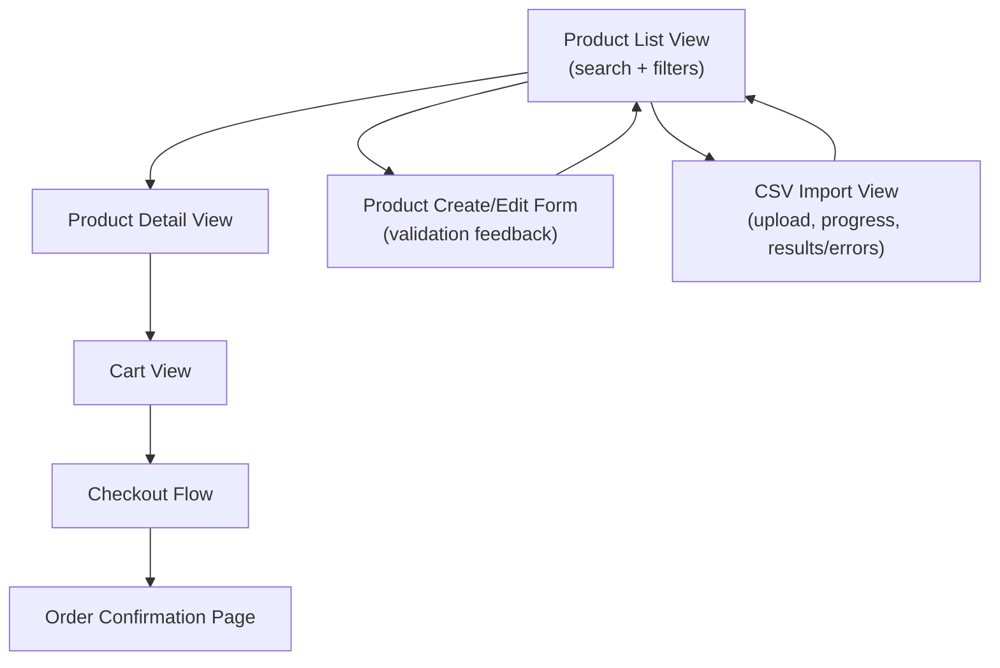

> [INDEX](../INDEX.md) / [Epics](./) / EP05 --- User Interface

# EP05 --- User Interface

## Summary

This epic delivers the web interface that exposes every feature defined in EP01 through
EP04 to a human user: browsing and searching the catalog, managing products, importing a
CSV, and completing a purchase. It is the surface through which all other epics become
observable and usable, and it is where validation feedback, import results, and order
confirmation are ultimately communicated.

## Business Value

A correct backend that no one can operate through a screen does not satisfy the challenge:
CRUD, search, and purchase are explicitly required to have a UI. Beyond meeting that
requirement, the interface is where data-integrity and security decisions made elsewhere
become visible to a human --- a validation error that is silently swallowed, or a search
result that is not sanitized on display, undoes the defensive work done in the domain
layer. A clear, functional UI is also what allows an evaluator to actually exercise every
other epic without reading source code.

## Domain Flow

## User Stories

- [ ] **Must Have** --- As a shopper, I want a product list view with search and filters,
  so that I can find products without scrolling through the entire catalog.
- [ ] **Must Have** --- As a shopper, I want a product detail view, so that I can review a
  single product's full information before adding it to my cart.
- [ ] **Must Have** --- As an administrator, I want a product create/edit form with inline
  validation feedback, so that I know immediately when a field I entered is invalid and why.
- [ ] **Must Have** --- As an administrator, I want a CSV import interface with file upload,
  progress indication, and a results/errors summary, so that I can run a bulk import and
  understand exactly what succeeded, what failed, and why.
- [ ] **Must Have** --- As a shopper, I want a shopping cart view, so that I can review and
  adjust my selections before checking out.
- [ ] **Must Have** --- As a shopper, I want a checkout flow, so that I can confirm my order
  and complete a simulated purchase.
- [ ] **Must Have** --- As a shopper, I want an order confirmation page, so that I have
  visual proof my purchase went through and know what I ordered.
- [ ] **Should Have** --- As a shopper on any device, I want the layout to respond to
  different screen sizes, so that the application remains usable on a smaller viewport.

## Acceptance Boundaries

- Every view in this epic exposes functionality already defined by EP01-EP04; this epic
  does not introduce new business rules, only their presentation.
- All user-supplied and imported data rendered in the UI must be displayed safely --- a
  value that fails sanitization upstream must never be trusted to render safely just
  because it reached the UI layer.
- Every validation error surfaced by the domain (product fields, CSV rows, stock limits)
  must be communicated to the user in a way that identifies which input caused it.
- The CSV import results view must distinguish between rows imported successfully, rows
  rejected with a reason, and rows skipped, so the operator never has to guess what
  happened to a given row.
- Visual design polish and pixel-level aesthetics are explicitly de-prioritized relative to
  functional completeness, per the challenge's evaluation weighting.
- Accessibility and internationalization are out of scope for this epic unless later
  promoted by an explicit decision.

## Related Architecture

- [Tech Stack](../architecture/tech-stack.md) --- TBD, populated during Architect
- [API Contract](../architecture/api-contract.md) --- TBD, populated during Architect
- [Testing Strategy](../architecture/testing-strategy.md) --- TBD, populated during Architect

## Related Documents

- [Project Brief](../project-brief.md)
- [Domain Glossary](../domain-glossary.md) --- TBD, populated during Discover
- [EP01 --- Product Management](EP01-product-management.md)
- [EP02 --- CSV Import](EP02-csv-import.md)
- [EP03 --- Product Search](EP03-product-search.md)
- [EP04 --- Purchase Workflow](EP04-purchase-workflow.md)
