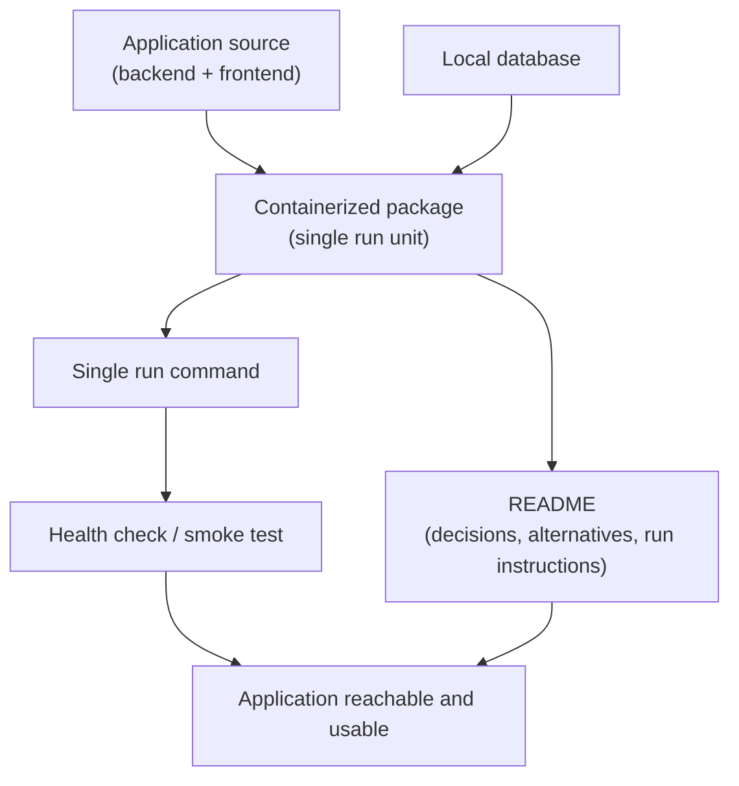

> [INDEX](../INDEX.md) / [Epics](./) / EP06 --- Containerization & Documentation

# EP06 --- Containerization & Documentation

## Summary

This epic packages the complete application --- backend, frontend, and database --- so that
an evaluator can run it with a single command and no external dependencies, and documents
the decisions, alternatives, and trade-offs behind the solution. It is the delivery
wrapper that makes every other epic actually reachable and evaluable.

## Business Value

The challenge is explicit that engineering judgment is evaluated as much as feature
completeness, and judgment is invisible unless it is written down and unless the evaluator
can actually run the thing. A submission that works perfectly on the author's machine but
fails to start elsewhere effectively delivers nothing: the evaluator cannot verify claims
they cannot observe. Clear documentation of decisions and alternatives considered is the
artifact through which the candidate's reasoning --- not just their code --- gets assessed.

## Domain Flow

## User Stories

- [ ] **Must Have** --- As an evaluator, I want to start the entire application with a
  single command, so that I can run it without manually installing or configuring
  individual components.
- [ ] **Must Have** --- As an evaluator, I want the database to be included in the
  containerized setup, so that I do not need to install or configure any external
  database service myself.
- [ ] **Must Have** --- As an evaluator, I want a README documenting the decisions made,
  the approach taken, the alternatives considered, and the local run instructions, so that
  I understand the reasoning behind the solution and can reproduce it reliably.
  - The README states the date the sample CSV was downloaded (2026-07-27), so that any
    discrepancy against a newer version of the file can be explained.
- [ ] **Must Have** --- As an evaluator, I want a way to verify that the running container
  is actually healthy and serving the application, so that I can distinguish "still
  starting" from "broken" without inspecting logs manually.
- [ ] **Should Have** --- As an evaluator, I want the run instructions to work on first
  attempt with no undocumented manual steps, so that evaluating the submission does not
  require guessing at missing setup.

## Acceptance Boundaries

- The containerized setup must not depend on any service, credential, or resource external
  to the container package itself (no external database, no external payment provider,
  no required internet access at runtime beyond what the base images need to build).
- A single command must bring up every component required to exercise CRUD, search, CSV
  import, and purchase end to end.
- Documentation must name the decisions made and the alternatives considered for each,
  not only the final choice --- a choice without a stated alternative is treated as
  undocumented judgment.
- The CSV download date recorded in the README is a fixed fact (2026-07-27) and must not
  be silently changed if the sample file is re-downloaded later.
- This epic does not cover production deployment, CI/CD pipelines, or scaling concerns;
  it covers local, reviewer-facing runnability only.

## Related Architecture

- [Tech Stack](../architecture/tech-stack.md) --- TBD, populated during Architect
- [Testing Strategy](../architecture/testing-strategy.md) --- TBD, populated during Architect

## Related Documents

- [Project Brief](../project-brief.md)
- [Domain Glossary](../domain-glossary.md) --- TBD, populated during Discover
- [EP01 --- Product Management](EP01-product-management.md)
- [EP02 --- CSV Import](EP02-csv-import.md)
- [EP03 --- Product Search](EP03-product-search.md)
- [EP04 --- Purchase Workflow](EP04-purchase-workflow.md)
- [EP05 --- User Interface](EP05-user-interface.md)
