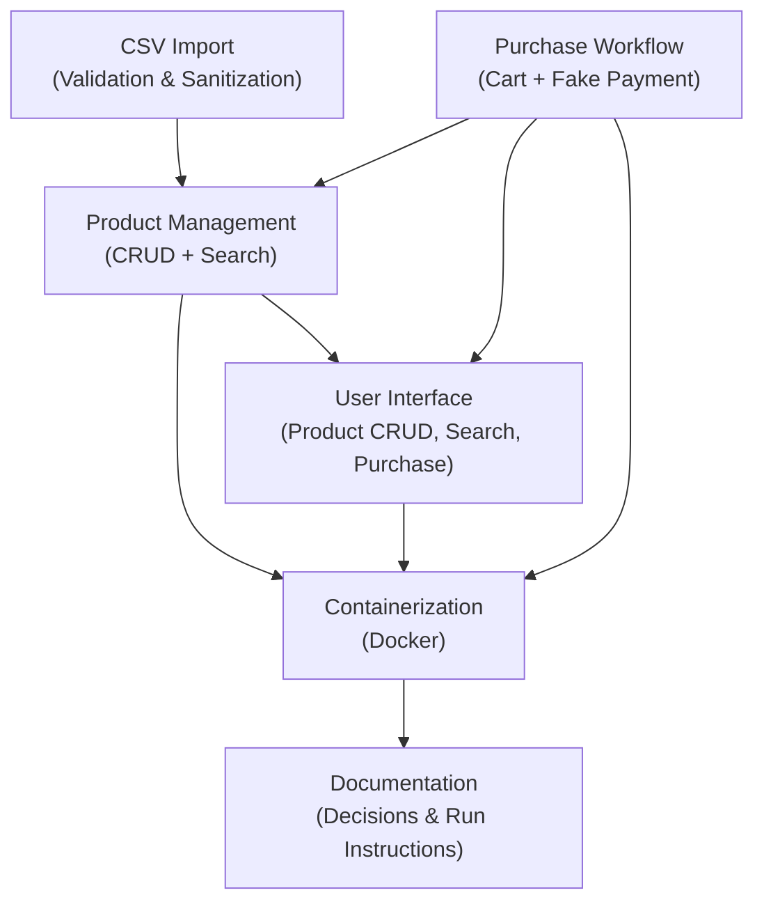

> [INDEX](INDEX.md) / Project Brief

# Project Brief --- E-Commerce Application (Gila Software Challenge)

## Vision

An enterprise-grade e-commerce application that demonstrates production-level engineering judgment through robust product management, resilient data import, and a complete purchase workflow --- delivering not just working software but a codebase that evidences defensive design, data integrity enforcement, and thoughtful architectural decisions under a tight deadline.

## Project Type

**Project Type**: `product`

Classified during Capture per the AGENTS.md framework. This is a user-facing e-commerce
application (product CRUD, search, and purchase workflow), not a library, tool,
extension, or bot. This classification requires the full set of Discover-phase
artifacts: user personas, journey maps, competitive analysis, and a domain glossary
covering both domain events and state lifecycles.

## Problem Statement

Gila Software needs to evaluate senior engineering candidates beyond algorithmic puzzles, through a realistic e-commerce challenge that surfaces how candidates handle ambiguity, dirty data, security threats, and architectural trade-offs. The challenge provides a CSV file deliberately seeded with edge cases (XSS payloads, SQL injection attempts, malformed prices, duplicate SKUs, empty rows, negative stock) to test whether the candidate builds defensively or merely completes the happy path. The gap is not "can the candidate build CRUD" but "does the candidate recognize and handle the traps that production systems must survive."

## Deliverable Map

## Deliverables

- [ ] **EP01 --- Product Management**: CRUD operations for products with persistent local storage ([docs/epics/EP01-product-management.md](epics/EP01-product-management.md))
- [ ] **EP02 --- CSV Import**: Bulk product import from CSV with validation, sanitization, and error reporting ([docs/epics/EP02-csv-import.md](epics/EP02-csv-import.md))
- [ ] **EP03 --- Product Search**: Search and filtering across the product catalog ([docs/epics/EP03-product-search.md](epics/EP03-product-search.md))
- [ ] **EP04 --- Purchase Workflow**: End-to-end purchase flow with simulated payment ([docs/epics/EP04-purchase-workflow.md](epics/EP04-purchase-workflow.md))
- [ ] **EP05 --- User Interface**: Web UI covering product CRUD, search, and purchasing ([docs/epics/EP05-user-interface.md](epics/EP05-user-interface.md))
- [ ] **EP06 --- Containerization & Documentation**: Docker packaging, run instructions, and decision documentation ([docs/epics/EP06-containerization-docs.md](epics/EP06-containerization-docs.md))

## Constraints

| Constraint | Detail |
| ---------- | ------ |
| **Deadline** | 3 business days from challenge receipt (due 2026-07-30) |
| **Backend language** | Must be one of: Java, Clojure, Python, PHP, or Go |
| **Frontend language** | Must be JavaScript or ClojureScript |
| **Database** | Must use a local database (SQL or NoSQL) |
| **Containerization** | Application must be runnable as a Docker container |
| **Deliverable format** | Public GitHub repository |
| **AI usage** | AI is allowed; all AI-generated comments must be removed from code |
| **CSV compatibility** | Must use the provided sample CSV (downloaded 2026-07-27) |
| **Payment** | Payment provider integration is not required; payment must be simulated |
| **Documentation** | README must document decisions, approach, alternatives considered, and local run instructions |
| **Evaluation focus** | Engineering judgment and foresight are weighted over mere completion (see Evaluation Criteria) |

## Evaluation Criteria

| Criterion | Weight | Description |
| --------- | ------ | ----------- |
| Data integrity & validation | High | Correct handling of dirty CSV data: malformed prices, negative/empty stock, duplicate SKUs, empty rows, whitespace-only fields |
| Security posture | High | Defense against XSS payloads and SQL injection attempts embedded in the CSV; output encoding; parameterized queries |
| Architectural decisions | High | Clear separation of concerns, justified technology choices, documented trade-offs and alternatives considered |
| Engineering judgment | High | Ability to identify and address edge cases proactively; asking the right questions rather than blindly implementing |
| Code quality | Medium | Clean, readable code without AI-generated comments; consistent conventions; appropriate abstractions |
| Completeness of features | Medium | All required features functional: CRUD, CSV import, search, purchase, UI for each |
| Docker & runnability | Medium | Application runs reliably via Docker with clear instructions; minimal setup friction for reviewers |
| Testing strategy | Medium | Meaningful test coverage that validates business rules and edge cases, not just happy paths |
| Documentation quality | Medium | README that communicates decisions clearly; run instructions that work on first attempt |
| User experience | Low | Functional UI that enables all required workflows; usability over aesthetics given the time constraint |

## Related Documents

| Document | Path | Phase |
| -------- | ---- | ----- |
| Project Dashboard | [docs/INDEX.md](INDEX.md) | Capture |
| Domain Glossary | [docs/domain-glossary.md](domain-glossary.md) | Discover |
| Architecture | [docs/architecture/](architecture/) | Architect |
| Epics | [docs/epics/](epics/) | Discover |
