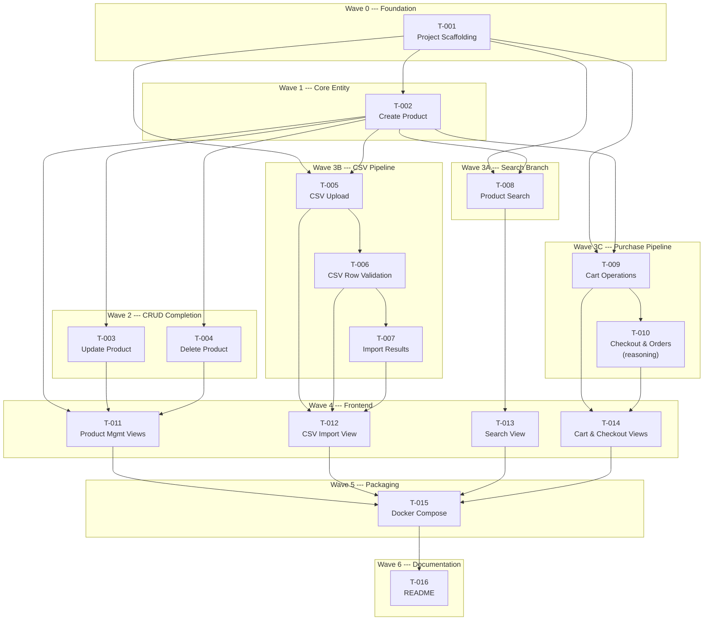

> [INDEX](../INDEX.md) / [Subtasks](./) / Batch 1 --- MVP Implementation Plan

# Batch 1 --- MVP Implementation Plan

## 1. Scope

This batch covers the complete MVP v1: 16 user stories across 6 epics, delivering a
functional e-commerce application with product management, CSV import, search, cart
and checkout, a web UI, Docker packaging, and documentation.

All stories are **Must Have** priority. No stories are deferred within this batch ---
items deferred to v2+ are documented in
[mvp-batch-1-refinement.md](../epics/mvp-batch-1-refinement.md).

### Epics in Scope

| Epic | Stories | Description |
|------|---------|-------------|
| EP01 | US-002, US-003, US-004 | Product CRUD (backend) |
| EP02 | US-005, US-006, US-007 | CSV import pipeline (backend) |
| EP03 | US-008 | Product search with filters (backend) |
| EP04 | US-009, US-010 | Cart operations and checkout (backend) |
| EP05 | US-011, US-012, US-013, US-014 | Web UI for all workflows (frontend) |
| EP06 | US-001, US-015, US-016 | Scaffolding, Docker, README |

## 2. Task List

| Task ID | Story | Title | Epic Dir | Model Tier | Depends On |
|---------|-------|-------|----------|------------|------------|
| T-001 | US-001 | Project Scaffolding | ep06 | standard | none |
| T-002 | US-002 | Create Product with Validation & Sanitization | ep01 | standard | T-001 |
| T-003 | US-003 | Update Product | ep01 | standard | T-002 |
| T-004 | US-004 | Delete Product | ep01 | standard | T-002 |
| T-005 | US-005 | CSV Upload & Background Processing Pipeline | ep02 | standard | T-001, T-002 |
| T-006 | US-006 | CSV Row Validation | ep02 | standard | T-005 |
| T-007 | US-007 | Import Results & Error Reporting | ep02 | standard | T-006 |
| T-008 | US-008 | Product Search with Filters, Sort & Pagination | ep03 | standard | T-001, T-002 |
| T-009 | US-009 | Cart Operations | ep04 | standard | T-001, T-002 |
| T-010 | US-010 | Checkout & Order Creation | ep04 | reasoning | T-009 |
| T-011 | US-011 | Product Management Views | ep05 | standard | T-002, T-003, T-004 |
| T-012 | US-012 | CSV Import View | ep05 | standard | T-005, T-006, T-007 |
| T-013 | US-013 | Product Search View | ep05 | standard | T-008 |
| T-014 | US-014 | Cart & Checkout Views | ep05 | standard | T-009, T-010 |
| T-015 | US-015 | Docker Compose Multi-Stage Setup | ep06 | standard | T-002 through T-014 |
| T-016 | US-016 | README & Decision Documentation | ep06 | standard | T-015 |

**Model tier note**: T-010 is assigned `reasoning` tier because checkout involves
atomic transaction design with `SELECT ... FOR UPDATE`, race condition handling under
concurrent checkouts, and stock validation with snapshot semantics (see decisions D1,
D8 in refinement addenda).

## 3. Dependency Graph (Mermaid DAG)

## 4. Execution Order (numbered waves)

### Wave 0 --- Foundation (sequential)

| Task | Title | Rationale |
|------|-------|-----------|
| T-001 | Project Scaffolding | Monorepo structure, shared validation module, Docker base, CI skeleton. Every other task depends on this. |

### Wave 1 --- Core Entity (sequential)

| Task | Title | Rationale |
|------|-------|-----------|
| T-002 | Create Product | Establishes the Product entity, database schema, validation rules, and the POST endpoint. Foundation for all product-related stories. |

### Wave 2 --- CRUD Completion (parallel)

| Task | Title | Rationale |
|------|-------|-----------|
| T-003 | Update Product | PUT endpoint. Depends only on T-002 (Product entity exists). |
| T-004 | Delete Product | DELETE endpoint with FK conflict handling (D3). Depends only on T-002. |

T-003 and T-004 are independent of each other and can execute in parallel.

### Wave 3 --- Backend Features (parallel branches)

Three independent branches can execute simultaneously. Within each branch, tasks are
sequential.

**Branch A --- Search**

| Task | Title | Rationale |
|------|-------|-----------|
| T-008 | Product Search | GET endpoint with `ts_rank`, filters, sort, pagination. Depends on T-001 + T-002 (both complete by Wave 1). |

**Branch B --- CSV Import Pipeline**

| Task | Title | Rationale |
|------|-------|-----------|
| T-005 | CSV Upload & Processing | Upload endpoint, background job queue, parsing. |
| T-006 | CSV Row Validation | Per-row validation, duplicate SKU handling (D2). Requires T-005 pipeline. |
| T-007 | Import Results Reporting | Status endpoint, error listing. Requires T-006 validation results. |

**Branch C --- Purchase Workflow**

| Task | Title | Rationale |
|------|-------|-----------|
| T-009 | Cart Operations | Cart CRUD with cookie-based identity (D4), stock rejection (D5). |
| T-010 | Checkout & Order Creation | Atomic checkout with `SELECT FOR UPDATE` (D8), price snapshot carry-through (D1). **Reasoning tier** --- requires careful concurrency design. |

### Wave 4 --- Frontend Views (parallel)

| Task | Title | Backend Gate |
|------|-------|--------------|
| T-011 | Product Management Views | T-002 + T-003 + T-004 (all CRUD endpoints) |
| T-012 | CSV Import View | T-005 + T-006 + T-007 (full import pipeline) |
| T-013 | Product Search View | T-008 (search endpoint) |
| T-014 | Cart & Checkout Views | T-009 + T-010 (full purchase workflow) |

All four frontend tasks are independent and can execute in parallel, but each is gated
by completion of its corresponding backend branch.

### Wave 5 --- Packaging (sequential)

| Task | Title | Rationale |
|------|-------|-----------|
| T-015 | Docker Compose Finalization | Multi-stage builds, service orchestration, health checks. Requires all application code (T-002 through T-014) to be complete. |

### Wave 6 --- Documentation (sequential)

| Task | Title | Rationale |
|------|-------|-----------|
| T-016 | README & Decision Documentation | Must reflect the final state of the application. Documents all decisions with alternatives considered. Depends on T-015 (Docker setup finalized). |

### Execution Summary

| Wave | Tasks | Parallelism | Cumulative Complete |
|------|-------|-------------|---------------------|
| 0 | T-001 | sequential | 1 / 16 |
| 1 | T-002 | sequential | 2 / 16 |
| 2 | T-003, T-004 | parallel (2) | 4 / 16 |
| 3 | T-005 -- T-010, T-008 | 3 branches | 10 / 16 |
| 4 | T-011 -- T-014 | parallel (4) | 14 / 16 |
| 5 | T-015 | sequential | 15 / 16 |
| 6 | T-016 | sequential | 16 / 16 |

Critical path: T-001 --> T-002 --> T-009 --> T-010 --> T-014 --> T-015 --> T-016
(7 tasks, longest sequential chain).

## 5. Definition of Done --- Batch

- [ ] All 16 handoff files exist under `docs/subtasks/{epic}/`
- [ ] All backend unit tests pass
- [ ] All backend integration tests pass against PostgreSQL
- [ ] All frontend unit tests pass
- [ ] Docker Compose builds and starts cleanly
- [ ] All quality gates in each handoff file are PASS
- [ ] README documents all decisions with alternatives considered
- [ ] No files modified outside deliverables lists
- [ ] `git diff --stat` shows only expected files
- [ ] INDEX.md updated with completion checkboxes

## 6. Related Documents

- [INDEX.md](../INDEX.md) --- project root and document map
- [MVP Batch 1 --- Refinement Addenda](../epics/mvp-batch-1-refinement.md) --- 18 resolved decisions, MVP cut, implementation order
- [Tech Stack](../architecture/tech-stack.md) --- language, framework, and tooling choices
- [Testing Strategy](../architecture/testing-strategy.md) --- test levels, coverage targets, runner configuration
- [API Contract](../architecture/api-contract.md) --- endpoint specifications, request/response schemas
- [Data Model](../architecture/data-model.md) --- entity definitions, relationships, constraints
- [User Stories](../user-stories/) --- all 16 story definitions with acceptance criteria
