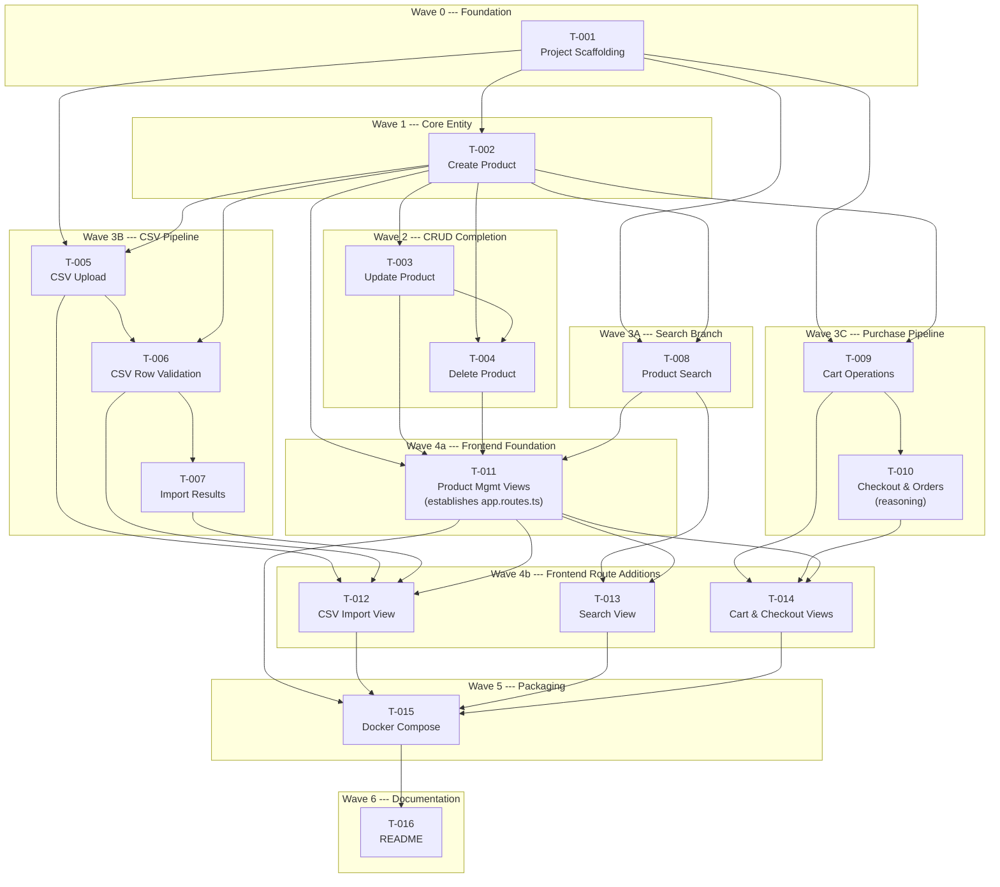

> [INDEX](../INDEX.md) / [Subtasks](./) / Batch 1 --- MVP Implementation Plan

# Batch 1 --- MVP Implementation Plan

## 1. Scope

This batch covers the complete MVP v1: 16 user stories across 6 epics, delivering a
functional e-commerce application with product management, CSV import, search, cart
and checkout, a web UI, Docker packaging, and documentation.

All stories are **Must Have** priority. No stories are deferred within this batch ---
items deferred to v2+ are documented in
[mvp-batch-1-refinement.md](../epics/mvp-batch-1-refinement.md).

### Epics in Scope

| Epic | Stories | Description |
|------|---------|-------------|
| EP01 | US-002, US-003, US-004 | Product CRUD (backend) |
| EP02 | US-005, US-006, US-007 | CSV import pipeline (backend) |
| EP03 | US-008 | Product search with filters (backend) |
| EP04 | US-009, US-010 | Cart operations and checkout (backend) |
| EP05 | US-011, US-012, US-013, US-014 | Web UI for all workflows (frontend) |
| EP06 | US-001, US-015, US-016 | Scaffolding, Docker, README |

### Capacity Assessment

Capacity assessment: 16 tasks across 7 waves, agent-driven execution. Estimated
throughput: 3-4 tasks per session. With parallel execution within waves, the batch
is completable within the 3-business-day constraint.

## 2. Task List

| Task ID | Story | Title | Epic Dir | Model Tier | Depends On |
|---------|-------|-------|----------|------------|------------|
| T-001 | US-001 | Project Scaffolding | ep06 | standard | none |
| T-002 | US-002 | Create Product with Validation & Sanitization | ep01 | standard | T-001 |
| T-003 | US-003 | Update Product | ep01 | standard | T-002 |
| T-004 | US-004 | Delete Product | ep01 | standard | T-002, T-003† |
| T-005 | US-005 | CSV Upload & Background Processing Pipeline | ep02 | standard | T-001, T-002 |
| T-006 | US-006 | CSV Row Validation | ep02 | standard | T-005, T-002 |
| T-007 | US-007 | Import Results & Error Reporting | ep02 | standard | T-006 |
| T-008 | US-008 | Product Search with Filters, Sort & Pagination | ep03 | standard | T-001, T-002 |
| T-009 | US-009 | Cart Operations | ep04 | standard | T-001, T-002 |
| T-010 | US-010 | Checkout & Order Creation | ep04 | reasoning | T-009 |
| T-011 | US-011 | Product Management Views | ep05 | standard | T-002, T-003, T-004, T-008 |
| T-012 | US-012 | CSV Import View | ep05 | standard | T-005, T-006, T-007, T-011† |
| T-013 | US-013 | Product Search View | ep05 | standard | T-008, T-011 |
| T-014 | US-014 | Cart & Checkout Views | ep05 | standard | T-009, T-010, T-011† |
| T-015 | US-015 | Docker Compose Multi-Stage Setup | ep06 | standard | T-002 through T-014 |
| T-016 | US-016 | README & Decision Documentation | ep06 | standard | T-015 |

† Execution-order constraint due to shared-file edits, not a functional/data
dependency --- see the "Execution-order constraints" note in Section 3 and the
corresponding wave descriptions in Section 4.

**Model tier note**: T-010 is assigned `reasoning` tier because checkout involves
atomic transaction design with `SELECT ... FOR UPDATE`, race condition handling under
concurrent checkouts, and stock validation with snapshot semantics (see decisions D1,
D8 in refinement addenda).

## 3. Dependency Graph (Mermaid DAG)

### Notes on Dependency Graph

**Missing dependencies corrected:**
- T-008 → T-011: Product Management Views now explicitly depend on the Search API, as both CRUD and search operations inform product display patterns.
- T-011 → T-013: Product Search View now explicitly depends on Product Management Views, as both frontend tasks share the `product.service.ts` module established in T-011.
- T-002 → T-006: CSV Row Validation now explicitly depends on T-002 (Create Product), as validation rules must align with the Product entity schema.

**Execution-order constraints (file-overlap avoidance):**
- **T-003 → T-004**: Not a functional dependency --- both tasks modify the same three
  files (`src/ecommerce/product/handler.clj`, `src/ecommerce/product/repository.clj`,
  `src/ecommerce/product/router.clj`). To avoid merge conflicts, T-003 (Update Product,
  the more complex change) executes first, then T-004 (Delete Product).
- **T-011 → T-012, T-011 → T-014**: Not functional dependencies --- T-011, T-012,
  T-013, and T-014 all modify `frontend/src/app/app.routes.ts`. T-011 executes first
  and establishes the initial routing structure; T-012, T-013, and T-014 each append a
  single route entry afterward, which is why they can then run in parallel without
  conflicting edits.

**Critical integrations:**
- **T-013 Search-to-Cart Bridge**: Product Search View (T-013) includes an "Add to Cart" action that invokes `POST /api/cart/items` (defined in T-009). This provides a direct purchase path from search results.
- **T-015 E2E Infrastructure**: Docker Compose Finalization (T-015) now includes Playwright service setup in `docker-compose.yml`. E2E test infrastructure is delivered by T-015; actual E2E test scenarios and suites are written as part of each feature task's quality gates and handoff acceptance criteria.

## 4. Execution Order (numbered waves)

### Wave 0 --- Foundation (sequential)

| Task | Title | Rationale |
|------|-------|-----------|
| T-001 | Project Scaffolding | Monorepo structure, shared validation module, Docker base, CI skeleton. Every other task depends on this. |

### Wave 1 --- Core Entity (sequential)

| Task | Title | Rationale |
|------|-------|-----------|
| T-002 | Create Product | Establishes the Product entity, database schema, validation rules, and the POST endpoint. Foundation for all product-related stories. |

### Wave 2 --- CRUD Completion (sequential)

| Task | Title | Rationale |
|------|-------|-----------|
| T-003 | Update Product | PUT endpoint. Depends only on T-002 (Product entity exists). Executes first within the wave. |
| T-004 | Delete Product | DELETE endpoint with FK conflict handling (D3). Depends on T-002; sequenced after T-003. |

T-003 and T-004 both modify `src/ecommerce/product/handler.clj`,
`src/ecommerce/product/repository.clj`, and `src/ecommerce/product/router.clj`.
Running them in parallel risks merge conflicts on all three files, so they execute
sequentially within Wave 2: T-003 (Update Product, the more complex change) first,
then T-004 (Delete Product, simpler).

### Wave 3 --- Backend Features (parallel branches)

Three independent branches can execute simultaneously. Within each branch, tasks are
sequential.

**Branch A --- Search**

| Task | Title | Rationale |
|------|-------|-----------|
| T-008 | Product Search | GET endpoint with `ts_rank`, filters, sort, pagination. Depends on T-001 + T-002 (both complete by Wave 1). |

**Branch B --- CSV Import Pipeline**

| Task | Title | Rationale |
|------|-------|-----------|
| T-005 | CSV Upload & Processing | Upload endpoint, background job queue, parsing. |
| T-006 | CSV Row Validation | Per-row validation, duplicate SKU handling (D2). Requires T-005 pipeline. |
| T-007 | Import Results Reporting | Status endpoint, error listing. Requires T-006 validation results. |

**Branch C --- Purchase Workflow**

| Task | Title | Rationale |
|------|-------|-----------|
| T-009 | Cart Operations | Cart CRUD with cookie-based identity (D4), stock rejection (D5). |
| T-010 | Checkout & Order Creation | Atomic checkout with `SELECT FOR UPDATE` (D8), price snapshot carry-through (D1). **Reasoning tier** --- requires careful concurrency design. |

### Wave 4a --- Frontend Foundation (sequential)

| Task | Title | Backend Gate | Frontend Gate |
|------|-------|--------------|---------------|
| T-011 | Product Management Views | T-002 + T-003 + T-004 + T-008 (all CRUD endpoints + search API) | none |

T-011 executes first within Wave 4. Besides delivering the Product Management Views,
it creates `product.service.ts` and establishes the initial structure of
`frontend/src/app/app.routes.ts` that the remaining frontend tasks build on.

### Wave 4b --- Frontend Route Additions (parallel)

| Task | Title | Backend Gate | Frontend Gate |
|------|-------|--------------|---------------|
| T-012 | CSV Import View | T-005 + T-006 + T-007 (full import pipeline) | T-011 (routes structure established) |
| T-013 | Product Search View | T-008 (search endpoint) | T-011 (reuses `product.service.ts` and routes structure) |
| T-014 | Cart & Checkout Views | T-009 + T-010 (full purchase workflow) | T-011 (routes structure established) |

T-012, T-013, and T-014 each append a single route entry to the `app.routes.ts`
structure established by T-011, rather than restructuring the file. Because these are
independent append operations, all three can execute in parallel once T-011 and their
respective backend gates are satisfied. T-013 additionally reuses `product.service.ts`
from T-011. All Wave 4 tasks (4a and 4b) must be complete before Docker finalization
(T-015).

### Wave 5 --- Packaging & E2E Infrastructure (sequential)

| Task | Title | Rationale |
|------|-------|-----------|
| T-015 | Docker Compose Finalization | Multi-stage builds, service orchestration, health checks. Includes Playwright service for E2E testing. Requires all application code (T-002 through T-014) to be complete. E2E test infrastructure (runner, service definitions) is delivered here; individual E2E test scenarios are part of each feature task's quality gates. |

### Wave 6 --- Documentation (sequential)

| Task | Title | Rationale |
|------|-------|-----------|
| T-016 | README & Decision Documentation | Must reflect the final state of the application. Documents all decisions with alternatives considered. Depends on T-015 (Docker setup finalized). |

### Execution Summary

| Wave | Tasks | Parallelism | Cumulative Complete |
|------|-------|-------------|---------------------|
| 0 | T-001 | sequential | 1 / 16 |
| 1 | T-002 | sequential | 2 / 16 |
| 2 | T-003, T-004 | sequential (2) | 4 / 16 |
| 3 | T-005 -- T-010, T-008 | 3 branches | 10 / 16 |
| 4a | T-011 | sequential | 11 / 16 |
| 4b | T-012, T-013, T-014 | parallel (3) | 14 / 16 |
| 5 | T-015 | sequential | 15 / 16 |
| 6 | T-016 | sequential | 16 / 16 |

Critical path: T-001 --> T-002 --> T-005 --> T-006 --> T-007 --> T-012 --> T-015 -->
T-016 (8 tasks, longest sequential chain).

## 5. Definition of Done --- Batch

- [ ] All 16 handoff files exist under `docs/subtasks/{epic}/`
- [ ] All backend unit tests pass
- [ ] All backend integration tests pass against PostgreSQL
- [ ] All frontend unit tests pass
- [ ] Docker Compose builds and starts cleanly
- [ ] All quality gates in each handoff file are PASS
- [ ] README documents all decisions with alternatives considered
- [ ] No files modified outside deliverables lists
- [ ] `git diff --stat` shows only expected files
- [ ] INDEX.md updated with completion checkboxes

## 6. Related Documents

- [INDEX.md](../INDEX.md) --- project root and document map
- [MVP Batch 1 --- Refinement Addenda](../epics/mvp-batch-1-refinement.md) --- 18 resolved decisions, MVP cut, implementation order
- [Tech Stack](../architecture/tech-stack.md) --- language, framework, and tooling choices
- [Testing Strategy](../architecture/testing-strategy.md) --- test levels, coverage targets, runner configuration
- [API Contract](../architecture/api-contract.md) --- endpoint specifications, request/response schemas
- [Data Model](../architecture/data-model.md) --- entity definitions, relationships, constraints
- [User Stories](../user-stories/) --- all 16 story definitions with acceptance criteria
